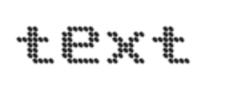
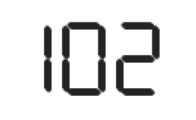
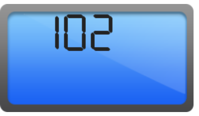
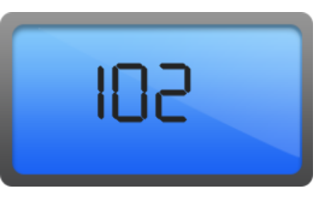
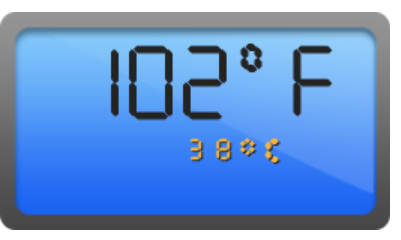

# Getting Started

Before we start with the DigitalGauge, please refer [this page](https://help.syncfusion.com/emberjs/overview) for general information regarding integrating Syncfusion widget’s.

## Adding JavaScript and CSS Reference

To render the DigitalGauge control, the following list of external dependencies are needed, 

* [jsRender](https://github.com/borismoore/jsrender) - to render the templates

The other required internal dependencies are tabulated below,

<table>
   <tr>
      <th>
         <b>Files</b>
      </th>
      <th>
         <b>Description/Usage </b>
      </th>
   </tr>
   <tr>
      <td>
         ej.core.min.js
      </td>
      <td>
        It is referred always before using all the JS controls.
      </td>
   </tr>
   <tr>
      <td>
         ej.data.min.js
      </td>
      <td>
         Used to handle data operation and is used while binding data to the JS controls.
      </td>
   </tr>
   <tr>
      <td>
        ej.digitalgauge.min.js
      </td>
      <td>
        DigitalGauge core script file which includes DigitalGauge related scripts files.
      </td>
   </tr>
   <tr>
      <td>
        excanvas.min.js
      </td>
      <td>
        
      </td>
   </tr>
</table>

Refer the `ej.web.all.min.js` which encapsulates all the `ej` controls and frameworks in a single file.

## Control Initialization

* Open the command prompt in the folder [ember-app](https://help.syncfusion.com/emberjs/getting-started#create-a-simple-ember-application) or the folder in which the application is created.

* Use the command [ember generate route digitalgauge/default](https://guides.emberjs.com/v2.11.0/routing/defining-your-routes/)to create template `default.hbs` file in templates folder and router `default.js` file in routes folder. It also add the routing content in `router.js`.

* Use below code in `default.hbs` in templates folder to render the digitalgauge.



	{{ej-digitalgauge id="DigitalGuage"}}



* Use the below code in `default.js` in routes folder to bind the model to the digitalgauge.



	import Ember from 'ember';

    export default Ember.Route.extend({
      model() {
         return {
         }
      }
    });



## Running the application

* To run the application, execute below command.


 
 ember serve



* Browse to [http://localhost:4200](http://localhost:4200) to see the application. And navigate to digitalgauge sample. The component is rendered as like the below screenshot. You can make changes in the code found under app folder and the browser should auto-refresh itself while you save files. 

## Set Height and Width values

Basic attributes of each canvas elements are height and width. You can set the height and width of the gauge.



	{{ej-digitalgauge id="DigitalGuage" e-width=model.width e-height=model.height}}





	import Ember from 'ember';

    export default Ember.Route.extend({
      model() {
         return {
             height: 145,
             width: 260,
         }
      }
    });



On executing the above code, sample renders a default **Digital Gauge** with the specified height and width values.

## Set Items Property

You can customize the **Digital Gauge** using different properties.

**Add Segment and Character Properties**

* In this example, the **Digital Gauge** uses a welcome board in which the text color must be distinctly visible in nature. To meet this requirement, you can give some segment properties such as segment spacing, segment width, segment color, segment length and segment opacity.

* **Character** type is used to define the Digital representation of the character. Thee five types of character representation are as follows:

  * EightCrossEightDotMatrix

  * SevenSegment

  * FourteenSegment

  * SixteenSegment 

  * EightCrossEightSquareMatrix.



	{{ej-digitalgauge id="DigitalGuage" e-width=model.width e-height=model.height e-items=model.items}}





	import Ember from 'ember';

    export default Ember.Route.extend({
      model() {
         return {
             height: 145,
             width: 260,
			 items: [{
                segmentSettings: { width: 2, length: 20 },
                characterSettings: { type: "sevensegment", spacing: 12, },
                value: "102",
            }]
         }
      }
    });



On executing the above code, sample renders a **Digital Gauge** with default values as follows.

## Add Background Image

You can add a `frame.backgroundImageUrl` to set the background for the **Digital Gauge**.



	 {{ej-digitalgauge id="DigitalGuage" e-width=model.width e-frame=model.frame e-height=model.height e-items=model.items}}





	import Ember from 'ember';

    export default Ember.Route.extend({
      model() {
         return {
            height: 145,
            width: 260,
			frame: {
			 	// For setting background image
				backgroundImageUrl: "content/images/digitalgauge/digi.png",
			},
			items: [{
               segmentSettings: { width: 2, length: 20 },
               characterSettings: { type: "sevensegment", spacing: 12, },
               value: "102",
            }]
         }
      }
    });



On executing the above code, sample renders a default **Digital Gauge** as follows.           

## Add Location

You can position the digital letters inside the canvas element using **position** property.



	 {{ej-digitalgauge id="DigitalGuage" e-width=model.width e-frame=model.frame e-height=model.height e-items=model.items}}





	import Ember from 'ember';

    export default Ember.Route.extend({
      model() {
         return {
            height: 145,
            width: 260,
			frame: {
			 	// For setting background image
				backgroundImageUrl: "content/images/digitalgauge/digi.png",
			},
			items: [{
               segmentSettings: { width: 2, length: 20 },
               characterSettings: { type: "sevensegment", spacing: 12, },
               value: "102", position: { x: 15, y: 40 }
            }]
         }
      }
    });



On executing the above code, sample renders a default **Digital Gauge** as follows.

## Add Items collection

You can add **Items collection** to display the temperature value as used in the Digital thermometer.



	 {{ej-digitalgauge id="DigitalGuage" e-width=model.width e-frame=model.frame e-height=model.height e-items=model.items}}





	import Ember from 'ember';

    export default Ember.Route.extend({
      model() {
         return {
            height: 145,
            width: 260,
			frame: {
			 	// For setting background image
				backgroundImageUrl: "content/images/digitalgauge/digi.png",
			},
			items: [{
                //For Displaying Fahrenheit value
                segmentSettings: { width: 2, length: 20, spacing: 0 },
                characterSettings: { type: "sevensegment", spacing: 12, },
                value: "102",
                position: { x: 15, y: 40 }
            },
            {
                //For displaying degree symbol
                segmentSettings: { width: 2, length: 5, spacing: 0 },
                characterSettings: { type: "sevensegment", spacing: 5, },
                value: "0",
                position: { x: 70, y: 28 }
            },
            {
                //For Displaying Fahrenheit symbol
                segmentSettings: { width: 2, length: 20, spacing: 0 },
                characterSettings: { type: "sevensegment", spacing: 12, },
                value: "F",
                position: { x: 170, y: 40 }
            },
            {
                //For displaying Celsius value
                segmentSettings: { width: 1, length: 9, spacing: 0, color: "#F5b43f" },
                characterSettings: { type: "sevensegment", spacing: 12, },
                value: "38",
                position: { x: 70, y: 90 },
            },
            {
                //For displaying degree symbol
                segmentSettings: { width: 1, length: 3, spacing: 0, color: "#F5b43f" },
                characterSettings: { type: "sevensegment", spacing: 12, },
                value: "0",
                position: { x: 90, y: 80 }
            },
            {
                //For displaying Celsius symbol
                segmentSettings: { width: 1, length: 9, spacing: 0, color: "#F5b43f" },
                characterSettings: { type: "sevensegment", spacing: 12, },
                value: "c",
                position: { x: 120, y: 90 }
            }]
         }
      }
    });



The following screenshot displays a **Digital Gauge** with all the customizations discussed earlier.

