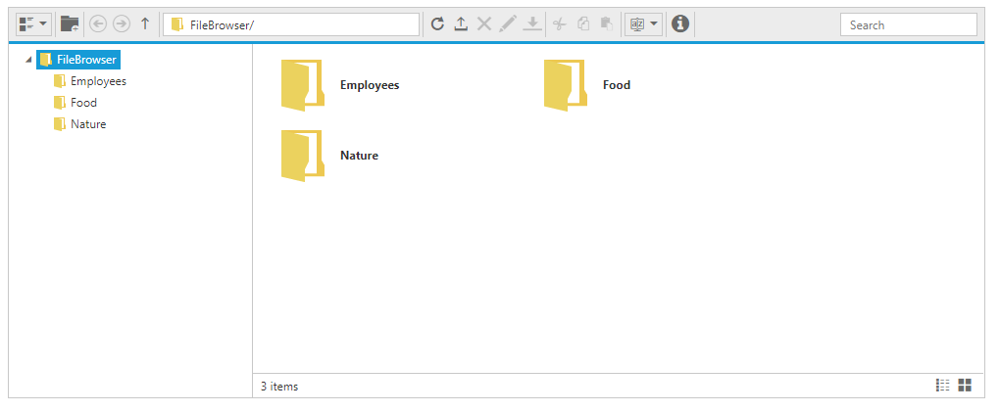
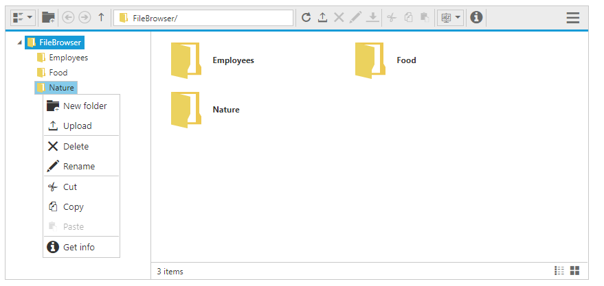
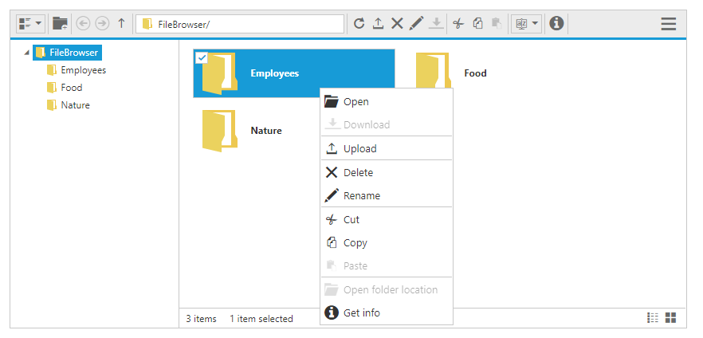
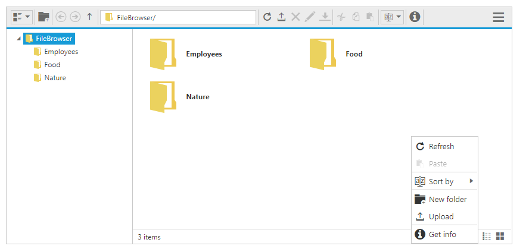

# Getting Started

Before we start with the FileExplorer, please refer [this page](https://help.syncfusion.com/emberjs/overview) for general information regarding integrating Syncfusion widget’s.

## Control Initialization

* Open the command prompt in the folder [ember-app](https://help.syncfusion.com/emberjs/getting-started#create-a-simple-ember-application) or the folder in which the application is created.

* Use the command [ember generate route fileexplorer/default](https://guides.emberjs.com/v2.11.0/routing/defining-your-routes/) to create template `default.hbs` file in templates folder and router `default.js` file in routes folder. It also add the routing content in `router.js`.

* Use below code in `default.hbs` in templates folder to render the FileExplorer.



    {{ej-fileexplorer id="defaultFile" e-path= model.path e-ajaxAction = model.ajaxaction e-width = "100%" e-isResponsive = model.responsive e-layout = model.layout}}



* Use the below code in `default.js` in routes folder to bind the model to the FileExplorer.



	export default Ember.Route.extend({
      model(){
         return {
            path: "http://js.syncfusion.com/demos/ejServices/Content/FileBrowser/",
            ajaxaction : "http://js.syncfusion.com/demos/ejServices/api/FileExplorer/FileOperations",
            responsive: true,
            layout: "Tile"
        }
    },



## Running the application

* To run the application, execute below command.


 
 ember server



* Browse to [http://localhost:4200](http://localhost:4200) to see the application. And navigate to FileExplorer sample. The component is rendered as like the below screenshot. You can make changes in the code found under app folder and the browser should auto-refresh itself while you save files. 

## File type restriction

FileExplorer control showcase all the files from the filesystem, here you can customize the file types that what you want to show by using [fileTypes](https://help.syncfusion.com/api/js/ejfileexplorer#members:filetypes) property. It filter the files based on the files extensions.

By default it having the value “*.*”, so it allows all the file types. In case of image browser you can allow the image files only by setting "*.png, *.gif, *.jpg, *.jpeg", so it doesn’t allow the other type of files.



{{ej-fileexplorer id="defaultFile" e-path= model.path e-ajaxAction = model.ajaxaction e-fileTypes = model.filetypes e-width = "100%" e-isResponsive = model.responsive e-layout = model.layout}}





 export default Ember.Route.extend({
    model(){
    return {
            path: "http://js.syncfusion.com/demos/ejServices/Content/FileBrowser/",
            ajaxaction : "http://js.syncfusion.com/demos/ejServices/api/FileExplorer/FileOperations",
            responsive: true,
            layout: "Tile",
            filetypes : "*pdf,*docx"
        }
    }



# Context Menu

The context-menu has [list of items](#context-menu-items) which helps to perform FileExplorer operations, and it appears based on the target such as file or folder.

## Context menu items

The below table shows the context menu items corresponding to the location where it is opened:

<table>
<tr>
<th>
Context menu location</th><th>
Context menu items</th></tr>
<tr>
<td>
While right click on treeview nodes (from navigation pane)  </td><td>
* New folder * Upload * Delete * Rename * Cut * Copy * Paste    </td></tr>
<tr>
<td>
While right click on File / Folder  </td><td>
* Open * Download * Upload * Delete * Rename * Cut * Copy * Paste * Get info    </td></tr>
<tr>
<td>
While right click on layout (content pane)  </td><td>
* Refresh * Paste * Sort By * New folder * Upload  * Get info     </td></tr>
</table>

While right click on treeview nodes (from navigation pane), it will looks like below.

While right click on File / Folder, it will looks like below.

While right click on layout (content pane), it will lokks like below.

The below table explains the behavior of each context menu item:

<table>
<tr>
<td>
Open  </td><td>
It opens the selected folder. When an image file selected it opens the preview of the image. For the remaining files this option becomes disabled.  </td></tr>
<tr>
<td>
Download  </td><td>
It downloads the selected file. When a file or number of files selected at that time only download option enabled.  If multiple files selected then it downloads all the files in a zip format.  </td></tr>
<tr>
<td>
Cut  </td><td>
It makes the copy of the selected files or folders into the clipboard. When the user paste the files in any location, the files are removed from the source location.  </td></tr>
<tr>
<td>
Copy  </td><td>
It makes the copy of the selected files or folders into the clipboard. When the user paste the files, the copy of the files only pasted in the target location.  </td></tr>
<tr>
<td>
Paste  </td><td>
It paste the files from the clipboard into the current selected folder. Note that when the files are copied into the clipboard at that time only it enabled.  </td></tr>
<tr>
<td>
Delete  </td><td>
It deletes the current selected file or folder. When you select any file or folder at that time only this option gets enabled.  If multiple files selected then it deletes all the selected items.  </td></tr>
<tr>
<td>
Rename  </td><td>
This is used to rename the current selected file or folder. When you select any file or folder at that time only this option gets enabled.  Even multiple files selected it renames the single file only.  </td></tr>
<tr>
<td>
New folder  </td><td>
It creates a new folder on the current directory.  While click on the NewFolder item a dialog appears to get the folder name. Based on the user input, a new folder create on the current directory.  </td></tr>
<tr>
<td>
Upload  </td><td>
It uploads a file or list of files into the current directory.  </td></tr>
<tr>
<td>
Get info  </td><td>
It displays the details of the current selected file or folder.  </td></tr>
<tr>
<td>Sort By  </td>
<td>
It's used to sorting the files and folders from the current directory.The sorting can be done based on the columns available from grid, in both ascending and descending order.  
</td></tr>
</table>

## Context menu Visibility

The presence of the context menu can be controlled by the [showContextMenu](https://help.syncfusion.com/api/js/ejfileexplorer#members:showcontextmenu) property. This was enabled by default, and by disabling this property you can prevent our built-in context menu.



{{ej-fileexplorer id="defaultFile" e-showContextMenu =false e-path= model.path e-ajaxAction = model.ajaxaction e-fileTypes = model.filetypes e-width = "100%" e-isResponsive = model.responsive e-layout = model.layout}}



# Multiple Selection

The FileExplorer allows the user to select multiple files by enabling the [allowMultiSelection](https://help.syncfusion.com/api/js/ejfileexplorer#members:allowmultiselection) property. The multiple selection can be done by pressing the **Ctrl** key or **Shift** key. You can select all the files in the directory by pressing “**Ctrl + A**”. The multiple selection is useful on copy pasting multiple files, deleting multiple files and downloading multiple files.



{{ej-fileexplorer id="defaultFile" e-allowMultiSelection=false e-path= model.path e-ajaxAction = model.ajaxaction e-fileTypes = model.filetypes e-width = "100%" e-isResponsive = model.responsive e-layout = model.layout}}



# Resizing 

The FileExplorer has the resize support through the resize handle which appears at right-bottom corner of footer. By clicking the resize handle the user can resize the FileExplorer through the UI. While resizing the dimension of the FileExplorer is automatically adjusted.

The resize behavior can be enabled through the [enableResize](https://help.syncfusion.com/api/js/ejfileexplorer#members:enableresize) property.

## Responsiveness

By enabling the [isResponsive](https://help.syncfusion.com/api/js/ejfileexplorer#members:isresponsive) property, you can make the FileExplorer as responsive. While resizing the FileExplorer component, the inner content and toolbar items are automatically adjusted to equalize the size. The toolbar items are displayed within Dropdown on enabling the responsive. Otherwise it floated to the next line to equalize the space.