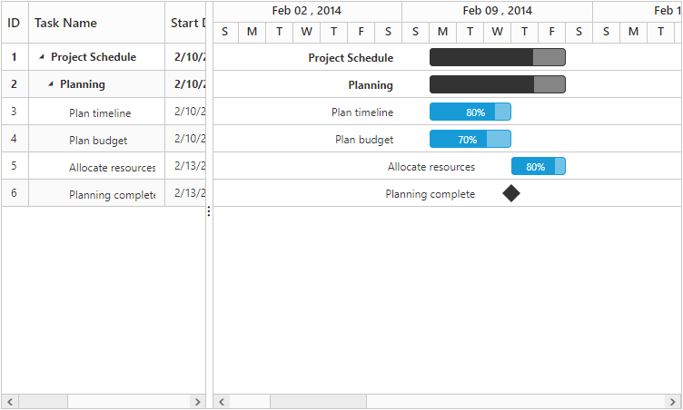
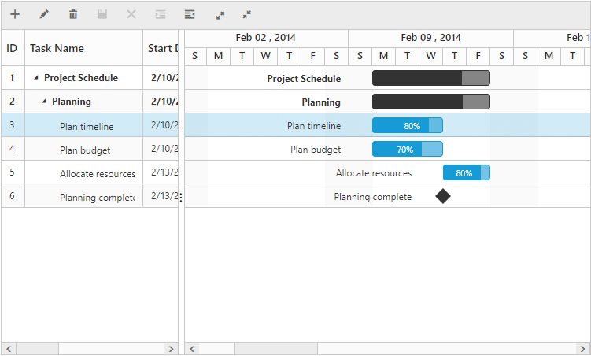
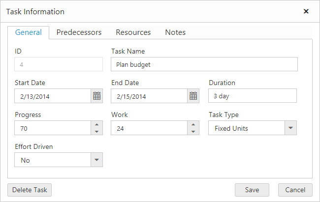
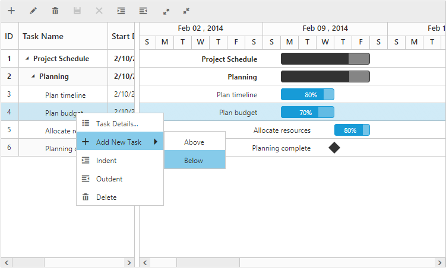
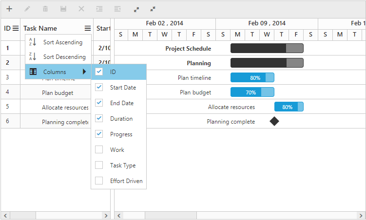
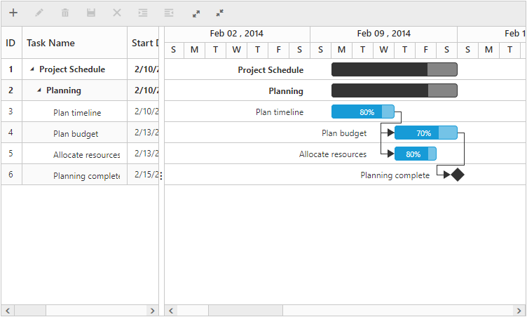
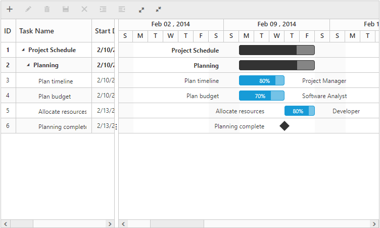
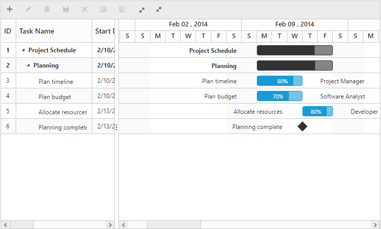

# Create your first Gantt sample in EmberJS

## Getting started with Ember CLI

* To quick start with create a new Ember CLI application run the below commands in the command prompt.



> ember new EmberGantt    // Create new Ember CLI app as 'EmberGantt'

> cd EmberGantt



* Add syncfusion-ember in `package.json` to add the Syncfusion Ember add-on into your application `EmberGantt`.



    "devDependencies": {
        ...
	    "syncfusion-ember":"*" //To install the latest version
    }



* Disable EXTEND_PROTOTYPES option in the environment.js file under config folder to prevent on function prototype extension in our controls events.


    EmberENV: {
        FEATURES: {
            // Here you can enable experimental features on an ember canary build
            // e.g. 'with-controller': true
        },
        EXTEND_PROTOTYPES: false,
    },


* Open the command prompt in the root folder and run the command `npm install` to download the dependent files in node-modules.

## Configure Syncfusion source and theme reference

* Copy the files `ej.web.all.min` and `jsrender.min` into the `vendor` folder. Import the same into the application using below code in `ember-cli-build.js`.


    module.exports = function(defaults) {
        var app = new EmberApp(defaults, {
            // Add options here
        });
        app.import('vendor/ej.web.all.min.js');
        app.import('vendor/jsrender.min.js');
        return app.toTree();
    };


* Create the folder `scripts` and `content` in public folder and copy JavaScript and CSS files from `/scripts` and `/content` folder which is in JavaScript samples location `(Click explore button from the Javascript Dashboard)` into created folders. And include the necessary file references in Index page which is in `app` folder of the Ember application.


<head>
   <link rel="stylesheet" href="{{rootURL}}content/ejthemes/default-theme/ej.web.all.min.css">
</head>
<body>            
</body>


## Configure the routes for the Router

* Use the below commands in the command prompt for generate routing to create template `default.hbs` file in templates folder and router `default.js` file in routes folder. It also add the routing content in `router.js`.



 > ember generate route gantt/default    // Defining routes



## Create Gantt sample in Ember CLI Application

* Use below code in `default.hbs` in templates folder to render the Gantt.

	
		
    {{ej-gantt id="GanttDefault" 
                e-dataSource=model.dataSource 
                e-childMapping="subtasks"
                e-treeColumnIndex= 1
                e-isResponsive=true
                e-taskIdMapping="taskID"
                e-taskNameMapping="taskName"
                e-scheduleStartDate=model.scheduleStartDate
                e-scheduleEndDate=model.scheduleEndDate           
                e-startDateMapping="startDate"
                e-endDateMapping="endDate"
                e-durationMapping="duration"
                e-progressMapping="progress"
                e-allowGanttChartEditing=false
                }}
		


* Use the below code in `default.js` in routes folder to bind the model to the Gantt.


import Route from '@ember/routing/route';
let defaultGanttData = [{
        taskID: 1,
        taskName: "Project Schedule",
        startDate: new Date( "02/03/2014"),
        endDate: new Date( "03/07/2014"),
        subtasks: [
            {
            taskID: 1,
            taskName: "Project Schedule",
            startDate: new Date( "02/10/2014"),
            endDate: new Date( "03/12/2014"),
            subtasks: [
             {
                taskID: 2,
                taskName: "Planning",
                startDate: new Date( "02/10/2014"),
                endDate: new Date( "02/12/2014"),
                subtasks: [
                    { taskID: 3, taskName: "Plan timeline", startDate: new Date( "02/10/2014"), endDate: new Date( "02/12/2014"), duration: 3, progress: "80", resourceInfo: [1] },
                    { taskID: 4, taskName: "Plan budget", startDate: new Date( "02/10/2014"), endDate: new Date( "02/12/2014"), duration: 3, progress: "70", predecessor: "3FS", resourceInfo: [1] },
                    { taskID: 5, taskName: "Allocate resources", startDate: new Date( "02/13/2014"), endDate: new Date( "02/14/2014"), duration: 2, progress: "80", predecessor: "4SS", resourceInfo: [1] },
                    { taskID: 6, taskName: "Planning complete", startDate: new Date( "02/13/2014"), endDate: new Date( "02/13/2014"), duration: 0, predecessor: "4FS" }
                ]
            }]
}];

export default Route.extend({
    model() {
        return {
            dataSource: defaultGanttData,
            scheduleStartDate: new Date("02/01/2014"),
            scheduleEndDate: new Date("04/09/2014"),
        }
    }
});


A Gantt Control is created as shown in the following screen shot.

## Enable Toolbar

Gantt control contains toolbar options to edit, search, expand or collapse all records, indent, outdent, delete, and add a task. You can enable toolbar using the [`toolbarSettings`](http://help.syncfusion.com/js/api/ejgantt#members:toolbarsettings "toolbarSettings") property.



{{ej-gantt id="GanttControl"  
//...
    e-toolbarSettings=model.toolbarSettings
    e-editSettings=model.editSettings
    }}




export default Ember.Route.extend({
    model() {
        return {
            editSettings: {
                allowEditing: true,
                allowAdding: true,
                allowDeleting: true,
                allowIndent: true,
                editMode: "cellEditing"
            },
            toolbarSettings: {
                showToolbar: true,
                toolbarItems: [
                    window.ej.Gantt.ToolbarItems.Add,
                    window.ej.Gantt.ToolbarItems.Edit,
                    window.ej.Gantt.ToolbarItems.Delete,
                    window.ej.Gantt.ToolbarItems.Update,
                    window.ej.Gantt.ToolbarItems.Cancel,
                    window.ej.Gantt.ToolbarItems.Indent,
                    window.ej.Gantt.ToolbarItems.Outdent,
                    window.ej.Gantt.ToolbarItems.ExpandAll,
                    window.ej.Gantt.ToolbarItems.CollapseAll
                ]
            },
        }
    }
});



The following screen shot displays a Tool bar in Gantt chart control:

N>  Add, edit, delete, indent and outdent options are enabled when enabling the allowEditing, allowAdding, allowDelete, allowIndent and allowOutdent properties in the edit Options.

## Enable Sorting

The Gantt control has sorting functionality to arrange the tasks in ascending or descending order based on a particular column.

### Multicolumn Sorting

Enable the multicolumn sorting in Gantt by setting [`allowMultiSorting`](http://help.syncfusion.com/js/api/ejgantt#members:allowmultisorting "allowMultiSorting") as `true`. You can sort multiple columns in Gantt, by selecting the desired column header while holding the `CTRL` key.



{{ej-gantt id="GanttControl" 
//...
           e-allowMultiSorting=true
}}



## Enable Editing

You can enable editing using [`editSettings`](http://help.syncfusion.com/js/api/ejgantt#members:editsettings "editSettings") and [`allowGanttChartEditing`](http://help.syncfusion.com/js/api/ejgantt#members:allowganttchartediting "allowGanttChartEditing") options.

### Cell Editing

Modify the task details through the grid cell editing by setting the [`editMode`](http://help.syncfusion.com/js/api/ejgantt#members:editsettings-editmode "editSettings.editMode") as [`cellEditing`](http://help.syncfusion.com/js/api/ejgantt#members:editsettings-editmode "cellEditing").

### Normal Editing

Modify the task details through the edit dialog by setting the [`editMode`](http://help.syncfusion.com/js/api/ejgantt#members:editsettings-editmode "editSettings.editMode") as [`normal`](http://help.syncfusion.com/js/api/ejgantt#members:editsettings-editmode "normal").

### Taskbar Editing

Modify the task details through user interaction such as resizing and dragging the taskbar.

### Predecessor Editing

Modify the predecessor details of a task using mouse interactions by setting [`allowGanttChartEditing`](http://help.syncfusion.com/js/api/ejgantt#members:allowganttchartediting "allowGanttChartEditing") as `true` and setting the value for `predecessorMapping` property.



{{ej-gantt id="GanttControl" 
//...
           e-allowGanttChartEditing=true
           e-predecessorMapping="Predecessor"
           e-editSettings=model.editsettings
}}





export default Ember.Route.extend({
    model() {
        return {
            editSettings: {
                allowEditing: true,
                allowAdding: true,
                allowDeleting: true,
                allowIndent: true,
                editMode: "cellEditing"
            },            
        }
    }
});


The following screen shot displays a Gantt chart control with Enable Editing options.

N>  Both cellEditing and normal editing operations are performed through double-click or single click action that can be defined by editSettings.beginEditAction property.

## Enable Context Menu

You can enable the context menu in Gantt, by setting the [`enableContextMenu`](http://help.syncfusion.com/js/api/ejgantt#members:enablecontextmenu "enableContextMenu") as `true`.



{{ej-gantt id="GanttControl" 
//...
   e-enableContextMenu=true
}}



The following screen shot displays Gantt chart in which Context menu option is enabled:

## Enable Column Menu

You can enable the column menu in Gantt, by setting the [`showColumnChooser`](http://help.syncfusion.com/js/api/ejgantt#members:showcolumnchooser "showColumnChooser") as `true`.



{{ej-gantt id="GanttControl" 
//...
    e-showColumnChooser=true
}}



The following screen shot displays Gantt chart in which column chooser option is enabled:

## Provide tasks relationship

In Gantt, you have the predecessor support to show the relationship between two different tasks.

* **Start to Start (SS)** - You cannot start a task until the other task also starts.
* **Start to Finish (SF)** - You cannot finish a task until the other task finishes.
* **Finish to Start (FS)** - You cannot start a task until the other task completes.
* **Finish to Finish (FF)** - You cannot finish a task until the other task completes.

You can show the relationship in tasks, by using the [`predecessorMapping`](http://help.syncfusion.com/js/api/ejgantt#members:predecessormapping "predecessorsMapping")

, as shown in the following code example.



{{ej-gantt id="GanttControl" 
//...
    e-predecessorMapping="Predecessor"
}}



The following screenshot displays the relationship between tasks.

## Provide Resources

In Gantt control, you can display and assign the resource for each task. Create a collection of `JSON` object, which contains id and name of the resource and assign it to [`resources`](http://help.syncfusion.com/js/api/ejgantt#members:resources "resources") property. Then, specify the field name for id and name of the resource in the resource collection to [`resourceIdMapping`](http://help.syncfusion.com/js/api/ejgantt#members:resourceidmapping "resourceIdMapping") and [`resourceNameMapping`](http://help.syncfusion.com/js/api/ejgantt#members:resourcenamemapping "resourceNameMapping") options. The name of the field, which contains the actual resources assigned for a particular task in the `dataSource` is specified using [`resourceInfoMapping`](http://help.syncfusion.com/js/api/ejgantt#members:resourceinfomapping "resourceInfoMapping").

1.Create the resource collection to be displayed in ejGantt



import Ember from 'ember';

let projectResources =[{
        resourceId: 1,
        resourceName: "Project Manager"
    },{
        resourceId: 2,
        resourceName: "Software Analyst"
    },{
        resourceId: 3,
        resourceName: "Developer"
    },{
        resourceId: 4,
        resourceName: "Testing Engineer"
    }];
export default Ember.Route.extend({
   model() {
       return {
            resources : projectResources
        }
    }



2.Initialize the Gantt with resources created in last step. 



{{ej-gantt id="GanttControl" 
//...
    e-resourceInfoMapping="resourceId"
    e-resourceNameMapping="resourceName"
    e-resourceIdMapping="resourceId"
    e-resources= model.resources"
}}



The following screenshot displays resource allocation for tasks in Gantt chart.

By following these steps, you have learned how to provide data source to Gantt chart, how to configure Gantt to set task relationships, assign resources for each task, and add toolbar with necessary buttons.

## Highlight Weekend

In Gantt, you can on or off weekends highlighting by setting the [`highlightWeekends`](https://help.syncfusion.com/api/js/ejgantt#members:highlightweekends "highlightWeekEnds")

 as `true` or `false`.



{{ej-gantt id="GanttControl" 
//...
    e-highlightWeekends=true
}}



The following screen shot displays Gantt chart in which highlight weekends is disabled:

## Build or Run the Ember CLI application.

* To Build the Ember CLI application using the command `ember build` which builds the application and creates the `dist` folder. Now you can host the `dist` folder in IIS.

* To Run the Ember CLI application using the command `ember server` which builds the application and creates the `dist` folder. However it hosts the application in the url `http://localhost:4200`.

* Open the browser and navigates to `http://localhost:4200/gantt/default`.

