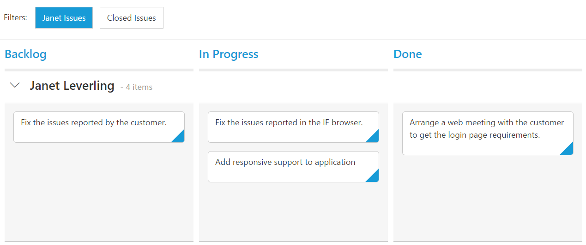

# Getting Started

Before we start with the Kanban, please refer [`this page`](https://help.syncfusion.com/emberjs/getting-started) for general information regarding integrating Syncfusion widget's.

## Adding Javascript and CSS reference

To render the Kanban control, the following list of external dependencies are needed.

* [`jsRender`](https://github.com/borismoore/jsrender) - to render the templates

Refer to the internal dependencies in the following table.

<table>
   <tr>
      <th>
         <b>Files</b>
      </th>
      <th>
         <b>Description/Usage </b>
      </th>
   </tr>
   <tr>
      <td>
         ej.core.min.js
      </td>
      <td>
        It is referred always before using all the JS controls.
      </td>
   </tr>
   <tr>
      <td>
         ej.data.min.js
      </td>
      <td>
         Used to handle data operation and is used while binding data to the JS controls.
      </td>
   </tr>
   <tr>
      <td>
        ej.touch.min.js 
      </td>
      <td>
          It is referred when using touch functionalities in Kanban.
      </td>
   </tr>
    <tr>
      <td>
        ej.draggable.min.js 
      </td>
      <td>
          It is referred when using drag and drop in Kanban.
      </td>
   </tr>
   <tr>
      <td>
        ej.kanban.min.js
      </td>
      <td>
        The Kanban’s main file.
      </td>
   </tr>
   <tr>
      <td>
        ej.globalize.min.js
      </td>
      <td>
       It is referred when using localization in Kanban.
      </td>
   </tr>
   <tr>
      <td>
         ej.scroller.min.js
      </td>
      <td>
         It is referred when scrolling is used in the Kanban. 
      </td>
   </tr>
   <tr>
      <td>
         ej.waitingpopup.min.js
      </td>
      <td>
        It is referred when waiting popup used.
      </td>
   </tr>
   <tr>
      <td>
        ej.dropdownlist.min.js
      </td>
      <td rowspan = "5">
         These files are used while enable the Editing feature in the Kanban.
      </td>
   </tr>
   <tr>
      <td>
         ej.dialog.min.js
      </td>
   </tr>
   <tr>
      <td>
        ej.button.min.js
      </td>
   </tr>
   <tr>
      <td>
         ej.datepicker.min.js
      </td>
   </tr>
   <tr>
      <td>
         ej.datetimepicker.min.js
      </td>
   </tr>
   <tr>
      <td>
         ej.editor.min.js
      </td>
   </tr>
   <tr>
      <td>
        ej.toolbar.min.js
      </td>
      <td>
        These files are used while enable the Filtering feature in the Kanban.
      </td>
   </tr>
    <tr>
      <td>
        ej.menu.min.js
      </td>
      <td rowspan = "2">
         These files are used while enable the context menu feature in the Kanban.
      </td>
   </tr>
   <tr>
      <td>
         ej.checkbox.min.js
      </td>
   </tr>
   <tr>
      <td>
        ej.rte.min.js
      </td>
      <td>
        These files are used while using the cell edit type as RTE in the Kanban.
      </td>
   </tr>
</table>

N> Kanban uses one or more script files, therefore refer the `ej.web.all.min.js` (which encapsulates all the `ej` controls and frameworks in a single file) in the application instead of referring all the above specified internal dependencies.

To get the real appearance of the Kanban, the dependent CSS file `ej.web.all.min.css` (which includes styles of all the widgets) should also needs to be referred.

## Create a Kanban

* Open the command prompt in the folder [ember-app](https://help.syncfusion.com/emberjs/getting-started#create-a-simple-ember-application) or the folder in which the application is created.

* Use the command [ember generate route kanban/default](https://guides.emberjs.com/v2.11.0/routing/defining-your-routes/) to create template `default.hbs` file in templates folder and router `default.js` file in routes folder. It also add the routing content in `router.js`.

* Use below code in `default.hbs` in templates folder to render the Kanban.



	
	{{ej-kanban id="Kanban" e-columns=model.columns }}
    



* Use the below code in `default.js` in routes folder to bind the model to the Kanban.



import Ember from 'ember';

export default Ember.Route.extend({
     model() {
        return {
            columns: [
                { headerText: "Backlog"},
                { headerText: "In Progress" },
                { headerText: "Done"}
            ],
        }
    }
});



## Running the application

* To run the application, execute below command.


 
 ember serve



* Browse to [http://localhost:4200](http://localhost:4200) to see the application. And navigate to Kanban sample. The component is rendered as like the below screenshot. You can make changes in the code found under app folder and the browser should auto-refresh itself while you save files. 

## Data Binding

`Data binding` in the Kanban is achieved by using the [`ej.DataManager`](https://help.syncfusion.com/js/datamanager/overview) that supports both RESTful JSON data services binding and local JSON array binding. To set the data source to Kanban, the `dataSource` property is assigned with the instance of the `ej.DataManger`. 



    
	{{ej-kanban id="Kanban" e-dataSource=model.dataSource e-columns=model.columns }}
    

   




import Ember from 'ember';

export default Ember.Route.extend({
     model() {
		  var kanbanData = [
                 { Id: 1, Status: "Open", Summary: "Analyze the new requirements gathered from the customer.", Type: "Story", Priority: "Low", Tags: "Analyze,Customer", Estimate: 3.5, Assignee: "Andrew Fuller", ImageUrl: "/images/kanban/1.png", RankId: 1 },
				 { Id: 2, Status: "InProgress", Summary: "Improve application performance", Type: "Improvement", Priority: "Normal", Tags: "Improvement", Estimate: 6, Assignee: "Andrew Fuller", ImageUrl: "/images/kanban/2.png", RankId: 1 },
				 { Id: 3, Status: "Open", Summary: "Arrange a web meeting with the customer to get new requirements.", Type: "Others", Priority: "Critical", Tags: "Meeting", Estimate: 5.5, Assignee: "Janet", ImageUrl: "/images/kanban/3.png", RankId: 2 },
				 { Id: 4, Status: "InProgress", Summary: "Fix the issues reported in the IE browser.", Type: "Bug", Priority: "Release Breaker", Tags: "IE", Estimate: 2.5, Assignee: "Janet", ImageUrl: "/images/kanban/3.png", RankId: 2 },
				 { Id: 5, Status: "Testing", Summary: "Fix the issues reported by the customer.", Type: "Bug", Priority: "Low", Tags: "Customer", Estimate: "3.5", Assignee: "Andrew Fuller", ImageUrl: "/images/kanban/5.png", RankId: 1 },
				 { Id: 6, Status: "Close", Summary: "Arrange a web meeting with the customer to get the login page requirements.", Type: "Others", Priority: "Low", Tags: "Meeting", Estimate: 2, Assignee: "Janet", ImageUrl: "/images/kanban/6.png", RankId: 1 },
				 { Id: 7, Status: "Validate", Summary: "Validate new requirements", Type: "Improvement", Priority: "Low", Tags: "Validation", Estimate: 1.5, Assignee: "Janet", ImageUrl: "/images/kanban/7.png", RankId: 1 },
				 { Id: 8, Status: "Close", Summary: "Login page validation", Type: "Story", Priority: "Release Breaker", Tags: "Validation,Fix", Estimate: 2.5, Assignee: "Andrew Fuller", ImageUrl: "/images/kanban/8.png", RankId: 2 },
				 { Id: 9, Status: "Testing", Summary: "Fix the issues reported in Safari browser.", Type: "Bug", Priority: "Release Breaker", Tags: "Fix,Safari", Estimate: 1.5, Assignee: "Janet", ImageUrl: "/images/kanban/1.png", RankId: 2 },
				 { Id: 10, Status: "Close", Summary: "Test the application in the IE browser.", Type: "Story", Priority: "Low", Tags: "Testing,IE", Estimate: 5.5, Assignee: "Andrew Fuller", ImageUrl: "/images/kanban/4.png", RankId: 3 }
		      ];
        return {
			dataSource: kanbanData,
            columns: [
                { headerText: "Backlog"},
                { headerText: "In Progress" },
                { headerText: "Done"}
            ],
        }
    }
});
   


N>  ODataAdaptor is the default adaptor used within DataManager. While binding to other web services, proper [`data adaptor`](https://help.syncfusion.com/js/datamanager/data-adaptors) needs to be set for `adaptor` option of DataManager.

## Mapping Values

In order to display cards in Kanban control, you need to map the database fields to Kanban cards and columns. The required mapping field are listed as follows

* `keyField` - Map the column name to use as `key` values to columns.
* `columns` -  Map the corresponding `key` values of `keyField` column to each columns
* `fields.content` - Map the column name to use as content to cards.
* `fields.primaryKey` - Map the column name to use as primary Key.



    
	{{ej-kanban id="Kanban" e-dataSource=model.dataSource e-columns=model.columns e-keyField=model.keyField e-fields=model.fields }}
    

 



import Ember from 'ember';

export default Ember.Route.extend({
     model() {
		  var kanbanData = [
                 { Id: 1, Status: "Open", Summary: "Analyze the new requirements gathered from the customer.", Type: "Story", Priority: "Low", Tags: "Analyze,Customer", Estimate: 3.5, Assignee: "Andrew Fuller", ImageUrl: "/images/kanban/1.png", RankId: 1 },
				 { Id: 2, Status: "InProgress", Summary: "Improve application performance", Type: "Improvement", Priority: "Normal", Tags: "Improvement", Estimate: 6, Assignee: "Andrew Fuller", ImageUrl: "/images/kanban/2.png", RankId: 1 },
				 { Id: 3, Status: "Open", Summary: "Arrange a web meeting with the customer to get new requirements.", Type: "Others", Priority: "Critical", Tags: "Meeting", Estimate: 5.5, Assignee: "Janet", ImageUrl: "/images/kanban/3.png", RankId: 2 },
				 { Id: 4, Status: "InProgress", Summary: "Fix the issues reported in the IE browser.", Type: "Bug", Priority: "Release Breaker", Tags: "IE", Estimate: 2.5, Assignee: "Janet", ImageUrl: "/images/kanban/3.png", RankId: 2 },
				 { Id: 5, Status: "Testing", Summary: "Fix the issues reported by the customer.", Type: "Bug", Priority: "Low", Tags: "Customer", Estimate: "3.5", Assignee: "Andrew Fuller", ImageUrl: "/images/kanban/5.png", RankId: 1 },
				 { Id: 6, Status: "Close", Summary: "Arrange a web meeting with the customer to get the login page requirements.", Type: "Others", Priority: "Low", Tags: "Meeting", Estimate: 2, Assignee: "Janet", ImageUrl: "/images/kanban/6.png", RankId: 1 },
				 { Id: 7, Status: "Validate", Summary: "Validate new requirements", Type: "Improvement", Priority: "Low", Tags: "Validation", Estimate: 1.5, Assignee: "Janet", ImageUrl: "/images/kanban/7.png", RankId: 1 },
				 { Id: 8, Status: "Close", Summary: "Login page validation", Type: "Story", Priority: "Release Breaker", Tags: "Validation,Fix", Estimate: 2.5, Assignee: "Andrew Fuller", ImageUrl: "/images/kanban/8.png", RankId: 2 },
				 { Id: 9, Status: "Testing", Summary: "Fix the issues reported in Safari browser.", Type: "Bug", Priority: "Release Breaker", Tags: "Fix,Safari", Estimate: 1.5, Assignee: "Janet", ImageUrl: "/images/kanban/1.png", RankId: 2 },
				 { Id: 10, Status: "Close", Summary: "Test the application in the IE browser.", Type: "Story", Priority: "Low", Tags: "Testing,IE", Estimate: 5.5, Assignee: "Andrew Fuller", ImageUrl: "/images/kanban/4.png", RankId: 3 }
		      ];
        return {
			dataSource: kanbanData,
            columns: [
                { headerText: "Backlog", key: "Open"},
                { headerText: "In Progress", key: "InProgress"},
                { headerText: "Done", key: "Close"}
            ],
			keyField: "Status",
			fields: {
				content: "Summary",
				primaryKey: "Id"
			}
        }
    }
});
  
 

N>  `fields.primaryKey` field is mandatory for “Drag and Drop” ,”Selection” and “Editing” Features.

## Enable Swimlane

`Swimlane` can be enabled by mapping the `fields.swimlaneKey` to appropriate column name in `dataSource`. This enables the grouping of the cards based on the mapped column values.



    
	{{ej-kanban id="Kanban" e-dataSource=model.dataSource e-columns=model.columns e-keyField=model.keyField e-fields=model.fields }}
    

 



import Ember from 'ember';

export default Ember.Route.extend({
     model() {
		  var kanbanData = [
                 { Id: 1, Status: "Open", Summary: "Analyze the new requirements gathered from the customer.", Type: "Story", Priority: "Low", Tags: "Analyze,Customer", Estimate: 3.5, Assignee: "Andrew Fuller", ImageUrl: "/images/kanban/1.png", RankId: 1 },
				 { Id: 2, Status: "InProgress", Summary: "Improve application performance", Type: "Improvement", Priority: "Normal", Tags: "Improvement", Estimate: 6, Assignee: "Andrew Fuller", ImageUrl: "/images/kanban/2.png", RankId: 1 },
				 { Id: 3, Status: "Open", Summary: "Arrange a web meeting with the customer to get new requirements.", Type: "Others", Priority: "Critical", Tags: "Meeting", Estimate: 5.5, Assignee: "Janet", ImageUrl: "/images/kanban/3.png", RankId: 2 },
				 { Id: 4, Status: "InProgress", Summary: "Fix the issues reported in the IE browser.", Type: "Bug", Priority: "Release Breaker", Tags: "IE", Estimate: 2.5, Assignee: "Janet", ImageUrl: "/images/kanban/3.png", RankId: 2 },
				 { Id: 5, Status: "Testing", Summary: "Fix the issues reported by the customer.", Type: "Bug", Priority: "Low", Tags: "Customer", Estimate: "3.5", Assignee: "Andrew Fuller", ImageUrl: "/images/kanban/5.png", RankId: 1 },
				 { Id: 6, Status: "Close", Summary: "Arrange a web meeting with the customer to get the login page requirements.", Type: "Others", Priority: "Low", Tags: "Meeting", Estimate: 2, Assignee: "Janet", ImageUrl: "/images/kanban/6.png", RankId: 1 },
				 { Id: 7, Status: "Validate", Summary: "Validate new requirements", Type: "Improvement", Priority: "Low", Tags: "Validation", Estimate: 1.5, Assignee: "Janet", ImageUrl: "/images/kanban/7.png", RankId: 1 },
				 { Id: 8, Status: "Close", Summary: "Login page validation", Type: "Story", Priority: "Release Breaker", Tags: "Validation,Fix", Estimate: 2.5, Assignee: "Andrew Fuller", ImageUrl: "/images/kanban/8.png", RankId: 2 },
				 { Id: 9, Status: "Testing", Summary: "Fix the issues reported in Safari browser.", Type: "Bug", Priority: "Release Breaker", Tags: "Fix,Safari", Estimate: 1.5, Assignee: "Janet", ImageUrl: "/images/kanban/1.png", RankId: 2 },
				 { Id: 10, Status: "Close", Summary: "Test the application in the IE browser.", Type: "Story", Priority: "Low", Tags: "Testing,IE", Estimate: 5.5, Assignee: "Andrew Fuller", ImageUrl: "/images/kanban/4.png", RankId: 3 }
		      ];
        return {
			dataSource: kanbanData,
            columns: [
                { headerText: "Backlog", key: "Open"},
                { headerText: "In Progress", key: "InProgress"},
                { headerText: "Done", key: "Close"}
            ],
			keyField: "Status",
			fields: {
				content: "Summary",
				primaryKey: "Id",
				swimlaneKey: "Assignee"
			}
        }
    }
});

 

## Adding Filters

Filters allows to filter the collection of cards from `dataSource` which meets the predefined `query` in the filters collection. To enable filtering, define `filterSettings` collection with display `text` and [`ej.Query`](https://help.syncfusion.com/js/datamanager/query).
 


    
	{{ej-kanban id="Kanban" e-dataSource=model.dataSource e-columns=model.columns e-keyField=model.keyField e-fields=model.fields e-filterSettings=model.filterSettings }}
    

 



import Ember from 'ember';

export default Ember.Route.extend({
     model() {
		  var kanbanData = [
                 { Id: 1, Status: "Open", Summary: "Analyze the new requirements gathered from the customer.", Type: "Story", Priority: "Low", Tags: "Analyze,Customer", Estimate: 3.5, Assignee: "Andrew Fuller", ImageUrl: "/images/kanban/1.png", RankId: 1 },
				 { Id: 2, Status: "InProgress", Summary: "Improve application performance", Type: "Improvement", Priority: "Normal", Tags: "Improvement", Estimate: 6, Assignee: "Andrew Fuller", ImageUrl: "/images/kanban/2.png", RankId: 1 },
				 { Id: 3, Status: "Open", Summary: "Arrange a web meeting with the customer to get new requirements.", Type: "Others", Priority: "Critical", Tags: "Meeting", Estimate: 5.5, Assignee: "Janet", ImageUrl: "/images/kanban/3.png", RankId: 2 },
				 { Id: 4, Status: "InProgress", Summary: "Fix the issues reported in the IE browser.", Type: "Bug", Priority: "Release Breaker", Tags: "IE", Estimate: 2.5, Assignee: "Janet", ImageUrl: "/images/kanban/3.png", RankId: 2 },
				 { Id: 5, Status: "Testing", Summary: "Fix the issues reported by the customer.", Type: "Bug", Priority: "Low", Tags: "Customer", Estimate: "3.5", Assignee: "Andrew Fuller", ImageUrl: "/images/kanban/5.png", RankId: 1 },
				 { Id: 6, Status: "Close", Summary: "Arrange a web meeting with the customer to get the login page requirements.", Type: "Others", Priority: "Low", Tags: "Meeting", Estimate: 2, Assignee: "Janet", ImageUrl: "/images/kanban/6.png", RankId: 1 },
				 { Id: 7, Status: "Validate", Summary: "Validate new requirements", Type: "Improvement", Priority: "Low", Tags: "Validation", Estimate: 1.5, Assignee: "Janet", ImageUrl: "/images/kanban/7.png", RankId: 1 },
				 { Id: 8, Status: "Close", Summary: "Login page validation", Type: "Story", Priority: "Release Breaker", Tags: "Validation,Fix", Estimate: 2.5, Assignee: "Andrew Fuller", ImageUrl: "/images/kanban/8.png", RankId: 2 },
				 { Id: 9, Status: "Testing", Summary: "Fix the issues reported in Safari browser.", Type: "Bug", Priority: "Release Breaker", Tags: "Fix,Safari", Estimate: 1.5, Assignee: "Janet", ImageUrl: "/images/kanban/1.png", RankId: 2 },
				 { Id: 10, Status: "Close", Summary: "Test the application in the IE browser.", Type: "Story", Priority: "Low", Tags: "Testing,IE", Estimate: 5.5, Assignee: "Andrew Fuller", ImageUrl: "/images/kanban/4.png", RankId: 3 }
		      ];
        return {
			dataSource: kanbanData,
            columns: [
                { headerText: "Backlog", key: "Open"},
                { headerText: "In Progress", key: "InProgress"},
                { headerText: "Done", key: "Close"}
            ],
			keyField: "Status",
			fields: {
				content: "Summary",
				primaryKey: "Id",
				swimlaneKey: "Assignee"
			},
			filterSettings: [
                { text: "Janet Issues", query: new ej.Query().where("Assignee", "equal", "Janet") },
                { text: "Closed Issues", query: new ej.Query().where("Status", "equal", "Close") }
            ]
        }
    }
});

 

