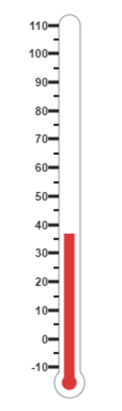

#Getting Started

Before we start with the LinearGauge, please refer [this page](https://help.syncfusion.com/emberjs/overview) for general information regarding integrating Syncfusion widget’s.

## Adding JavaScript and CSS Reference

To render the LinearGauge control, the following list of external dependencies are needed, 

* [jsRender](https://github.com/borismoore/jsrender) - to render the templates

The other required internal dependencies are tabulated below,

<table>
   <tr>
      <th>
         <b>Files</b>
      </th>
      <th>
         <b>Description/Usage </b>
      </th>
   </tr>
   <tr>
      <td>
         ej.core.min.js
      </td>
      <td>
        It is referred always before using all the JS controls.
      </td>
   </tr>
   <tr>
      <td>
         ej.data.min.js
      </td>
      <td>
         Used to handle data operation and is used while binding data to the JS controls.
      </td>
   </tr>
   <tr>
      <td>
        ej.lineargauge.min.js
      </td>
      <td>
        LinearGauge core script file which includes LinearGauge related scripts files.
      </td>
   </tr>
   <tr>
      <td>
        excanvas.min.js
      </td>
      <td>
        
      </td>
   </tr>
</table>

Refer the `ej.web.all.min.js` which encapsulates all the `ej` controls and frameworks in a single file.

## Control Initialization

* Open the command prompt in the folder [ember-app](https://help.syncfusion.com/emberjs/getting-started#create-a-simple-ember-application) or the folder in which the application is created.

* Use the command [ember generate route lineargauge/default](https://guides.emberjs.com/v2.11.0/routing/defining-your-routes/)to create template `default.hbs` file in templates folder and router `default.js` file in routes folder. It also add the routing content in `router.js`.

* Use below code in `default.hbs` in templates folder to render the lineargauge.



	{{ej-lineargauge id="LinearGuage"}}



* Use the below code in `default.js` in routes folder to bind the model to the lineargauge.



	import Ember from 'ember';

    export default Ember.Route.extend({
      model() {
         return {
         }
      }
    });



## Running the application

* To run the application, execute below command.


 
 ember serve



* Browse to [http://localhost:4200](http://localhost:4200) to see the application. And navigate to lineargauge sample. The component is rendered as like the below screenshot. You can make changes in the code found under app folder and the browser should auto-refresh itself while you save files. 

## Set Height and Width values

* Basic attributes of each canvas elements are height and width properties. 

* You can set the height and width of the gauge as shown in the following code example.



	{{ej-lineargauge id="LinearGuage" e-width=model.width e-height=model.height}}





	import Ember from 'ember';

    export default Ember.Route.extend({
      model() {
         return {
             height: 550,
             width: 500,
         }
      }
    });



On executing the above code sample renders a default **Linear Gauge** with height and width.

## Set animate option and Label Color

* You can draw the Thermometer with Label color and set animate property to _True_.  

* Initially set the animate property to _False_ to avoid unwanted script loads.



	{{ej-lineargauge id="LinearGuage" e-width=model.width e-height=model.height e-labelColor=model.labelColor e-enableAnimation=model.enableAnimation}}





	import Ember from 'ember';

    export default Ember.Route.extend({
      model() {
         return {
             height: 550,
             width: 500,
             labelColor: "#8c8c8c",
             enableAnimation: false,
         }
      }
    });



On executing the above code sample renders a customized **Linear Gauge** as follows.

## Provide scale values

* You can change the Scale Style of Thermometer using **type** property.

* You can set the Minimum temperature up to -10 and maximum body temperature up to 110. 

* You can set the Minimum scale value as -10 and maximum value as 110.

* You can set the Location values such as vertical and horizontal position in the thermometer.

* You can set the thermometer height using **length** property.

* You can set the Minor Interval value as 5 to get the exact temperature of the patient.



	{{ej-lineargauge id="LinearGuage" e-width=model.width e-height=model.height e-enableAnimation=model.enableAnimation
				e-scales=model.scales }}





	import Ember from 'ember';

    export default Ember.Route.extend({
      model() {
         return {
            height: 550,
            width: 500,
            enableAnimation: false,
            scales: [{
                type: "thermometer",
                backgroundColor: "transparent",
                minimum: -10,
                maximum: 110,
                minorIntervalValue: 5,
                width: 20,
                position: { x: 50, y: 18 },
                length: 355,
                border: { width: 0.5 }
                //Add the pointers customization code here
                //Add the labels customization code here
                //Add the ticks customization code here
                //Add the Custom labels customization code here
            }]
         }
      }
    });



On executing the above code sample renders a customized gauge with ranges as follows.

## Add pointers data

In **Linear gauge** there are two types of pointers available such as marker pointer and bar pointer.

* **Marker pointer** displays as a pointer device which shows the actual values. In this example, there is no need to show a marker pointer in a thermometer, therefore, you can hide it by setting the **Opacity** property to ‘0’.

* **Bar pointer** displays as a mercury metal that shows the exact temperature of the person. You can set the basic properties of the bar pointer such as **width**, **distanceFromScale**, **Value** and **backgroundColor**.



	{{ej-lineargauge id="LinearGuage" e-width=model.width e-height=model.height e-enableAnimation=model.enableAnimation
				e-scales=model.scales }}





	import Ember from 'ember';

    export default Ember.Route.extend({
      model() {
         return {
            height: 550,
            width: 500,
            enableAnimation: false,
            scales: [{
                //Add the pointers customization code here
                markerPointers: [{ opacity: 0 }],
                barPointers: [{
                    width: 10,
                    distanceFromScale: -0.5,
                    value: 37,
                    backgroundColor: "#DB3738"
                }],
                //Add the labels customization code here
                //Add the ticks customization code here
                //Add the Custom labels customization code here
            }]
         }
      }
    });



On executing the above code sample renders a **Linear Gauge** with bar marker as follows.

## Add Label Customization

* You can display the label value on both sides to get temperature in different scales. For that you can add two label values in an array.

* You can use the scale labels to display the value in the gauge. You can customize the label placement, font (including its style and family) and  its distance from scale.



	{{ej-lineargauge id="LinearGuage" e-width=model.width e-height=model.height e-enableAnimation=model.enableAnimation
				e-scales=model.scales }}





	import Ember from 'ember';

    export default Ember.Route.extend({
      model() {
         return {
            height: 550,
            width: 500,
            enableAnimation: false,
            scales: [{
                //Add the pointers customization code here
                //Add the labels customization code here
                labels: [{
                    placement: "near",
                    font: {
                        size: "10px", fontFamily: "Segoe UI",
                        fontStyle: "Normal"
                    }
                },
                {
                    placement: "far",
                    distanceFromScale: { x: 10 }
                }],
                //Add the ticks customization code here
                //Add the Custom labels customization code here
            }]
         }
      }
    });



On executing the above code sample renders a customized **Linear Gauge** as follows.

## Add Ticks Details

* You can set the width and height of the major ticks greater than the Minor ticks. You can set dark background for tick Color to have a better visibility.

* You can also use four ticks for both the sides, each having two minor ticks and major ticks.



	{{ej-lineargauge id="LinearGuage" e-width=model.width e-height=model.height e-enableAnimation=model.enableAnimation
				e-scales=model.scales }}





	import Ember from 'ember';

    export default Ember.Route.extend({
      model() {
         return {
            height: 550,
            width: 500,
            enableAnimation: false,
            scales: [{
                //Add the pointers customization code here
                //Add the labels customization code here
                //Add the ticks customization code here
                ticks: [{
                    type: "majorinterval",
                    height: 8,
                    width: 1,
                    color: "#8c8c8c",
                    distanceFromScale: { y: -4 }
                }, {
                    type: "minorinterval",
                    height: 4,
                    width: 1,
                    color: "#8c8c8c",
                    distanceFromScale: { y: -4 }
                }, {
                    type: "majorinterval",
                    placement: "far",
                    height: 8,
                    width: 1,
                    color: "#8c8c8c",
                    distanceFromScale: { y: -4 }
                }, {
                    type: "minorinterval",
                    placement: "far",
                    height: 4,
                    width: 1,
                    color: "#8c8c8c",
                    distanceFromScale: { y: -4 }
                }],
                //Add the Custom labels customization code here  
            }]
         }
      }
    });



On executing the above code sample renders a **Linear Gauge** with custom labels as follows.

## Add Custom Label Details

* You can specify the texts using **Custom labels** which displays in the gauge and customize them using various properties.

* You can change the **showIndicators** property as **True** to show the custom labels.

The following code example illustrates how to use custom texts.



	{{ej-lineargauge id="LinearGuage" e-width=model.width e-height=model.height e-enableAnimation=model.enableAnimation
				e-scales=model.scales }}





	import Ember from 'ember';

    export default Ember.Route.extend({
      model() {
         return {
            height: 550,
            width: 500,
            enableAnimation: false,
            scales: [{
                showCustomLabels: true,
                //Add the pointers customization code here
                //Add the labels customization code here
                //Add the ticks customization code here
                //Add the Custom labels customization code here
                customLabels: [{
                    value: "(° C)",
                    position: { x: 44, y: 78 },
                    font: "Bold 12px Segoe UI", color: "#666666"
                }, {
                    value: "(° F)",
                    position: { x: 56, y: 78 },
                    font: "Bold 12px Segoe UI", color: "#666666"
                },
                {
                    position: { x: 51, y: 90 },
                    font: "Bold 13px Segoe UI",
                    color: "#666666"
                }] 
            }]
         }
      }
    });



On executing the above code sample renders a customized **Linear Gauge** as follows. 

## Change scale Degree to Fahrenheit

You can add a function to convert the temperature from Degrees to Fahrenheit values in the label by having index value as 1.



	{{ej-lineargauge id="LinearGuage" e-drawLabels=model.drawLabels }}





	import Ember from 'ember';

    export default Ember.Route.extend({
      model() {
         return {
           drawLabels: function(args) {
				 if (args.label.index == 1) {
				 args.style.textValue = (args.label.value * (9 / 5)) + 32;
				 args.style.font = "Normal 10px Segoe UI";
				 }
			},
         }
      }
    });



On executing the above code sample renders a **Linear Gauge** with values in Degrees and Fahrenheit as follows.

## Add Custom label for Current Value

You can add the function that displays the current temperature value in the custom label.



	{{ej-lineargauge id="LinearGuage" e-drawLabels=model.drawLabels e-drawCustomLabel=model.drawCustomLabel }}





	import Ember from 'ember';

    export default Ember.Route.extend({
      model() {
         return {
           drawLabels: function(args) {
				 if (args.label.index == 1) {
				 args.style.textValue = (args.label.value * (9 / 5)) + 32;
				 args.style.font = "Normal 10px Segoe UI";
				 }
			},
            drawCustomLabel: function(args) {
				if (args.customLabelIndex == 2) {
					var temp = args.scaleElement.barPointers[0].value;
					var fahValue = (temp * (9 / 5)) + 32;
					if (temp == -10) {
						args.style.textValue = "Very Cold Weather" + "(" + fahValue.toFixed(1) + "° F)";
					}
					else if ((temp > -10 && temp < 0) || (temp > 0 && temp < 15)) {
						args.style.textValue = "Cool Weather" + " (" + fahValue.toFixed(1) + "° F)";
					}
					else if (temp == 0) {
						args.style.textValue = "Freezing point of Water" + " (" + fahValue.toFixed(1) + "° F)";
					}
					else if (temp >= 15 && temp < 30) {
						args.style.textValue = "Room Temperature" + " (" + fahValue.toFixed(1) + "° F)";
					}
					else if (temp == 30) {
						args.style.textValue = "Beach Weather" + " (" + fahValue.toFixed(1) + "° F)";
					}
					else if (temp == 37) {
						args.style.textValue = "Body Temperature" + " (" + fahValue.toFixed(1) + "° F)";
					}
					else if (temp == 40) {
						args.style.textValue = "Hot Bath Temperature" + " (" + fahValue.toFixed(1) + "° F)";
					}
					else if (temp > 40 && temp < 100) {
						args.style.textValue = "Very Hot Temperature" + " (" + fahValue.toFixed(1) + "° F)";
					}
					else if (temp == 100) {
						args.style.textValue = "Boiling point of Water" + " (" + fahValue.toFixed(1) + "° F)";
					}
				}
			},
         }
      }
    });



The following screen shot displays a linear gauge with all the customizations discussed earlier.

