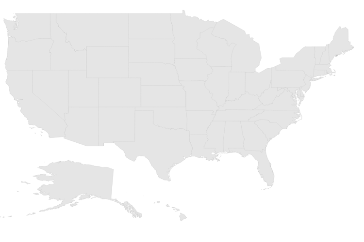
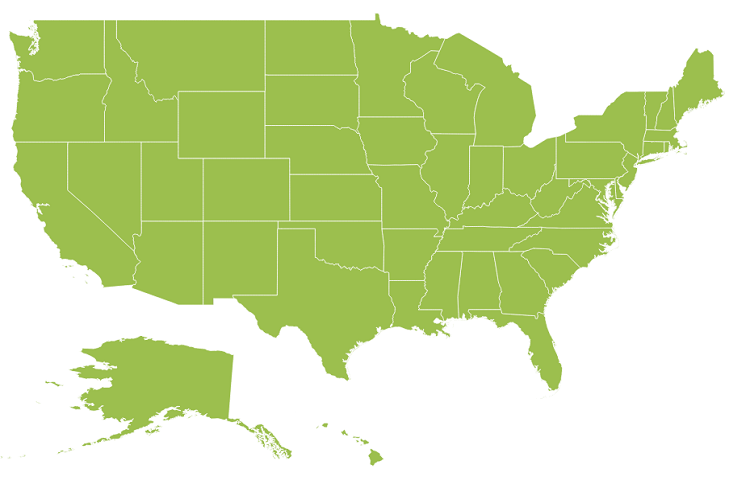
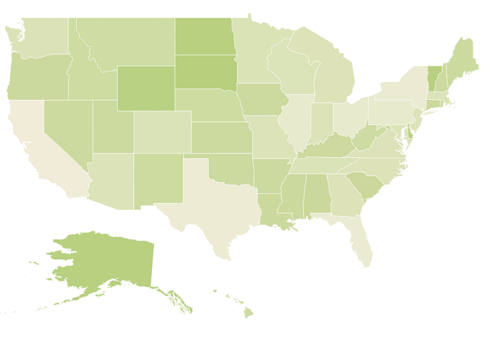
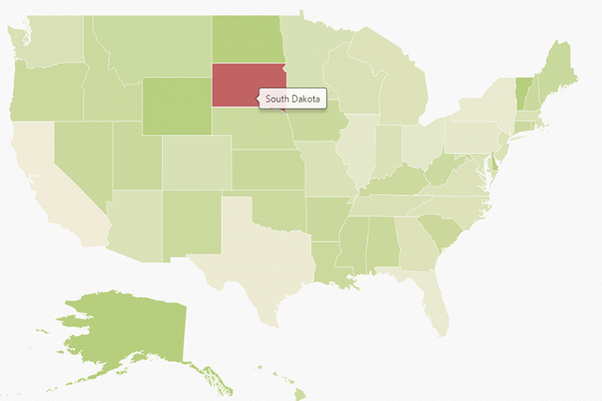
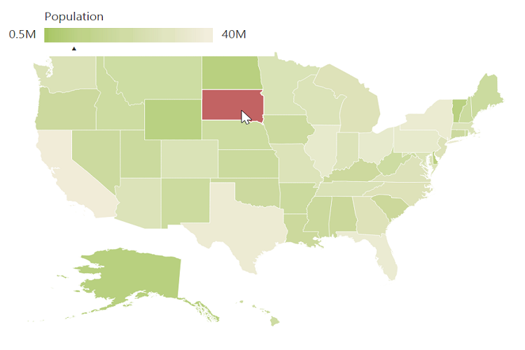

# Getting Started

Before we start with the Maps, please refer [this page](https://help.syncfusion.com/emberjs/overview) for general information regarding integrating Syncfusion widget’s.

## Adding JavaScript and CSS Reference

To render the Maps control, the following list of external dependencies are needed, 

* [jsRender](https://github.com/borismoore/jsrender) - to render the templates

The other required internal dependencies are tabulated below,

<table>
   <tr>
      <th>
         <b>Files</b>
      </th>
      <th>
         <b>Description/Usage </b>
      </th>
   </tr>
   <tr>
      <td>
         ej.core.min.js
      </td>
      <td>
        It is referred always before using all the JS controls.
      </td>
   </tr>
   <tr>
      <td>
         ej.data.min.js
      </td>
      <td>
         Used to handle data operation and is used while binding data to the JS controls.
      </td>
   </tr>
   <tr>
      <td>
        ej.maps.min.js
      </td>
      <td>
        Maps core script file which includes Maps related scripts files.
      </td>
   </tr>
</table>

Refer the `ej.web.all.min.js` which encapsulates all the `ej` controls and frameworks in a single file. 

To get the real appearance of the Maps, the dependent CSS file `ej.web.all.min.css` (which includes styles of all the widgets) should also needs to be referred.

## Control Initialization

* Open the command prompt in the folder [ember-app](https://help.syncfusion.com/emberjs/getting-started#create-a-simple-ember-application) or the folder in which the application is created.

* Use the command [ember generate route map/default](https://guides.emberjs.com/v2.11.0/routing/defining-your-routes/)to create template `default.hbs` file in templates folder and router `default.js` file in routes folder. It also add the routing content in `router.js`.

* Use below code in `default.hbs` in templates folder to render the map.



	{{ej-map id="Map"}}



* Use the below code in `default.js` in routes folder to bind the model to the map.



	import Ember from 'ember';

    export default Ember.Route.extend({
      model() {
         return {
         }
      }
    });



## Prepare Shape Data

The Shape Data collection describing geographical shape information can be obtained from [GEOJSON format shapes](http://www.syncfusion.com/uploads/user/uploads/Maps_GeoJSON.zip). 

In this example, USA shape is used as shape data by utilizing the “**United States of America.json**” file in the following folder structure obtained from downloaded Maps_GeoJSON folder.

**..\ Maps_GeoJSON\All Countries with States**

You can assign the complete contents in “**United States of America.json**” file to new JSON object. For your better understanding, a JS file “**USA.js**” is already created to store JSON data in JSON object “usMap”.

## Prepare DataSource

The datasource is populated with JSON data relative to shape data and stored in JSON object. USA population as datasource is used for better understanding. The “**populationData.js**” file is used to store JSON data in JSON object “**populationData**”.



 var populationData = [
        { name: 'California', population: '38332521' },
        { name: 'Texas', population: '26448193' },
        { name: 'New York', population: '19651127' },
        { name: 'Florida', population: '19552860' },
        { name: 'Illinois', population: '12882135' },
        { name: 'Pennsylvania', population: '12773801' },
        { name: 'Ohio', population: '11570808' },
        { name: 'Georgia', population: '9992167' },
        { name: 'Michigan', population: '9895622' },
        { name: 'North Carolina', population: '9848060' },
        { name: 'New Jersey', population: '8899339' },
        { name: 'Virginia', population: '8260405' },
        { name: 'Washington', population: '6971406' },
        { name: 'Massachusetts', population: '6692824' },
        { name: 'Arizona', population: '6626624' },
        { name: 'Indiana', population: '6570902' },
        { name: 'Tennessee', population: '6495978' },
        { name: 'Missouri', population: '6044171' },
        { name: 'Maryland', population: '5928814' },
        { name: 'Wisconsin', population: '5742713' },
        { name: 'Minnesota', population: '5420380' },
        { name: 'Colorado', population: '5268367' },
        { name: 'Alabama', population: '4833722' },
        { name: 'South Carolina', population: '4774839' },
        { name: 'Louisiana', population: '4625470' },
        { name: 'Kentucky', population: '4395295' },
        { name: 'Oregon', population: '3930065' },
        { name: 'Oklahoma', population: '3850568' },
        { name: 'Puerto Rico', population: '3615086' },
        { name: 'Connecticut', population: '3596080' },
        { name: 'Iowa', population: '3090416' },
        { name: 'Mississippi', population: '2991207' },
        { name: 'Arkansas', population: '2959373' },
        { name: 'Utah', population: '2900872' },
        { name: 'Kansas', population: '2893957' },
        { name: 'Nevada', population: '2790136' },
        { name: 'New Mexico', population: '2085287' },
        { name: 'Nebraska', population: '1868516' },
        { name: 'West Virginia', population: '1854304' },
        { name: 'Idaho', population: '1612136' },
        { name: 'Hawaii', population: '1404054' },
        { name: 'Maine', population: '1328302' },
        { name: 'New Hampshire', population: '1323459' },
        { name: 'Rhode Island', population: '1051511' },
        { name: 'Montana', population: '1015165' },
        { name: 'Delaware', population: '925749' },
        { name: 'South Dakota', population: '844877' },
        { name: 'Alaska', population: '735132' },
        { name: 'North Dakota', population: '723393' },
        { name: 'District of Columbia', population: '646449' },
        { name: 'Vermont', population: '626630' },
        { name: 'Wyoming', population: '582658' }
       ];
    


Refer to both shape data and datasource as illustrated in the following code example in **index.html** file.



   
   



## Initialize Map

1\. Create a **&lt;div&gt;** tag with a specific id and set the height and width to determine the rendering map’s size with `ej-map` attribute.
2\. Set the shapeData attribute value as usMap under layer property, which contains the USA shape data details. 



	{{ej-map id="Map" e-layers=model.layers}}



* Now create a document with .js extension under `app/routes/map` folder with the below code snippet.



	import Ember from 'ember';

    export default Ember.Route.extend({
      model() {
         return {
             layers: [
                {
                    layerType: "geometry",
                    shapeData: usMap
                }
            ]
         }
      }
    });



## Running the application

* To run the application, execute below command.


 
 ember serve



* Browse to [http://localhost:4200](http://localhost:4200) to see the application. And navigate to map sample. The component is rendered as like the below screenshot. You can make changes in the code found under app folder and the browser should auto-refresh itself while you save files. 

The above code renders a map, with default properties and shape input provided through data in layers.

## Data Binding in Map

The following properties in shape layers are used for binding data in **Map** control.

* dataSource
* shapeDataPath
* shapePropertyPath

### DataSource

The `dataSource` property accepts collection values as input. For example, the list of objects can be provided as input.

### Shape Data Path

The `shapeDataPath` property used to refer the data ID in dataSource. For example, "populationData" JSON object contains data ids ‘name’ and ‘population’. The `shapeDataPath` and the `shapePropertyPath` properties are related to each other (refer to `shapePropertyPath` for more details).

### Shape Property Path

The `shapePropertyPath` property is similar to the `shapeDataPath` that refers the column name in the `shapeData` property of shape layers to identify the shape. When the values of the `shapeDataPath` property in the `dataSource` property and the value of `shapePropertyPath` in the shapeData property match, then the associated object from the `dataSource` is bound to the corresponding shape.

The **JSON** object “populationData” is used as dataSource in the following code example.



	{{ej-map id="Map" e-layers=model.layers}}





	export default Ember.Route.extend({
      model() {
         return {
             layers: [
                {
                    shapeData: usMap,
                    shapeDataPath: "name",
                    shapePropertyPath: "name",
                    dataSource: populationData
                }
            ]
         }
      }
    });



## Customize Map Appearance 

You can customize the shape’s color by using `fill`, `stroke` and `strokeThickness` properties in `shapeSettings`.



	{{ej-map id="Map" e-layers=model.layers}}





	export default Ember.Route.extend({
      model() {
         return {
             layers: [
                {
                    shapeData: usMap,
                    shapeDataPath: "name",
                    shapePropertyPath: "name",
                    dataSource: populationData, 
                    enableSelection: false,
                    enableMouseHover: true,
                    shapeSettings: {
                        fill: "#9CBF4E",
                        strokeThickness: "0.5",
                        stroke: "White",
                        highlightStroke: "White",
                        highlightColor: "#BC5353",
                        highlightBorderWidth: "1"
                    }
                }
            ]
         }
      }
    });



### Customize Map Appearance by Range

The Range color mapping is used to differentiate the shape’s fill based on its underlying value and color ranges. The `from` and `to` properties defines the value ranges and the `gradientColors` property defines the equivalent color ranges respective to their value ranges.

N> The `enableGradient` property value is set to true to apply gradient colors for the maps.



	{{ej-map id="Map" e-layers=model.layers}}





	export default Ember.Route.extend({
      model() {
         return {
             layers: [
                {
                    shapeData: usMap,
                    shapeDataPath: "name",
                    shapePropertyPath: "name",
                    dataSource: populationData,
                    enableSelection: false,
                    enableMouseHover: true,
                    shapeSettings: {
                        fill: "#9CBF4E",
                        strokeThickness: "0.5",
                        stroke: "White",
                        highlightStroke: "White",
                        highlightColor: "#BC5353",
                        highlightBorderWidth: "1",
                        valuePath: "name",
                        colorValuePath: "population",
                        enableGradient: true,
                        colorMappings:
                        {
                            rangeColorMapping: [
                                {
                                    from: 500000,
                                    to: 1000000,
                                    gradientColors: ["#9CBF4E", "#B8CE7B"]
                                },
                                {
                                    from: 1000001,
                                    to: 5000000,
                                    gradientColors: ["#B8CE7B", "#CBD89A"]
                                },
                                {
                                    from: 5000001,
                                    to: 10000000,
                                    gradientColors: ["#CBD89A", "#DEE2B9"]
                                },
                                {
                                    from: 10000001,
                                    to: 40000000,
                                    gradientColors: ["#DEE2B9", "#F1ECD8"]
                                }
                            ]
                        }
                    }
                }
            ]
         }
      }
    });



## Enable Tooltip

The tooltip is displayed only when the `showTooltip` is set to “**True**” in the `layers`. By default, it takes the property of the bound object that is referred in the `valuePath` and displays its content on hovering the corresponding shape. The `tooltipTemplate` property is used for customizing the template for tooltip.	



	{{ej-map id="Map" e-layers=model.layers}}





	export default Ember.Route.extend({
      model() {
         return {
             layers: [
                {
                    // ...
                    shapeSettings: {
                        // ...
                        valuePath: "name",
                        // ...
                    },
                    showTooltip: true
                }
            ]
         }
      }
    });



The following screenshot illustrates a map control displaying a Tooltip.

## Legend

A Legend can be made visible by setting the `showLegend` property in `legendSettings`. 

### Interactive Legend

The legends can be made interactive with an arrow mark indicating the exact range color in the legend, when the mouse hovers on the corresponding shape. You can enable this option by setting the `mode` property in the `legendSettings` value as "**interactive**". The default value of `mode` property is "**default**" to enable the normal legend.

#### Title

Use the `title` property to provide title for interactive legend.

#### Label

You can use `leftLabel` and `rightLabel` property to provide left and right labels for interactive legend.



	{{ej-map id="Map" e-layers=model.layers}}





	export default Ember.Route.extend({
      model() {
         return {
             layers: [
                {
                    // ...
                    legendSettings: {
                        showLegend:true,
						dockOnMap:true,
                        height:18,
                        width:190,
                        mode:"interactive",
                        title: "Population",
                        leftLabel: "0.5M",
                        rightLabel: "40M"
                    }
                }
            ]
         }
      }
    });



The following screenshot illustrates a map displaying an interactive legend.

