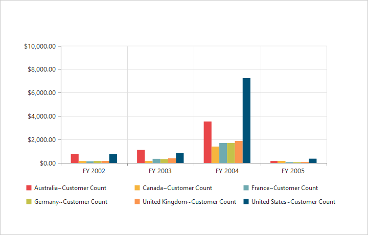
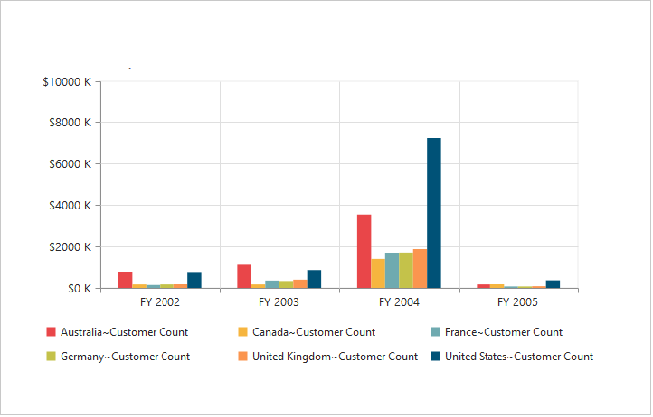
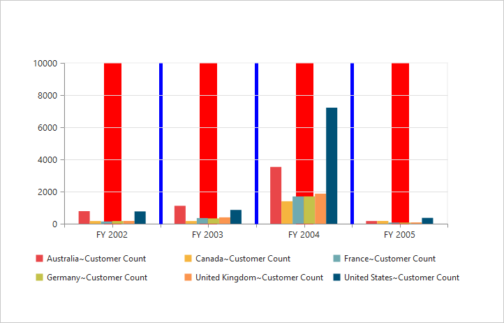
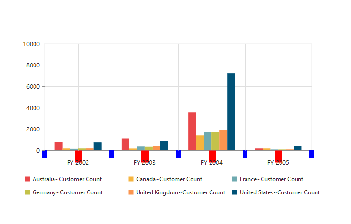
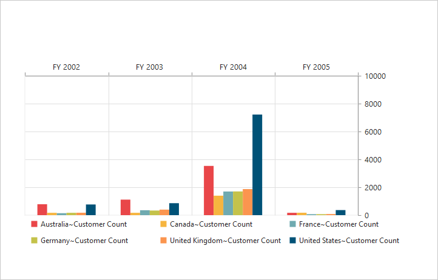

# Axes 

## Label format

### Format numeric labels

By using the `labelFormat` property, you can format the numeric labels. Numeric values can be formatted with n (number with decimal points), c (currency), and p (percentage) commands.




	

	
	{{ej-pivotchart id="PivotChart" e-primaryYAxis=model.primaryYAxis }}
	
	





import Ember from 'ember';

export default Ember.Route.extend({
   model(){
    return {
                //...
                
                primaryYAxis: {
					labelFormat: 'c'
				},
        }
    }
});





Following table describes the result when applying some commonly used label formats on numeric values:

<table>
<tr>
<th>
Label Value</th><th>
Label Format Property Value</th><th>
Result</th><th>
Description</th>
</tr>
<tr><td>
1000</td><td>
n1</td><td>    
1000.0</td><td>
The Number is rounded to 1 decimal place</td>
</tr>
<tr><td>
1000</td><td>
n2</td><td>    
1000.00</td><td>
The Number is rounded to 2 decimal place</td>
</tr>
<tr><td>
1000</td><td>
n3</td><td>    
1000.000</td><td>
The Number is rounded to 3 decimal place</td>
</tr>
<tr><td>
0.01</td><td>
p1</td><td>    
1.0%</td><td>
The Number is converted to percentage with 1 decimal place</td>
</tr>
<tr><td>
0.01</td><td>
p2</td><td>    
1.00%</td><td>
The Number is converted to percentage with 2 decimal place</td>
</tr>
<tr><td>
0.01</td><td>
p3</td><td>    
1.000%</td><td>
The Number is converted to percentage with 3 decimal place</td>
</tr>
<tr><td>
1000</td><td>
c1</td><td>    
$1,000.0</td><td>
The Currency symbol is appended to number and number is rounded to 1 decimal place</td>
</tr>
<tr><td>
1000</td><td>
c2</td><td>    
$1,000.00</td><td>
The Currency symbol is appended to number and number is rounded to 2 decimal place</td>
</tr>
</table>

### Label format customization

By using the `labelFormat` property of `primaryYAxis`, you can add the category labels with prefix and/or suffix.




	

	
	{{ej-pivotchart id="PivotChart" e-primaryYAxis=model.primaryYAxis }}
	
	





import Ember from 'ember';

export default Ember.Route.extend({
   model(){
    return {
                //...
                
                primaryYAxis: {
					labelFormat: '${value} K'
				},
        }
    }
});





## Common axis features

### Axis visibility

Axis visibility can be set by using the `visible` property of the respective axis.

N> By default, the value of `visible` property is true in the pivot chart.




	

	
	{{ej-pivotchart id="PivotChart" e-primaryYAxis=model.primaryYAxis }}
	
	





import Ember from 'ember';

export default Ember.Route.extend({
   model(){
    return {
                //...
                
                primaryYAxis: {
					visible: false
				},
        }
    }
});





### Label customization

By using the `font` property of the axis, you can customize the font family, color, opacity, size, and font-weight of labels.




	

	
	{{ej-pivotchart id="PivotChart" e-primaryXAxis=model.primaryXAxis }}
	
	





import Ember from 'ember';

export default Ember.Route.extend({
   model(){
    return {
                //...
                
                primaryXAxis: {
					font:
                    {
                        fontFamily: 'Segoe UI',
                        size: '14px',
                        fontWeight: 'bold',
                        color: 'blue'
                    } 
				},
        }
    }
});





### Label and tick positioning

Axis labels and ticks can be positioned inside or outside the chart area by using the `labelPosition` and `tickLinesPosition` properties. The labels and ticks are positioned outside the chart area, by default.




	

	
	{{ej-pivotchart id="PivotChart" e-primaryXAxis=model.primaryXAxis }}
	
	





import Ember from 'ember';

export default Ember.Route.extend({
   model(){
    return {
                //...
                
                primaryXAxis: {
					labelPosition: 'inside',
                    tickLinesPosition: 'inside'
				},
        }
    }
});





### Grid lines customization

By using the `majorGridLines` and `minorGridLines` properties of the axis, you can customize the width, color, visibility, and opacity of the grid lines.

N> By default, the minor grid lines are not visible in the pivot chart.




	

	
	{{ej-pivotchart id="PivotChart" e-primaryXAxis=model.primaryXAxis }}
	
	





import Ember from 'ember';

export default Ember.Route.extend({
   model(){
    return {
                //...
                
                primaryXAxis: {
					//Customizing Grid Lines
                    majorGridLines:
                    {
                        color: 'blue',
                        visible: true,
                        width: 5
                    },
                    minorTicksPerInterval: 1,
                    minorGridLines:
                    {
                        color: 'red',
                        visible: true,
                        width: 5
                    }
				},
        }
    }
});





### Tick line customization

By using the `majorTickLines` and `minorTickLines` properties of the axis, you can customize the width, color, visibility, size, and opacity of the tick lines.

N> By default, the minor tick lines are not visible in the pivot chart.




	

	
	{{ej-pivotchart id="PivotChart" e-primaryXAxis=model.primaryXAxis }}
	
	





import Ember from 'ember';

export default Ember.Route.extend({
   model(){
    return {
                //...
                
                primaryXAxis: {
                    //Customizing Tick Lines
                    majorTickLines:
                    {
                        color: 'blue',
                        visible: true,
                        width: 10,
                        size: 15,
                    },
                    minorTicksPerInterval: 1,
                    minorTickLines:
                    {
                        color: 'red',
                        visible: true,
                        width: 20,
                        size: 15
                    }
				},
        }
    }
});





### Inversing axis

The axis can be inversed by using the `isInversed` property of the axis.

N> By default, the `isInversed` property is false in the pivot chart.




	

	
	{{ej-pivotchart id="PivotChart" e-primaryXAxis=model.primaryXAxis e-primaryYAxis=model.primaryYAxis }}
	
	





import Ember from 'ember';

export default Ember.Route.extend({
   model(){
    return {
                //...
                
                primaryXAxis: {
                    //Inversing the X-axis
                    isInversed: true
				},
                primaryYAxis: {
                    //Inversing the Y-axis
                    isInversed: true
				},
        }
    }
});





### Placing axes at opposite side

The `opposedPosition` property of the chart axis can be used to place the axis at the opposite direction from its default position.

N> By default, the `opposedPosition` property is false in the pivot chart.




	

	
	{{ej-pivotchart id="PivotChart" e-primaryXAxis=model.primaryXAxis e-primaryYAxis=model.primaryYAxis }}
	
	





import Ember from 'ember';

export default Ember.Route.extend({
   model(){
    return {
                //...
                
                primaryXAxis: {
                    //Placing X-axis at the opposite side of its normal position
                    opposedPosition: true
				},
                primaryYAxis: {
                    //Placing Y-axis at the opposite side of its normal position
                    opposedPosition: true
				},
        }
    }
});





## Smart axis labels

When the axis labels overlap with each other based on the chart dimensions and label size, you can use the `labelIntersection` property of the axis to avoid overlapping.

N> By default, the `labelIntersection` property is none in the pivot chart.

The following are supported options for the `labelIntersection` property:
 
* Rotate45
* Rotate90
* Trim
* MultipleRows
* Wrap
* Hide. 




	

	
	{{ej-pivotchart id="PivotChart" e-primaryXAxis=model.primaryXAxis e-primaryYAxis=model.primaryYAxis }}
	
	





import Ember from 'ember';

export default Ember.Route.extend({
   model(){
    return {
                //...
                
                primaryXAxis: {
                    labelIntersectAction: 'multipleRows'
				}
        }
    }
});





