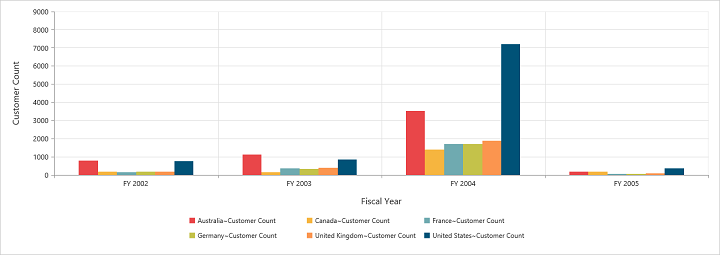

# Dimensions

## Set size in percentage

You can customize the pivot chart dimension by setting the width and height of the control in percentage.




	

	
	{{ej-pivotchart id="PivotChart" e-size=model.size }}
	
	





import Ember from 'ember';

export default Ember.Route.extend({
   model(){
    return {
                //...
                
                size: { 
                    height: "80%", 
                    width: "80%" 
                },
        }
    }
});





ej-pivotchart {
    width:100%;
    height:450px;
}





## Set size in pixels

You can customize the pivot chart dimension by setting the width and height of the control in pixels.




	

	
	{{ej-pivotchart id="PivotChart" e-size=model.size }}
	
	





import Ember from 'ember';

export default Ember.Route.extend({
   model(){
    return {
                //...
                
                size: { 
                    height: "540px", 
                    width: "950px" 
                },
        }
    }
});





ej-pivotchart {
    width:950px;
    height:450px;
}




 
 

## Responsive

The pivot chart control supports responsive rendering based on the target device (desktop and tablet) resolution. It supports resolution upto 1024x600. You can enable responsiveness in the pivot chart by setting the `isResponsive` property to true.




	

	
	{{ej-pivotchart id="PivotChart" e-isResponsive=model.isResponsive e-size=model.size }}
	
	





import Ember from 'ember';

export default Ember.Route.extend({
   model(){
    return {
                //...
                
                size: { 
                    height: "540px", 
                    width: "950px" 
                },
                isResponsive: true
        }
    }
});





ej-pivotchart {
    min-width:525px;
    min-height:460px;
    width: 100%;
    height:450px;
}





_Normal View_

_ResponsiveView_

