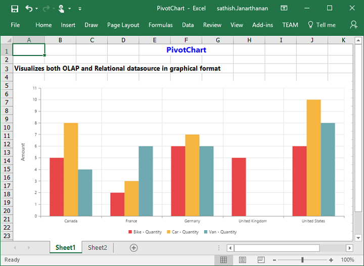
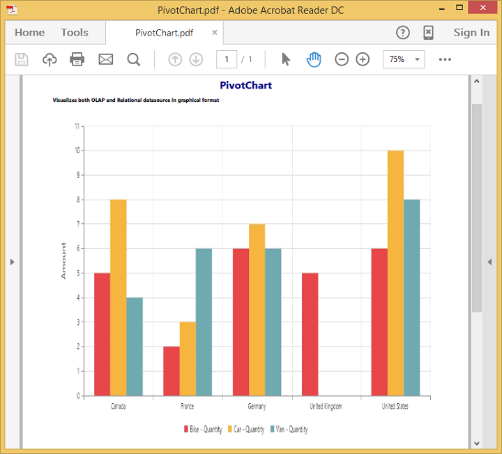

# Exporting

The pivot chart control can be exported to the following file formats:

* Microsoft Excel
* Microsoft Word
* PDF
* Image

The pivot chart control can be exported by invoking the **“exportPivotChart”** method with an appropriate export option as a parameter.




	

	
	{{ej-pivotchart id="PivotChart" e-commonSeriesOptions=model.commonSeriesOptions }}
    {{ej-button id="Export" e-text="Export" e-click=model.Export }}
	
	





import Ember from 'ember';

export default Ember.Route.extend({
   model(){
    return {
                //...
                
                commonSeriesOptions: {
					type: ej.PivotChart.ChartTypes.Column
				},
                Export: function(args) {
                    var chartObj = $('.e-pivotchart').data("ejPivotChart");
                    chartObj.exportPivotChart("http://js.syncfusion.com/ejservices/api/PivotChart/Olap/ExcelExport","fileName");
                }
        }
    }
});





## Excel export

You can export contents of the pivot chart to an Excel document for future archival, references, and analysis purposes.

To achieve Excel export, the service URL and the file name are set as parameters.



import Ember from 'ember';

export default Ember.Route.extend({
   model(){
    return {
                //...
                
                Export: function(args) {
                    var chartObj = $('.e-pivotchart').data("ejPivotChart");
                    chartObj.exportPivotChart("http://js.syncfusion.com/ejservices/api/PivotChart/Olap/ExcelExport","fileName");
                }
        }
    }
});



## Word export

You can export contents of the pivot chart to a Word document for future archival, references, and analysis purposes.

To achieve Word export, the service URL and the file name are set as parameters.



import Ember from 'ember';

export default Ember.Route.extend({
   model(){
    return {
                //...
                
                Export: function(args) {
                    var chartObj = $('.e-pivotchart').data("ejPivotChart");
                    chartObj.exportPivotChart("http://js.syncfusion.com/ejservices/api/PivotChart/Olap/WordExport","fileName");
                }
        }
    }
});



## PDF export

You can export contents of the pivot chart to the PDF document for future archival, references, and analysis purposes.

To achieve PDF export, the service URL and the file name are set as parameters.



import Ember from 'ember';

export default Ember.Route.extend({
   model(){
    return {
                //...
                
                Export: function(args) {
                    var chartObj = $('.e-pivotchart').data("ejPivotChart");
                    chartObj.exportPivotChart("http://js.syncfusion.com/ejservices/api/PivotChart/Olap/PDFExport","fileName");
                }
        }
    }
});



## Image export

You can export contents of the pivot chart to image format for future archival, references, and analysis purposes. You can export the pivot chart to the following image formats:

* PNG
* EMF
* JPG
* GIF
* BMP

To export pivot chart in PNG format, the service URL, file name, and **“ej.PivotChart.ExportOptions.PNG”** enumeration value are set as parameters. This is similar to other image formats.



import Ember from 'ember';

export default Ember.Route.extend({
   model(){
    return {
                //...
                
                Export: function(args) {
                    var chartObj = $('.e-pivotchart').data("ejPivotChart");
                    chartObj.exportPivotChart("http://js.syncfusion.com/ejservices/api/PivotChart/Olap/ImageExport","fileName","png");
                }
        }
    }
});



## Exporting customization

You can add the title and description to the exporting document by using the title and description property obtained in the "e-beforeExport" event.

N> The title and description cannot be added to image formats.




	

	
	{{ej-pivotchart id="PivotChart" e-commonSeriesOptions=model.commonSeriesOptions e-beforeExport=model.beforeExport}}
    {{ej-button id="Export" e-text="Export" e-click=model.Export }}
	
	





import Ember from 'ember';

export default Ember.Route.extend({
   model(){
    return {
                //...
                
                commonSeriesOptions: {
					type: ej.PivotChart.ChartTypes.Column
				},
                Export: function(args) {
                    var chartObj = $('.e-pivotchart').data("ejPivotChart");
                    chartObj.exportPivotChart("http://js.syncfusion.com/ejservices/api/PivotChart/Olap/ExcelExport","fileName");
                },
                beforeExport: function(args) {
                    args.title = "PivotChart";
                    args.description = "Visualizes both OLAP and Relational datasource in graphical format";
                }
        }
    }
});





The following screenshot shows the pivot chart control exported to an Excel document:

The following screenshot shows the pivot chart control exported to a Word document:

The following screenshot shows the pivot chart control exported to a PDF document:

The following screenshot shows the pivot chart control exported to a PNG format:

