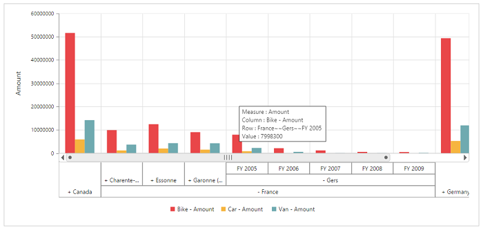

# Multi-level labels

Multi-level labels allows you to drill down to access the detailed level of data or drill up to see the summarized data by using the expander present in the OLAP chart. You can enable the option by setting the `e-enableMultiLevelLabels` property to **“true”.**


	

	
	{{ej-pivotchart id="PivotChart" e-enableMultiLevelLabels=model.enableMultiLevelLabels }}
	
	





import Ember from 'ember';

export default Ember.Route.extend({
   model(){
    return {
                //...
                
                enableMultiLevelLabels: true
        }
    }
});



## Relational

## OLAP

