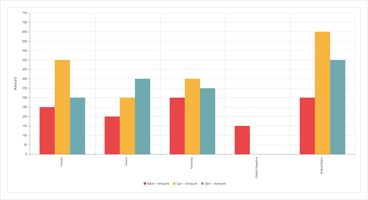
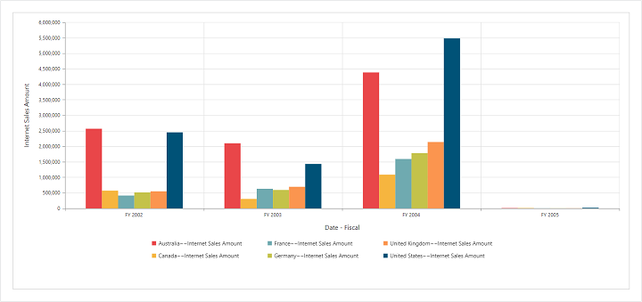

# Getting Started

Before we start with the PivotChart, please refer [`this page`](https://help.syncfusion.com/emberjs/getting-started) for general information regarding integrating Syncfusion widget's.

This section explains you the steps required to populate the PivotChart with data source. This section covers only the minimal features that you need to know to get started with the PivotChart.

## Adding Script Reference

To render the PivotChart control, the following list of external dependencies are needed, 

PivotChart uses one or more sub-controls, therefore refer the `ej.web.all.min.js` (which encapsulates all the `ej` controls and frameworks in a single file) in the application instead of referring all the above specified internal dependencies. 

To get the real appearance of the PivotChart, the dependent CSS file `ej.web.all.min.css` (which includes styles of all the widgets) should also needs to be referred.

Refer this [`link`](https://help.syncfusion.com/emberjs/getting-started "link") to add the above dependencies in to your ember application.

## Relational

This section covers the information that you need to know to populate a simple PivotChart with Relational data source.

### Initialize PivotChart

The PivotChart component can be created with prefix of `ej-`.The code example for defining controls in EmberJS is as follows,



	
	{{ej-pivotchart id="PivotChart"}}
	




import Ember from 'ember';

export default Ember.Route.extend({
   model(){
    return {
        }
    },
});
    


### Populate PivotChart with relational data source

Let us now see how to populate the PivotChart control using a sample JSON data as shown below.


	

	
	{{ej-pivotchart id="PivotChart" e-dataSource=model.dataSource e-isResponsive=model.isResponsive e-zooming=model.zooming e-type=model.type e-commonSeriesOptions=model.commonSeriesOptions e-size=model.size e-primaryYAxis=model.primaryYAxis e-legend=model.legend }}
	
	





import Ember from 'ember';

export default Ember.Route.extend({
   model(){
    return {
            dataSource: {
                                data: [
									{ Amount: 100, Country: "Canada", Date: "FY 2005", Product: "Bike", Quantity: 2, State: "Alberta" },
									{ Amount: 200, Country: "Canada", Date: "FY 2006", Product: "Van", Quantity: 3, State: "British Columbia" },
									{ Amount: 300, Country: "Canada", Date: "FY 2007", Product: "Car", Quantity: 4, State: "Brunswick" },
									{ Amount: 150, Country: "Canada", Date: "FY 2008", Product: "Bike", Quantity: 3, State: "Manitoba" },
									{ Amount: 200, Country: "Canada", Date: "FY 2006", Product: "Car", Quantity: 4, State: "Ontario" },
									{ Amount: 100, Country: "Canada", Date: "FY 2007", Product: "Van", Quantity: 1, State: "Quebec" },
									{ Amount: 200, Country: "France", Date: "FY 2005", Product: "Bike", Quantity: 2, State: "Charente-Maritime" },
									{ Amount: 250, Country: "France", Date: "FY 2006", Product: "Van", Quantity: 4, State: "Essonne" },
									{ Amount: 300, Country: "France", Date: "FY 2007", Product: "Car", Quantity: 3, State: "Garonne (Haute)" },
									{ Amount: 150, Country: "France", Date: "FY 2008", Product: "Van", Quantity: 2, State: "Gers" },
									{ Amount: 200, Country: "Germany", Date: "FY 2006", Product: "Van", Quantity: 3, State: "Bayern" },
									{ Amount: 250, Country: "Germany", Date: "FY 2007", Product: "Car", Quantity: 3, State: "Brandenburg" },
									{ Amount: 150, Country: "Germany", Date: "FY 2008", Product: "Car", Quantity: 4, State: "Hamburg" },
									{ Amount: 200, Country: "Germany", Date: "FY 2008", Product: "Bike", Quantity: 4, State: "Hessen" },
									{ Amount: 150, Country: "Germany", Date: "FY 2007", Product: "Van", Quantity: 3, State: "Nordrhein-Westfalen" },
									{ Amount: 100, Country: "Germany", Date: "FY 2005", Product: "Bike", Quantity: 2, State: "Saarland" },
									{ Amount: 150, Country: "United Kingdom", Date: "FY 2008", Product: "Bike", Quantity: 5, State: "England" },
									{ Amount: 250, Country: "United States", Date: "FY 2007", Product: "Car", Quantity: 4, State: "Alabama" },
									{ Amount: 200, Country: "United States", Date: "FY 2005", Product: "Van", Quantity: 4, State: "California" },
									{ Amount: 100, Country: "United States", Date: "FY 2006", Product: "Bike", Quantity: 2, State: "Colorado" },
									{ Amount: 150, Country: "United States", Date: "FY 2008", Product: "Car", Quantity: 3, State: "New Mexico" },
									{ Amount: 200, Country: "United States", Date: "FY 2005", Product: "Bike", Quantity: 4, State: "New York" },
									{ Amount: 250, Country: "United States", Date: "FY 2008", Product: "Car", Quantity: 3, State: "North Carolina" },
									{ Amount: 300, Country: "United States", Date: "FY 2007", Product: "Van", Quantity: 4, State: "South Carolina" }
								],
                                rows: [
                                        {
                                            fieldName: "Country",
                                            fieldCaption: "Country"
                                        },
                                        {
                                            fieldName: "State",
                                            fieldCaption: "State"
                                        },
                                        {
                                            fieldName: "Date",
                                            fieldCaption: "Date"
                                        }
                                    ],
                                    columns: [
                                        {
                                            fieldName: "Product",
                                            fieldCaption: "Product"
                                        }
                                    ],
                                    values: [
                                        {
                                            fieldName: "Amount",
                                            fieldCaption: "Amount"
                                        }
                                    ]
                            },
							isResponsive: true,
							zooming : { enableScrollbar : true},
							enableRTL: false,
							type: ej.PivotChart.ChartTypes.Column,
                            commonSeriesOptions: {
								enableAnimation: true,
								type: ej.PivotChart.ChartTypes.Column, tooltip: { visible: true }
							},
							size: { height: "640px", width: "100%" },
							primaryYAxis: { title: { text: "Amount" } },
							legend: { visible: true }
        }
    }
});



The above code will generate a simple PivotChart with sales amount over products in different regions.

## OLAP

This section covers the information that you need to know to populate a simple PivotChart with OLAP data source.

### Initialize PivotChart

The PivotChart component can be created with prefix of `ej-`.The code example for defining controls in EmberJS is as follows,



	
	{{ej-pivotchart id="PivotChart"}}
	




import Ember from 'ember';

export default Ember.Route.extend({
   model(){
    return {
        }
    },
});
    


### Populate PivotChart with OLAP data source

Let us now see how to populate the PivotChart control using OLAP data source as shown below.


	

	
	{{ej-pivotchart id="PivotChart" e-dataSource=model.dataSource e-isResponsive=model.isResponsive e-zooming=model.zooming e-type=model.type e-commonSeriesOptions=model.commonSeriesOptions e-size=model.size e-primaryXAxis=model.primaryXAxis e-primaryYAxis=model.primaryYAxis e-legend=model.legend }}
	
	





import Ember from 'ember';

export default Ember.Route.extend({
   model(){
    return {
            dataSource: {
                                data: "http://bi.syncfusion.com/olap/msmdpump.dll", //data
                                catalog: "Adventure Works DW 2008 SE",
                                cube: "Adventure Works",
                                rows: [
                                    {
                                        fieldName: "[Date].[Fiscal]"
                                    }
                                ],
                                columns: [
                                    {
                                        fieldName: "[Customer].[Customer Geography]"
                                    }
                                ],
                                values: [
                                    {
                                        measures: [
                                            {
                                                fieldName: "[Measures].[Internet Sales Amount]",
                                            }
                                        ],
                                        axis: "columns"
                                    }
                                ]
                            },
							isResponsive: true,zooming : { enableScrollbar : true},
                            type: ej.PivotChart.ChartTypes.Column,
							commonSeriesOptions: {
								enableAnimation: true,
								type: ej.PivotChart.ChartTypes.Column, tooltip: { visible: true }
							},
							size: { height: "560px", width: "100%" },
							primaryXAxis: { title: { text: "Date - Fiscal" }, labelRotation: 0 },
							primaryYAxis: { title: { text: "Internet Sales Amount" } },
							legend: { visible: true, rowCount: 2 },
        }
    }
});


The above code will generate a simple PivotChart with internet sales amount over a period of fiscal years across different customer geographic locations.

