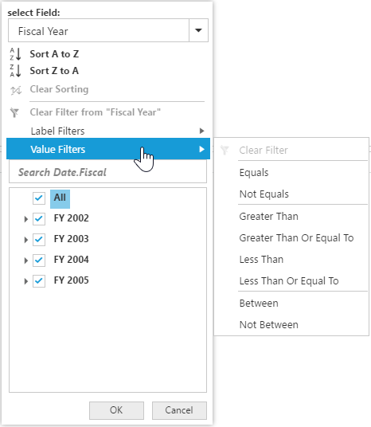

# Advanced filtering and sorting

It allows you to filter and sort the field members in the pivot client.

You can enable the Advanced Filtering and Sorting option in the pivot client by setting the `e-enableAdvancedFilter` property to true.


	

	
	{ej-pivotclient id="PivotClient" e-enableAdvancedFilter=model.enableAdvancedFilter }}
	
	





import Ember from 'ember';

export default Ember.Route.extend({
   model(){
    return {
                enableAdvancedFilter: true
        }
    }
});



## Sorting

The sorting provides an option to sort the members of a field either in the ascending or descending order.

I> This feature is not applicable for the OLAP data source bound from the server-side.

## Label filtering

Label filtering provides an option to filter the members of a field purely based on their caption. 

## Value filtering

Value filtering provides an option to filter members based on total values of the appropriate measure between members of the level. 

