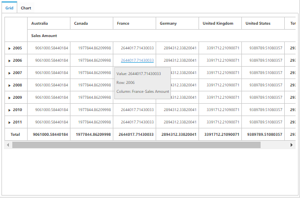

# Drill through

I> This feature is applicable only for the OLAP data source.

Drill-through retrieves raw items that are used to create a specified cell of the pivot grid. To enable drill-through support, set the `e-enableDrillThrough` property to true. Raw items are obtained through the `e-drillThrough` event, using which you can bind them to an external widget for a precise view.

N> Drill-through is supported in the pivot grid only when you configure and enable the drill-through action at the cube. 

When any value cell is clicked, the "Drill Through Information" dialog will open. It consists of a grid with the data associated with the measure values of the clicked value cell. In this example, the measure behind the respective cell is “Sales Amount” and the values of the dimensions associated with this measure are alone displayed in the grid.

When the "Hierarchy Selector" button displayed below the grid is clicked, the "Hierarchy Selector" dialog will open. It consists of dimensions that are associated with the measure of a clicked value cell. In this example, the measure behind the respective cell is “Sales Amount” and the values of dimensions associated with this measure are alone displayed in the dialog.

Dragg and drop the respective hierarchies and click OK, the drill-through MDX query will be framed and executed internally and provides back raw items through the "drillThrough" event. In this example, the obtained raw items are bound to the ejGrid widget. Refer to the following code sample and screenshot:


	

	
	{{ej-pivotclient id="PivotClient" e-enableDrillThrough=model.enableDrillThrough e-drillThrough=model.drillThrough}}
	
	





import Ember from 'ember';

export default Ember.Route.extend({
   model(){
    return {
            //...
            
            enableDrillThrough: true,
            drillThrough: function (args) {
                $(".e-dialog, .e-clientDialog, .e-tableDlg").remove();
                gridData = JSON.parse(args.data);
                var dialogContent = ej.buildTag("div#" + this._id + "_tableDlg.e-tableDlg", $("

"))[0].outerHTML;
                var dialogFooter = ej.buildTag("div", ej.buildTag("button#btnOK.e-dialogBtnOK", "Hierarchy Selector")[0].outerHTML, { "float": "right", "margin": "-5px 0 6px" })[0].outerHTML
                ejDialog = ej.buildTag("div#clientDialog.e-clientDialog", dialogContent + dialogFooter, { "opacity": "1" }).attr("title", "Drill Through Information")[0].outerHTML;
                $(ejDialog).appendTo("#" + this._id);
                $("#btnOK").ejButton().css({ margin: "30px 0 20px 0" });
                $("#Grid1").ejGrid({
                    dataSource: gridData,
                    allowPaging: true,
                    allowTextWrap: true,
                    pageSettings: { pageSize: 8 }
                });
                this.element.find(".e-clientDialog").ejDialog({ width: "70%", content: "#" + this._id, enableResize: false, close: ej.proxy(ej.Pivot.closePreventPanel, this) });
                var pivotClient = $("#" + this._id).data("ejPivotClient");
                $("#btnOK").click(function () {
                    ej.Pivot.openHierarchySelector(pivotClient);
                });
            }
        }
    }
});



