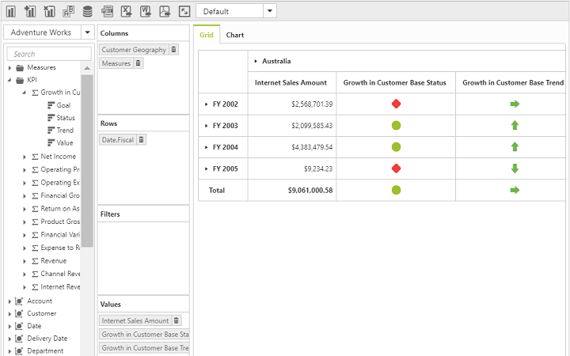

# KPI

A key performance indicator (KPI) demonstrates the progress of an enterprise when meeting its business goals.

The different indicators are:

* KPI value: A physical measure or a calculated measure.
* KPI goal: Defines the target for the measure.
* KPI status: Evaluates the current status of the value compared to the goal.
* KPI trend: Evaluates the current trend of the value compared to the goal.

The **“KpiElements”** class in OLAP base library holds the KPI name, and when its object is added to an OLAP report, you can view the resultant information in the pivot client.

To enable the KPI option, set the `e-enableKPI` property to `true`.


	

	
	{{ej-pivotclient id="PivotClient" e-enableKPI=model.enableKPI e-dataSource=model.dataSource }}
	
	





import Ember from 'ember';

export default Ember.Route.extend({
   model(){
    return {
            dataSource: {
                                data: "//bi.syncfusion.com/olap/msmdpump.dll", //data
                                catalog: "Adventure Works DW 2008 SE",
                                cube: "Adventure Works",
                                rows: [
                                    {
                                        fieldName: "[Date].[Fiscal]"
                                    }
                                ],
                                columns: [
                                    {
                                        fieldName: "[Product].[Product Categories]"
                                    }
                                ],
                                values: [
                                    {
                                        measures: [
                                            {
                                                fieldName: "[Measures].[Internet Sales Amount]",
                                            },
                                            {
                                                fieldName: "[Measures].[Growth in Customer Base Trend]"
                                            }, 
                                            {
                                                fieldName: "[Measures].[Growth in Customer Base Status]"
                                            }
                                        ],
                                        axis: "columns"
                                    }
                                ]
                            },
                            enableKPI: true
        }
    }
});



