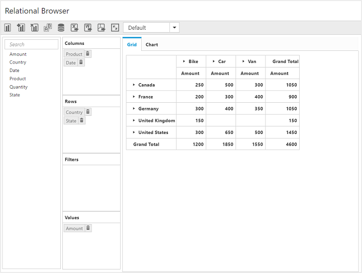
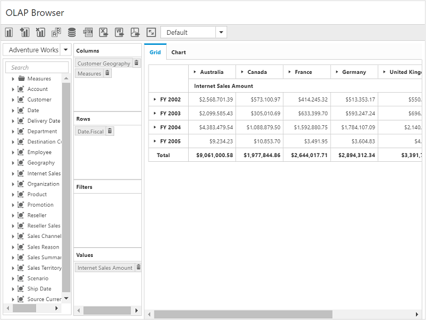

# Getting started

Before you start with the pivot client, refer to [`this page`](https://help.syncfusion.com/emberjs/getting-started) for general information regarding integrating Syncfusion widgets.

This section explains how to populate the pivot client with data source. This section covers only the minimal features that are needed to get started with the pivot client.

## Adding script reference

To render the pivot client control, the following list of external dependencies are required:

The pivot client uses one or more sub-controls, therefore refer to the `ej.web.all.min.js` (which encapsulates all the `ej` controls and frameworks in a single file) in the application instead of referring all the above specified internal dependencies. 

To get the real appearance of the pivot client, the dependent CSS file `ej.web.all.min.css` (which includes styles of all widgets) should also needs to be referred.

Refer to this [`link`](https://help.syncfusion.com/emberjs/getting-started "link") to add the above dependencies to your ember application.

## Relational

This section explains how to populate a simple pivot client with relational data source.

### Initialize pivot client

The pivot client component can be created with the prefix of `ej-`. The code example for defining controls in the EmberJS is as follows:



	
	{{ej-pivotclient id="PivotClient"}}
	




import Ember from 'ember';

export default Ember.Route.extend({
   model(){
    return {
        }
    },
});
    


### Populate pivot client with relational data source

You can populate the pivot client control by using a sample JSON data as shown follows:


	

	
	{{ej-pivotclient id="PivotClient" e-size=model.size e-dataSource=model.dataSource e-title=model.title e-beforeExport=model.beforeExport e-renderSuccess=model.renderSuccess e-loadReport=model.loadReport e-fetchReport=model.fetchReport e-saveReport=model.saveReport}}
	
	





import Ember from 'ember';

export default Ember.Route.extend({
   model(){
    return {
            dataSource: {
                                data: [
									{ Amount: 100, Country: "Canada", Date: "FY 2005", Product: "Bike", Quantity: 2, State: "Alberta" },
									{ Amount: 200, Country: "Canada", Date: "FY 2006", Product: "Van", Quantity: 3, State: "British Columbia" },
									{ Amount: 300, Country: "Canada", Date: "FY 2007", Product: "Car", Quantity: 4, State: "Brunswick" },
									{ Amount: 150, Country: "Canada", Date: "FY 2008", Product: "Bike", Quantity: 3, State: "Manitoba" },
									{ Amount: 200, Country: "Canada", Date: "FY 2006", Product: "Car", Quantity: 4, State: "Ontario" },
									{ Amount: 100, Country: "Canada", Date: "FY 2007", Product: "Van", Quantity: 1, State: "Quebec" },
									{ Amount: 200, Country: "France", Date: "FY 2005", Product: "Bike", Quantity: 2, State: "Charente-Maritime" },
									{ Amount: 250, Country: "France", Date: "FY 2006", Product: "Van", Quantity: 4, State: "Essonne" },
									{ Amount: 300, Country: "France", Date: "FY 2007", Product: "Car", Quantity: 3, State: "Garonne (Haute)" },
									{ Amount: 150, Country: "France", Date: "FY 2008", Product: "Van", Quantity: 2, State: "Gers" },
									{ Amount: 200, Country: "Germany", Date: "FY 2006", Product: "Van", Quantity: 3, State: "Bayern" },
									{ Amount: 250, Country: "Germany", Date: "FY 2007", Product: "Car", Quantity: 3, State: "Brandenburg" },
									{ Amount: 150, Country: "Germany", Date: "FY 2008", Product: "Car", Quantity: 4, State: "Hamburg" },
									{ Amount: 200, Country: "Germany", Date: "FY 2008", Product: "Bike", Quantity: 4, State: "Hessen" },
									{ Amount: 150, Country: "Germany", Date: "FY 2007", Product: "Van", Quantity: 3, State: "Nordrhein-Westfalen" },
									{ Amount: 100, Country: "Germany", Date: "FY 2005", Product: "Bike", Quantity: 2, State: "Saarland" },
									{ Amount: 150, Country: "United Kingdom", Date: "FY 2008", Product: "Bike", Quantity: 5, State: "England" },
									{ Amount: 250, Country: "United States", Date: "FY 2007", Product: "Car", Quantity: 4, State: "Alabama" },
									{ Amount: 200, Country: "United States", Date: "FY 2005", Product: "Van", Quantity: 4, State: "California" },
									{ Amount: 100, Country: "United States", Date: "FY 2006", Product: "Bike", Quantity: 2, State: "Colorado" },
									{ Amount: 150, Country: "United States", Date: "FY 2008", Product: "Car", Quantity: 3, State: "New Mexico" },
									{ Amount: 200, Country: "United States", Date: "FY 2005", Product: "Bike", Quantity: 4, State: "New York" },
									{ Amount: 250, Country: "United States", Date: "FY 2008", Product: "Car", Quantity: 3, State: "North Carolina" },
									{ Amount: 300, Country: "United States", Date: "FY 2007", Product: "Van", Quantity: 4, State: "South Carolina" }
								],
                                rows: [
                                        {
                                            fieldName: "Country",
                                            fieldCaption: "Country"
                                        },
                                        {
                                            fieldName: "State",
                                            fieldCaption: "State"
                                        }
                                    ],
                                    columns: [
                                        {
                                            fieldName: "Product",
                                            fieldCaption: "Product"
                                        },
                                        {
                                            fieldName: "Date",
                                            fieldCaption: "Date"
                                        }
                                    ],
                                    values: [
                                        {
                                            fieldName: "Amount",
                                            fieldCaption: "Amount"
                                        }
                                    ]
                            },
							title: "Relational Browser",
							beforeExport:function (args) {
								args.url = "//js.syncfusion.com/ejservices/api/PivotClient/Olap/Export";
							},
							loadReport:function reportSettings(args) {
								if (args.fetchReportSetting)
                                    args.fetchReportSetting.url = "//js.syncfusion.com/ejservices/api/PivotClient/Olap";
                                else if (args.loadReportSetting)
                                    args.loadReportSetting.url = "//js.syncfusion.com/ejservices/api/PivotClient/Olap";
                                else
                                    args.saveReportSetting.url = "//js.syncfusion.com/ejservices/api/PivotClient/Olap";
                                return args;
							},
							saveReport:function reportSettings(args) {
								if (args.fetchReportSetting)
                                    args.fetchReportSetting.url = "//js.syncfusion.com/ejservices/api/PivotClient/Olap";
                                else if (args.loadReportSetting)
                                    args.loadReportSetting.url = "//js.syncfusion.com/ejservices/api/PivotClient/Olap";
                                else
                                    args.saveReportSetting.url = "//js.syncfusion.com/ejservices/api/PivotClient/Olap";
                                return args;
							},
							fetchReport:function reportSettings(args) {
								if (args.fetchReportSetting)
                                    args.fetchReportSetting.url = "//js.syncfusion.com/ejservices/api/PivotClient/Olap";
                                else if (args.loadReportSetting)
                                    args.loadReportSetting.url = "//js.syncfusion.com/ejservices/api/PivotClient/Olap";
                                else
                                    args.saveReportSetting.url = "//js.syncfusion.com/ejservices/api/PivotClient/Olap";
                                return args;
							},
							renderSuccess: function setChartProperties(args) {
								this._pivotChart.model.load = "loadTheme";
								if (args._successAction == undefined || args._successAction == "Filter") {
									this._pivotChart.model.legend.rowCount = 2;
									this._pivotChart.model.primaryXAxis = { title: { text: "Country" }, labelRotation: 270 };
									this._pivotChart.model.primaryYAxis = { title: { text: "Amount" } };
								}
							},
							size:{width:"910px"}

        }
    }
});



The above code will generate a simple pivot client with the pivot chart, and the pivot grid is rendered with “Country” field in the row, “Product” field in the column, and “Amount” field in the value section.

## OLAP

To populate a simple pivot client with OLAP data source:

### Initialize pivot client

The pivot client component can be created with the prefix of `ej-`. The code example for defining controls in the EmberJS is as follows:



	
	{{ej-pivotclient id="PivotClient"}}
	




import Ember from 'ember';

export default Ember.Route.extend({
   model(){
    return {
        }
    },
});
    


### Populate pivot client with OLAP data source

This section shows how to populate the pivot client control using the OLAP data source.


	

	
	{{ej-pivotclient id="PivotClient" e-size=model.size e-dataSource=model.dataSource e-title=model.title e-beforeExport=model.beforeExport e-renderSuccess=model.renderSuccess e-loadReport=model.loadReport e-fetchReport=model.fetchReport e-saveReport=model.saveReport}}
	
	





import Ember from 'ember';

export default Ember.Route.extend({
   model(){
    return {
            dataSource: {
                                data: "//bi.syncfusion.com/olap/msmdpump.dll", //data
                                catalog: "Adventure Works DW 2008 SE",
                                cube: "Adventure Works",
                                rows: [
                                    {
                                        fieldName: "[Date].[Fiscal]"
                                    }
                                ],
                                columns: [
                                    {
                                        fieldName: "[Customer].[Customer Geography]"
                                    }
                                ],
                                values: [
                                    {
                                        measures: [
                                            {
                                                fieldName: "[Measures].[Internet Sales Amount]",
                                            }
                                        ],
                                        axis: "columns"
                                    }
                                ]
                            },
							title: "OLAP Browser",
							beforeExport:function (args) {
								args.url = "//js.syncfusion.com/ejservices/api/PivotClient/Olap/Export";
							},
							loadReport:function reportSettings(args) {
								if (args.fetchReportSetting)
                                    args.fetchReportSetting.url = "//js.syncfusion.com/ejservices/api/PivotClient/Olap";
                                else if (args.loadReportSetting)
                                    args.loadReportSetting.url = "//js.syncfusion.com/ejservices/api/PivotClient/Olap";
                                else
                                    args.saveReportSetting.url = "//js.syncfusion.com/ejservices/api/PivotClient/Olap";
                                return args;
							},
							saveReport:function reportSettings(args) {
								if (args.fetchReportSetting)
                                    args.fetchReportSetting.url = "//js.syncfusion.com/ejservices/api/PivotClient/Olap";
                                else if (args.loadReportSetting)
                                    args.loadReportSetting.url = "//js.syncfusion.com/ejservices/api/PivotClient/Olap";
                                else
                                    args.saveReportSetting.url = "//js.syncfusion.com/ejservices/api/PivotClient/Olap";
                                return args;
							},
							fetchReport:function reportSettings(args) {
								if (args.fetchReportSetting)
                                    args.fetchReportSetting.url = "//js.syncfusion.com/ejservices/api/PivotClient/Olap";
                                else if (args.loadReportSetting)
                                    args.loadReportSetting.url = "//js.syncfusion.com/ejservices/api/PivotClient/Olap";
                                else
                                    args.saveReportSetting.url = "//js.syncfusion.com/ejservices/api/PivotClient/Olap";
                                return args;
							},
							renderSuccess: function setChartProperties(args) {
								this._pivotChart.model.load = "loadTheme";
								if (args._successAction == undefined || args._successAction == "Filter") {
									this._pivotChart.model.legend.rowCount = 2;
									this._pivotChart.model.primaryXAxis = { title: { text: "Customer Geography" }, labelRotation: 270 };
									this._pivotChart.model.primaryYAxis = { title: { text: "Internet Sales Amount" } };
								}
							},
							size:{width:"910px"}
        }
    }
});



The above code will generate a simple pivot client with the pivot chart. This will also generate the pivot grid with “Customer Geography” in the column, “Fiscal” in the row, and “Internet Sales Amount” measure in the value section.

