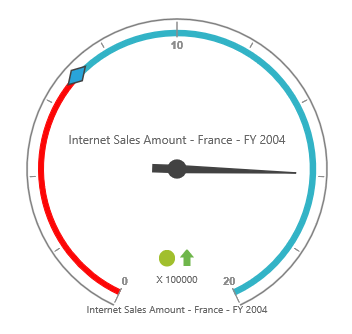

# Frame type

## Full circle

The full circle frame is used to display the pivot gauge in circular shape. The frame type can be set by using the `frameType` property. By default, the frame type is "fullcircle".



	
	{{ej-pivotgauge id="PivotGauge" e-frame=model.frame }}
    





import Ember from 'ember';

export default Ember.Route.extend({
   model(){
    return {
            frame: { 
                frameType: "fullcircle" 
            }
        }
    },
});
    


## Half circle
The half circle frame is used to display the pivot gauge in semi-circular shape. For this, frame type should be set as "HalfCircle" in the `frameType` property, and should set the `startAngle` and `sweepAngle` for the pivot gauge in the `scales` property.



	
	{{ej-pivotgauge id="PivotGauge" e-frame=model.frame e-scales=model.scales }}
    





import Ember from 'ember';

export default Ember.Route.extend({
   model(){
    return {
            frame: {
               frameType: 'halfcircle',
               halfCircleFrameStartAngle: 180, halfCircleFrameEndAngle: 360
        },
        scales: [{
                    //..
                    startAngle: 180, sweepAngle: 180
                    //..
                }]
        }
    },
});
    


