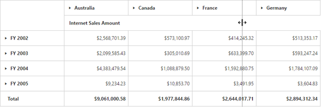

# Resizing column

Allows you to change the column width by holding and dragging the column border using the mouse pointer.

## Column width based on size

The `e-enableColumnResizing` property adjusts the width of each column based on the size of the widget.


	

	
	{{ej-pivotgrid id="PivotGrid" e-enableColumnResizing=model.enableColumnResizing }}}
	
	




    export default Ember.Route.extend({
        model() {
            return {
            	enableColumnResizing: true
           }
        }
    });
 

## Column width based on text

The `e-resizeColumnsToFit` property automatically adjusts the width of each column based on the maximum content length available in the respective column.


	

	
	{{ej-pivotgrid id="PivotGrid" e-resizeColumnsToFit=model.resizeColumnsToFit }}}
	
	




    export default Ember.Route.extend({
        model() {
            return {
            	resizeColumnsToFit: true
           }
        }
    });
 )

