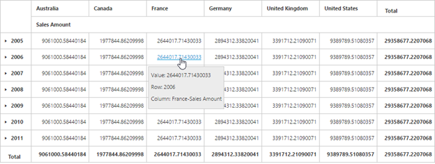
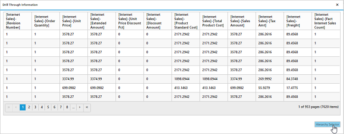

# Drill through

Drill-through retrieves raw items that are used to create a specific cell. To enable drill-through support, set `e-enableDrillThrough` property to true. Raw items are obtained through the `e-drillThrough` event, using which user can bind them to an external widget for a precise view.

## OLAP

N> Drill-through is supported in the pivot grid only when you configure and enable the drill-through action at the cube.

When any value cell is clicked, the "Drill Through Information" dialog will  open. It consists of a grid with data associated with the measure values of the clicked value cell. In this example, the measure behind the respective cell is “Sales Amount” and the values of the dimensions associated with this measure are alone displayed in the grid.

When the "Hierarchy Selector" displayed below the grid is clicked, the "Hierarchy Selector" dialog will open. It consists of dimensions that are associated with the measure of a clicked value cell. In this example, the measure behind the respective cell is “Sales Amount” and the dimensions associated with this measure are alone displayed in the dialog.

Dragg and drop the respective hierarchies and click OK. The drill-through MDX query will be framed and executed internally and provides back raw items through the "drillThrough" event. In this example, the obtained raw items are bound to the ejGrid widget. Refer to the following code sample and screenshot:




	

	
	{{ej-pivotgrid id="PivotGrid" e-enableDrillThrough=model.enableDrillThrough e-drillThrough=model.drillThrough}}
	
	




    export default Ember.Route.extend({
        model() {
            return {
                enableDrillThrough: true,
                drillThrough: function(args) {
                    $(".e-dialog, .clientDialog, .tableDlg").remove();
                    var gridData = JSON.parse(args.data);
                    var dialogContent = ej.buildTag("div#" + this._id + "_tableDlg.tableDlg", $("

"))[0].outerHTML;
                    var dialogFooter = ej.buildTag("div", ej.buildTag("button#btnOK.dialogBtnOK", "Hierarchy Selector")[0].outerHTML, { "float": "right", "margin": "-5px 0 6px" })[0].outerHTML
                    ejDialog = ej.buildTag("div#clientDialog.clientDialog", dialogContent + dialogFooter, { "opacity": "1" }).attr("title", "Drill Through Information")[0].outerHTML;
                    $(ejDialog).appendTo("#" + this._id);
                    $("#btnOK").ejButton().css({ margin: "30px 0 20px 0" });
                    $("#Grid1").ejGrid({
                        dataSource: gridData,
                        allowPaging: true,
                        allowTextWrap: true,
                        pageSettings: { pageSize: 8 }
                    });
                    this.element.find(".clientDialog").ejDialog({ width: "70%", content: "#" + this._id, enableResize: false, close: ej.proxy(ej.Pivot.closePreventPanel, this) });
                    var pivotGrid = $(".e-pivotgrid").data("ejPivotGrid");
                    $("#btnOK").click(function () {
                        ej.Pivot.createHierarchySelector(pivotGrid);
                    });
                }
           }
        }
    });




## Relational

To enable drill-through support, set the `e-enableDrillThrough` property to true. Raw items are obtained through the `e-drillThrough` event.




	

	
	{{ej-pivotgrid id="PivotGrid" e-enableDrillThrough=model.enableDrillThrough e-drillThrough=model.drillThrough}}
	
	




    export default Ember.Route.extend({
        model() {
            return {
                enableDrillThrough: true,
                drillThrough: function(args) {
                    var gridData = args.selectedData;
                    var dialogContent = ej.buildTag("div#Grid1", {height:"50px"})[0].outerHTML;
                    ejDialog = ej.buildTag("div#clientDialog.clientDialog", dialogContent, { "opacity": "1" }).attr("title", "Drill Through Information")[0].outerHTML;
                    $(ejDialog).appendTo("#" + this._id);
                    this.element.find(".clientDialog").ejDialog({ width: "70%", height: "100%", content: "#" + this._id, enableResize: false, close: ej.proxy(ej.Pivot.closePreventPanel, this) });
                        
                    $("#Grid1").ejGrid({
                        dataSource: gridData,
                    });
                }
           }
        }
    });




