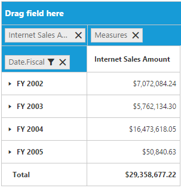

# Grouping bar

## Initialization 
The grouping bar allows you to dynamically alter the report by filter and remove operations in the pivot grid control. Based on the OLAP data source and report bound to the pivot grid control, the grouping bar will be automatically populated. You can enable this option in the pivot grid by setting the `e-enableGroupingBar` property to true.


	

	
	{{ej-pivotgrid id="PivotGrid" e-dataSource=model.dataSource e-enableGroupingBar=model.enableGroupingBar }}
	
	




    export default Ember.Route.extend({
        model() {
            return {
                dataSource: {
                data: "http://bi.syncfusion.com/olap/msmdpump.dll", //data
                catalog: "Adventure Works DW 2008 SE",
                cube: "Adventure Works",
                rows: [
                    {
                        fieldName: "[Date].[Fiscal]"
                    }
                ],
                columns: [
                    {
                        fieldName: "[Customer].[Customer Geography]"
                    }
                ],
                values: [
                    {
                        measures: [
                            {
                                fieldName: "[Measures].[Internet Sales Amount]",
                            }
                        ],
                        axis: "columns"
                    }
                ]
            },
            enableGroupingBar: true
           }
        }
    });


## Drag and drop

You can alter the report on fly through the drag and drop operation.

## Context menu

You can also alter the report by using the context menu.

## Searching values
The search option available in the grouping bar allows you to search a specific value that should be filtered from the list of values in the filter pop-up window.

## Filtering values
The filtering option available in the grouping bar allows you to select a specific set of values that should be displayed in the pivot grid control. At least, one value should be present in the checked state while filtering, otherwise the OK button will be disabled.

## Removing field
The remove option available in the grouping bar allows you to completely remove a specific field from the pivot grid control. The remove operation can be achieved by clicking the remove icon available in each field by dragging and dropping the field out of the grouping bar region.

