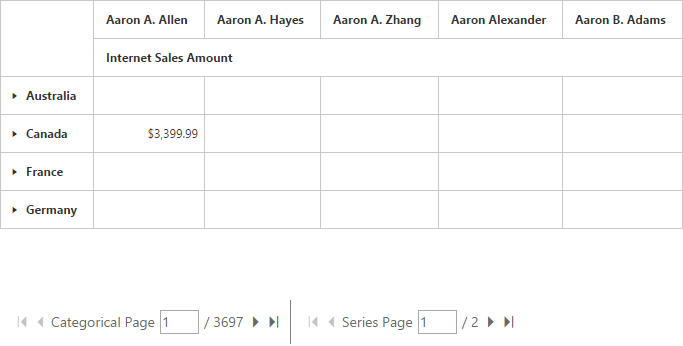

# Paging

## Pager 

Paging helps improve the rendering performance of the pivot grid control by dividing a large amount of data into several sections and displaying one section at a time. You can enable the paging option in pivot grid by setting the `e-enablePaging` property to true. You can provide the page size and current page details for each axis in the `pagerOptions` property.

To initialize a **Pager**, you should define a **div** tag with an appropriate **id** attribute which acts as a container for the widget. Then, you should initialize the widget by using the **ejPivotPager** method.

Inside the **ejPivotPager** method, the enumeration property mode should be set to **ej.PivotPager.Mode.Both** to display both categorical pager and series pager. The other enumerations such as **ej.PivotPager.Mode.Categorical** and **ej.PivotPager.Mode.Series** will display only categorical pager and series pager respectively.




	

	
	<!--Create a tag which acts as a container for PivotGrid-->
	{{ej-pivotgrid id="PivotGrid" e-dataSource=model.dataSource e-enablePaging=model.enablePaging }}
	<!--Create a tag which acts as a container for Pager. -->
	{{ej-pivotpager id="PivotPager1" e-targetControlID=model.targetControlID }}
	
	




    export default Ember.Route.extend({
        model() {
            return {
                dataSource: {
                data: "http://bi.syncfusion.com/olap/msmdpump.dll", //data
                catalog: "Adventure Works DW 2008 SE",
                cube: "Adventure Works",
                rows: [
                    {
                        fieldName: "[Date].[Fiscal]"
                    }
                ],
                columns: [
                    {
                        fieldName: "[Customer].[Customer Geography]"
                    }
                ],
                values: [
                    {
                        measures: [
                            {
                                fieldName: "[Measures].[Internet Sales Amount]",
                            }
                        ],
                        axis: "columns"
                    }
                ],
                pagerOptions : {
                    categoricalPageSize: 3,
                    seriesPageSize: 3,
                    categoricalCurrentPage: 1,
                    seriesCurrentPage: 1
                }
            },
			targetControlID: "PivotGrid",
            enablePaging: true
           }
        }
    });




Following are the navigation options available in the pager:

* Move first: Navigates to the first page.
* Move last: Navigates to the last page. 
* Move previous: Navigates to the previous page from the current page.
* Move next: Navigates to the next page from the current page.
* Numeric box: Navigates to the desired page when an appropriate page number is entered in numeric value.

## Virtual scrolling

Virtual scrolling is a technique that allows you to view the pivot grid information page by page with the use of vertical and horizontal scrollbars. You can enable the virtual scrolling option in the pivot grid by setting the `e-enableVirtualScrolling` property to true. You can provide the page size and current page details for each axis through the `pagerOptions` property.




	

	
	<!--Create a tag which acts as a container for PivotGrid-->
	{{ej-pivotgrid id="PivotGrid" e-dataSource=model.dataSource e-enableVirtualScrolling=model.enableVirtualScrolling }}}
	
	




    export default Ember.Route.extend({
        model() {
            return {
                dataSource: {
                data: "http://bi.syncfusion.com/olap/msmdpump.dll", //data
                catalog: "Adventure Works DW 2008 SE",
                cube: "Adventure Works",
                rows: [
                    {
                        fieldName: "[Date].[Fiscal]"
                    }
                ],
                columns: [
                    {
                        fieldName: "[Customer].[Customer Geography]"
                    }
                ],
                values: [
                    {
                        measures: [
                            {
                                fieldName: "[Measures].[Internet Sales Amount]",
                            }
                        ],
                        axis: "columns"
                    }
                ],
                pagerOptions : {
                    categoricalPageSize: 3,
                    seriesPageSize: 3,
                    categoricalCurrentPage: 1,
                    seriesCurrentPage: 1
                }
            },
			targetControlID: "PivotGrid",
            enableVirtualScrolling: true
           }
        }
    });




## Page settings

The properties associated to paging are:

* EnablePaging: This property is used to enable/disable paging in the pivot client control.
* PagerOptions.CategoricalPageSize: Specifies the number of categorical columns to be displayed within a page of the pivot client control.
* PagerOptions.SeriesPageSize: Specifies the number of series rows to be displayed within a page of the pivot client control.
* PagerOptions.CategoricalCurrentPage: Sets the current page of the categorical axis in pivot client control.
* PagerOptions.SeriesCurrentPage: Sets the current page of the series axis in pivot client control.

For client mode, the page setting for categorical and series axes should be set in the data source property by using the following properties:




	

	
	<!--Create a tag which acts as a container for PivotGrid-->
	{{ej-pivotgrid id="PivotGrid" e-dataSource=model.dataSource e-enablePaging=model.enablePaging }}
	<!--Create a tag which acts as a container for Pager. -->
	{{ej-pivotpager id="PivotPager1" e-targetControlID=model.targetControlID }}
	
	




    export default Ember.Route.extend({
        model() {
            return {
                dataSource: {
                data: "http://bi.syncfusion.com/olap/msmdpump.dll", //data
                catalog: "Adventure Works DW 2008 SE",
                cube: "Adventure Works",
                rows: [
                    {
                        fieldName: "[Date].[Fiscal]"
                    }
                ],
                columns: [
                    {
                        fieldName: "[Customer].[Customer Geography]"
                    }
                ],
                values: [
                    {
                        measures: [
                            {
                                fieldName: "[Measures].[Internet Sales Amount]",
                            }
                        ],
                        axis: "columns"
                    }
                ],
                pagerOptions : {
                    categoricalPageSize: 3,
                    seriesPageSize: 3,
                    categoricalCurrentPage: 1,
                    seriesCurrentPage: 1
                }
            },
			targetControlID: "PivotGrid",
            enablePaging: true
           }
        }
    });



