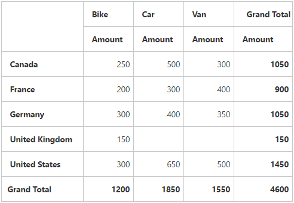
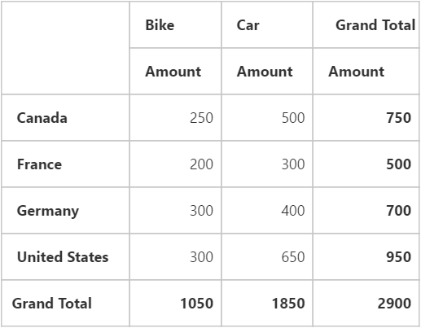
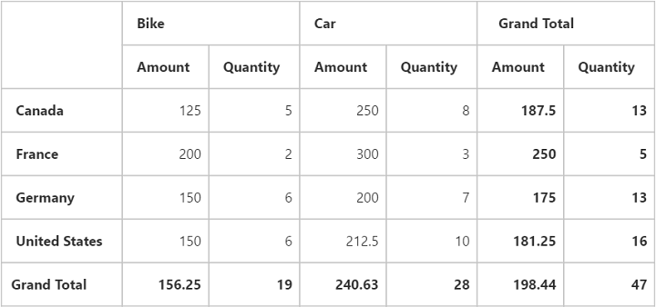

# Getting started

Before you start with the pivot grid, refer to [`this page`](https://help.syncfusion.com/emberjs/getting-started) for general information regarding integrating Syncfusion widgets.

This section explains how to populate the pivot grid with data source. This section covers only the minimal features that are needed to get started with the pivot grid.

## Adding script reference

To render the pivot grid control, the following list of external dependencies are needed: 

The pivot grid uses one or more sub-controls, therefore refer to the `ej.web.all.min.js` (which encapsulates all the `ej` controls and frameworks in a single file) in the application instead of referring all the above specified internal dependencies. 

To get the real appearance of the pivot grid, the dependent CSS file `ej.web.all.min.css` (which includes styles of all the widgets) should also be referred.

Refer to this [`link`](https://help.syncfusion.com/emberjs/getting-started "link") to add the above dependencies to your ember application.

## Relational

This section explains how to populate a simple pivot grid with relational data source.

### Initialize pivot grid

The pivot grid component can be created with prefix of `ej-`. The code example for defining controls in EmberJS is as follows:



	
	{{ej-pivotgrid id="PivotGrid"}}
	




import Ember from 'ember';

export default Ember.Route.extend({
   model(){
    return {
        }
    },
});
    


### Populate pivot grid with relational data source

This section explains how to populate the pivot grid control using a sample JSON data as shown below:


	

	
	{{ej-pivotgrid id="PivotGrid" e-dataSource=model.dataSource}}
	
	




    export default Ember.Route.extend({
        model() {
            return {
                dataSource: {
                                data: [
                                    { Amount: 100, Country: "Canada", Date: "FY 2005", Product: "Bike", Quantity: 2, State: "Alberta" },
                                    { Amount: 200, Country: "Canada", Date: "FY 2006", Product: "Van", Quantity: 3, State: "British Columbia" },
                                    { Amount: 300, Country: "Canada", Date: "FY 2007", Product: "Car", Quantity: 4, State: "Brunswick" },
                                    { Amount: 150, Country: "Canada", Date: "FY 2008", Product: "Bike", Quantity: 3, State: "Manitoba" },
                                    { Amount: 200, Country: "Canada", Date: "FY 2006", Product: "Car", Quantity: 4, State: "Ontario" },
                                    { Amount: 100, Country: "Canada", Date: "FY 2007", Product: "Van", Quantity: 1, State: "Quebec" },
                                    { Amount: 200, Country: "France", Date: "FY 2005", Product: "Bike", Quantity: 2, State: "Charente-Maritime" },
                                    { Amount: 250, Country: "France", Date: "FY 2006", Product: "Van", Quantity: 4, State: "Essonne" },
                                    { Amount: 300, Country: "France", Date: "FY 2007", Product: "Car", Quantity: 3, State: "Garonne (Haute)" },
                                    { Amount: 150, Country: "France", Date: "FY 2008", Product: "Van", Quantity: 2, State: "Gers" },
                                    { Amount: 200, Country: "Germany", Date: "FY 2006", Product: "Van", Quantity: 3, State: "Bayern" },
                                    { Amount: 250, Country: "Germany", Date: "FY 2007", Product: "Car", Quantity: 3, State: "Brandenburg" },
                                    { Amount: 150, Country: "Germany", Date: "FY 2008", Product: "Car", Quantity: 4, State: "Hamburg" },
                                    { Amount: 200, Country: "Germany", Date: "FY 2008", Product: "Bike", Quantity: 4, State: "Hessen" },
                                    { Amount: 150, Country: "Germany", Date: "FY 2007", Product: "Van", Quantity: 3, State: "Nordrhein-Westfalen" },
                                    { Amount: 100, Country: "Germany", Date: "FY 2005", Product: "Bike", Quantity: 2, State: "Saarland" },
                                    { Amount: 150, Country: "United Kingdom", Date: "FY 2008", Product: "Bike", Quantity: 5, State: "England" },
                                    { Amount: 250, Country: "United States", Date: "FY 2007", Product: "Car", Quantity: 4, State: "Alabama" },
                                    { Amount: 200, Country: "United States", Date: "FY 2005", Product: "Van", Quantity: 4, State: "California" },
                                    { Amount: 100, Country: "United States", Date: "FY 2006", Product: "Bike", Quantity: 2, State: "Colorado" },
                                    { Amount: 150, Country: "United States", Date: "FY 2008", Product: "Car", Quantity: 3, State: "New Mexico" },
                                    { Amount: 200, Country: "United States", Date: "FY 2005", Product: "Bike", Quantity: 4, State: "New York" },
                                    { Amount: 250, Country: "United States", Date: "FY 2008", Product: "Car", Quantity: 3, State: "North Carolina" },
                                    { Amount: 300, Country: "United States", Date: "FY 2007", Product: "Van", Quantity: 4, State: "South Carolina" }
                                ],
                                rows: [
									{
                                        fieldName: "Country",
                                        fieldCaption: "Country"
                                    }
                                ],
                                columns: [                                  									                                    
                                    {
                                        fieldName: "Product",
                                        fieldCaption: "Product"
                                    }
                                ],
                                values: [
                                    {
                                        fieldName: "Amount",
                                        fieldCaption: "Amount"
                                    }
                                ]
                            }
           }
        }
    });


The above code will generate a simple pivot grid with “Country” field in the row, “Product” field in the column, and “Amount” field in the value section.

### Apply sorting

You can sort a field in ascending or descending order by using the **"sortOrder"** property. Sorting is applicable only for row and column fields. By default, fields are arranged in the ascending order.
 

    export default Ember.Route.extend({
        model() {
            return {
                dataSource: {
                                //...
                                
                                rows: [
									{
                                        fieldName: "Country",
                                        fieldCaption: "Country",
                                        sortOrder: ej.PivotAnalysis.SortOrder.Descending
                                    }
                                ],
                                columns: [                                  									                                    
                                    {
                                        fieldName: "Product",
                                        fieldCaption: "Product"
                                    }
                                ],
                                values: [
                                    {
                                        fieldName: "Amount",
                                        fieldCaption: "Amount"
                                    }
                                ]
                            }
           }
        }
    });



### Apply filtering

The filtering option allows you to specify a set of values that should be displayed or hidden. Also, the filtering option is applicable only for the row, column, and filter areas.

**"filterItems"** object allows you to apply filtering to fields using the following properties:

* filterType:  Indicates whether the values should be included or excluded.
* values:  Specifies an array of values that should be included or excluded within the particular field.



    export default Ember.Route.extend({
        model() {
            return {
                dataSource: {
                                //...
                                
                                rows: [
									{
                                        fieldName: "Country",
                                        fieldCaption: "Country",
                                        filterItems: { 
                                            filterType: ej.PivotAnalysis.FilterType.Exclude,
                                            values: ["United Kingdom"]
                                        } 
                                    }
                                ],
                                columns: [                                  									                                    
                                    {
                                        fieldName: "Product",
                                        fieldCaption: "Product",
                                        filterItems: {
                                            filterType: ej.PivotAnalysis.FilterType.Include,
                                            values: ["Bike", "Car"]
                                        }
                                    }
                                ],
                                values: [
                                    {
                                        fieldName: "Amount",
                                        fieldCaption: "Amount"
                                    }
                                ]
                            }
           }
        }
    });



### Apply summary types

Allows you to specify the required summary type that pivot grid should use in its summary cells. **"sum"** is the default summary type. Following are the summary types that are supported:

* sum
* average
* count
* min
* max



    export default Ember.Route.extend({
        model() {
            return {
                dataSource: {
                                //...
                                
                                values: [
                                    {
                                        fieldName: "Amount",
                                        fieldCaption: "Amount", 
                                        summaryType: ej.PivotAnalysis.SummaryType.Average
                                    },
                                    { 
                                        fieldName: "Quantity", 
                                        fieldCaption: "Quantity", 
                                        summaryType: ej.PivotAnalysis.SummaryType.Sum 
                                    }
                                ]
                            }
           }
        }
    });

    

## OLAP

This section explains how to populate a simple pivot grid with OLAP data source.

### Initialize pivot grid

The pivot grid component can be created with prefix of `ej-`. The code example for defining controls in EmberJS is as follows:



	
	{{ej-pivotgrid id="PivotGrid"}}
	




import Ember from 'ember';

export default Ember.Route.extend({
   model(){
    return {
        }
    },
});
    


### Populate pivot grid with OLAP data source

This section shows how to populate the pivot grid control using OLAP data source as shown below:


	

	
	{{ej-pivotgrid id="PivotGrid" e-dataSource=model.dataSource}}
	
	




    export default Ember.Route.extend({
        model() {
            return {
                dataSource: {
                data: "http://bi.syncfusion.com/olap/msmdpump.dll", //data
                catalog: "Adventure Works DW 2008 SE",
                cube: "Adventure Works",
                rows: [
                    {
                        fieldName: "[Date].[Fiscal]"
                    }
                ],
                columns: [
                    {
                        fieldName: "[Customer].[Customer Geography]"
                    }
                ],
                values: [
                    {
                        measures: [
                            {
                                fieldName: "[Measures].[Internet Sales Amount]",
                            }
                        ],
                        axis: "columns"
                    }
                ]
            }
           }
        }
    });


The above code will generate a simple pivot grid with “Fiscal” field in the row, “Customer Geography” field in the column, and “Internet Sales Amount” field in the value section.

