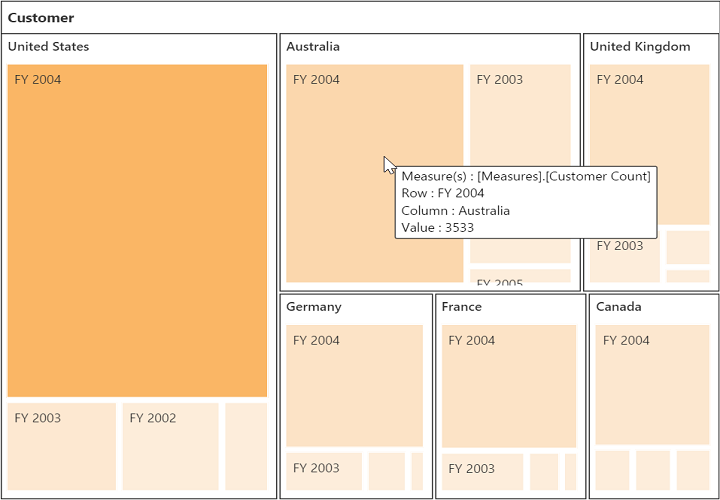

# Legend

## Legend visibility

The legend shows the value range differences and color occurrence in the respective leaf node while hovering it with the cursor.

N> By default, the legend is visible in the pivot tree map.

You can disable the legend by setting the **showLegend** property to **false**. The following code example shows how to disable the legend:




	

	
	{{ej-pivottreemap id="PivotTreeMap" e-renderSuccess=model.renderSuccess}}
	
	

    



    export default Ember.Route.extend({
        model() {
            return {
            renderSuccess: function(args){
                     var treemapTarget = $('#PivotTreeMapTreeMapContainer').data('ejTreeMap');
                     treemapTarget.model.showLegend = false;
                     treemapTarget.refresh();
                }
           }
        }
    });




