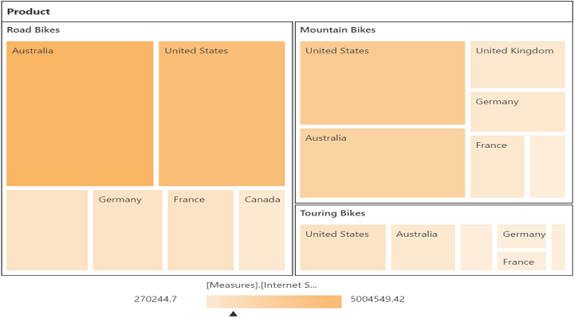

# Named sets

Named sets is a multidimensional expression (MDX) that returns a set of dimension members that can be created by combining cube data, arithmetic operators, numbers, and functions.

You can bind the named sets in the pivot tree map by setting it's unique name in the `field-name` property in the row or column axis and `is-named-sets` Boolean property to true.




	

	
	{{ej-pivottreemap id="PivotTreeMap" e-dataSource=model.dataSource e-renderSuccess=model.renderSuccess}}
	
	

    
    



    export default Ember.Route.extend({
        model() {
            return {
                dataSource: {
                data: "http://bi.syncfusion.com/olap/msmdpump.dll", //data
                catalog: "Adventure Works DW 2008 SE",
                cube: "Adventure Works",
                rows: [
                    {
                        fieldName: "[Date].[Fiscal]"
                    }
                ],
                columns: [
                    {
                        fieldName: "[Customer].[Customer Geography]"
                    }
                ],
                values: [
                    {
                        measures: [
                            {
                                fieldName: "[Measures].[Internet Sales Amount]",
                            }
                        ],
                        axis: "columns"
                    }
                ]
            },
            renderSuccess: function(args){
                     var treemapTarget = $('#PivotTreeMapTreeMapContainer').data('ejTreeMap');
                     treemapTarget.model.tooltipTemplate = null;
                     treemapTarget.model.showTooltip = false;
                     treemapTarget.refresh();
                }
           }
        }
    });




