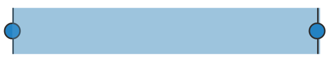

# Getting Started

Before we start with the RangeNavigator, please refer [this page](https://help.syncfusion.com/emberjs/overview) for general information regarding integrating Syncfusion widget’s.

## Adding JavaScript and CSS Reference

To render the RangeNavigator control, the following list of external dependencies are needed, 

<table>
   <tr>
      <th>
         <b>Files</b>
      </th>
      <th>
         <b>Description/Usage </b>
      </th>
   </tr>
   <tr>
      <td>
         ej.core.min.js
      </td>
      <td>
        It is referred always before using all the JS controls.
      </td>
   </tr>
   <tr>
      <td>
         ej.data.min.js
      </td>
      <td>
         Used to handle data operation and is used while binding data to the JS controls.
      </td>
   </tr>
   <tr>
      <td>
        ej.rangenavigator.min.js
      </td>
      <td>
        RangeNavigator core script file which includes RangeNavigator related scripts files.
      </td>
   </tr>   
   <tr>
      <td>
        ej.globalize.min.js
      </td>
      <td>
       It is referred when using localization in RangeNavigator.
      </td>
   </tr>
   <tr>
      <td>
         ej.scroller.min.js
      </td>
      <td>
         It is referred when scrolling is used in the RangeNavigator.
      </td>
   </tr>
</table>

N> RangeNavigator uses one or more script files, therefore refer the `ej.web.all.min.js` (which encapsulates all the `ej` controls and frameworks in a single file) in the application instead of referring all the above specified internal dependencies. 

To get the real appearance of the RangeNavigator, the dependent CSS file `ej.web.all.min.css` (which includes styles of all the widgets) should also needs to be referred.

## Control Initialization

* Open the command prompt in the folder [ember-app](https://help.syncfusion.com/emberjs/getting-started#create-a-simple-ember-application) or the folder in which the application is created.

* Use the command [ember generate route rangenavigator/default](https://guides.emberjs.com/v2.11.0/routing/defining-your-routes/)to create template `default.hbs` file in templates folder and router `default.js` file in routes folder. It also add the routing content in `router.js`.

* Use below code in `default.hbs` in templates folder to render the rangenavigator.



	{{ej-rangenavigator id="rangeNavigator"}}



* Use the below code in `default.js` in routes folder to bind the model to the rangenavigator.



	import Ember from 'ember';

    export default Ember.Route.extend({
      model() {
         return {
         }
      }
    });



## Running the application

* To run the application, execute below command.


 
 ember serve



* Browse to [http://localhost:4200](http://localhost:4200) to see the application. And navigate to rangenavigator sample. The component is rendered as like the below screenshot. You can make changes in the code found under app folder and the browser should auto-refresh itself while you save files. 

**Configure RangeNavigator**

Getting started with your **ej-rangenavigator** is simple. You can initialize the **ej-rangenavigator** by setting its range values.
Set `ej-rangenavigator` attribute to render RangeNavigator control and add `e-rangeSettings` for customize the rangeSettings.



	{{ej-rangenavigator id="rangeNavigator" e-rangeSettings=model.rangeSettings}}





  export default Ember.Route.extend({
      model() {
         return {
           rangeSettings: {
                    start: "2010/1/1", end: "2010/12/31"
                },
         }
      }
  });



The following screen shot displays the **RangeNavigator** with a range from 2010, January 1st to December 31st.

 

**Add series**

To add series to **ej-rangenavigator,** you need to set **dataSource** property of **ej-rangenavigator** as shown in the following code example. 

You can create a folder `service` and add data.serivce.ts file to give data source for **RangeNavigator** as follows.



	{{ej-rangenavigator id="rangeNavigator" e-series=model.series}}





  export default Ember.Route.extend({
      model() {
         return {
           series: [{
			            dataSource: chartData, xName: "xDate", yName: "yValue" 
		       }],
         }
      }
  });



Now, add the **dataSource** to the **series** property of **RangeNavigator** and provide the field name to get the values from the **dataSource** in **xName** and **yName** options as in the above code snippet.

The following screenshot displays a RangeNavigator with the default **"Line"** series type.

 

**Enable tooltip**

You can customize **Tooltip** for RangeNavigator using **tooltip** option. You can use **tooltipDisplayMode** option in **tooltip**,to display the tooltip "always" or "ondemand" (displays tooltip only while dragging the sliders). You can also specify label format for tooltip using **labelFormat**.

The following code sample shows how to enable a Tooltip.



	{{ej-rangenavigator id="rangeNavigator" e-series=model.series e-tooltipSettings=model.tooltipSettings}}





  export default Ember.Route.extend({
      model() {
         return {
           tooltipSettings: {
              visible: true, labelFormat: "MMM/yyyy", tooltipDisplayMode: "always",
           },
         }
      }
  });



The following screenshot displays the label format **Tooltip** in RangeNavigator:

 
