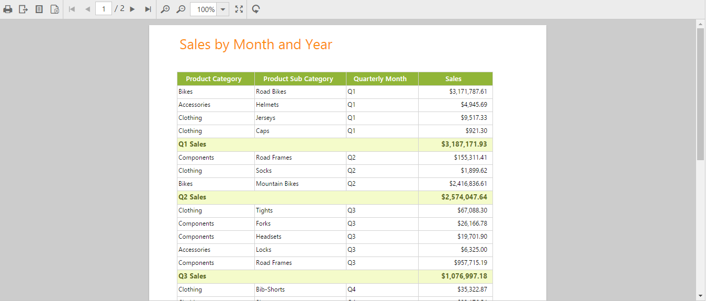

# Getting Started

To get start with how to use the ReportViewer component in an Ember application, refer the basic system requisites and also the steps to create an Ember CLI application from [here](https://help.syncfusion.com/emberjs/getting-started).

## External and Internal Dependencies

The following list of external dependencies are mandatory to render any of the Syncfusion controls.

* [jQuery](http://jquery.com) - 1.7.1 and later versions.
* [jsRender](https://github.com/borismoore/jsrender) - to render the templates.

The other required internal dependencies of the ReportViewer are tabulated below:

<table>
<tr>
<th>
File  </th><th>
Description/Usage  </th></tr>
<tr>
<td>
ej.core.js  </td><td>
It is a core file which must be referred initially before using any of the Syncfusion controls.  </td></tr>
<tr>
<td>
ej.data.js  </td><td>
Used to handle data operation and should be used while binding data to the controls.  </td></tr>
<tr>
<td>
ej.globalize.js  </td><td>
Must be referred to localize any of the component's text and content.  </td></tr>
<tr>
<td>
ej.reportviewer.js  </td><td>
ReportViewer core script file which includes reportviewer related scripts files such as <i>ej.reportviewer.render.js</i>, <i>ej.reportviewer.resources.js</i> and <i>ej.reportviewer.horizontal.js</i>  </td></tr>
<tr>
<td>
ej.draggable.js  ej.editor.js  ej.slider.js  ej.dialog.js  ej.treeview.js  ej.scroller.js  ej.dropdownlist.js  ej.checkbox.js  ej.waitingpopup.js  ej.tooltip.js  ej.toolbar.js  ej.radiobutton.js  ej.splitter.js  ej.button.js  ej.datepicker.js  ej.map.js  ej.touch.js  </td><td>
These files are referred for proper working of the sub-controls used within the ReportViewer.  </td></tr>
</table>

N> ReportViewer control uses multiple sub-controls within it, therefore refer the `ej.web.all.min.js` file (which encapsulates all the `ej` controls and frameworks in a single file) in the application, instead of referring all the above specified internal dependencies. 

To get the real appearance of the ReportViewer, the dependent CSS file `ej.web.all.min.css` (which includes styles of all the widgets) should also be referred.

N> An uncompressed version of all the Syncfusion library files are available, which can be used for development or debugging purpose and can be generated from the [custom script generator](http://csg.syncfusion.com).

## Initializing ReportViewer

The ReportViewer component can be created with the prefix of `ej-`. The below code example should be defined on the `default.hbs` file that is present within the templates folder.



	
	{{ej-ReportViewer id="ReportViewer"}}
    



Define the below code on `default.js` file within the routes folder to bind the model data to the ReportViewer. Here, it has been left empty to render the simple ReportViewer with no appointment data.



import Ember from 'ember';

export default Ember.Route.extend({
   model(){
    return {
        }
    }
});
    


## Load RDL Reports

Add necessary HTML elements and CSS style to render the ReportViewer and set the desired `ReportPath`, `ProcessingMode`, and `ReportServiceUrl` to the ReportViewer. The code example for defining ReportViewer control in emberjs is as follows:



    {{ej-reportviewer id="groupingaggregate_reportViewer_Control" e-reportServiceUrl=model.reportServiceUrl 
    e-processingMode=model.processingMode 
    e-reportPath=model.reportPath }}
 





groupingaggregate_reportViewer_Control{
		height: 550px;
		display: block;
	}





import Ember from 'ember';

export default Ember.Route.extend({
    model() {
        return {
            reportServiceUrl: "http://js.syncfusion.com/ejservices/api/ReportViewer",
            reportPath: "GroupingAgg.rdl",
            processingMode: "Remote",
        }
    }
});



## Run the Application

To run the Ember CLI application, execute the below command in the command prompt.


 
 ember serve



Now, open the browser and navigate to [http://localhost:4200](http://localhost:4200) to see the hosted application, on which reportViewer will get displayed as shown below:

ReportViewer with Grouping Aggregate Report {:.caption}.

## Load SSRS Server Reports

Add necessary HTML elements and CSS style to render ReportViewer and set the desired `ReportPath`, `ProcessingMode`, and `ReportServiceUrl` to the ReportViewer. The code example for defining ReportViewer control in emberjs is as follows:



     {{ej-reportviewer id="territorysales_reportViewer_Control" e-reportServiceUrl = model.reportServiceUrl 
	 e-reportServerUrl = model.reportServerUrl
     e-processingMode = model.processingMode 
     e-reportPath = model.reportPath }}





territorysales_reportViewer_Control{
		height: 550px;
		display: block;
	}





import Ember from 'ember';

export default Ember.Route.extend({
    model() {
        return {
            reportServiceUrl: "http://js.syncfusion.com/ejservices/api/ReportViewer",
            reportServerUrl: "http://mvc.syncfusion.com/reportserver",
            reportPath: "/SSRSSamples2/Territory Sales new",
            processingMode: "Remote",
        }
    }
});



## Run the Application

To run the Ember CLI application, execute the below command in the command prompt.


 
 ember serve



Now, open the browser and navigate to [http://localhost:4200](http://localhost:4200) to see the hosted application, on which the reportViewer will get displayed as shown below. 

Report from SSRS {:.caption}

## Load RDLC Reports

The ReportViewer has data binding support to visualize the RDLC reports and set the desired `reportPath`, `reportServerUrl`, `processingMode`, and `reportServiceUrl` to the ReportViewer. The following code example helps you to bind the data to the ReportViewer.



    {{ej-reportviewer id = "areachart_reportViewer_Control" e-reportServiceUrl = model.reportServiceUrl 
    e-processingMode = model.processingMode 
    e-reportPath = model.reportPath
	e-dataSources = model.dataSources }}





areachart_reportViewer_Control {
    display: block;
    height: 550px;
}





import Ember from 'ember';

export default Ember.Route.extend({
	model() {
		return {
			reportServiceUrl: "http://js.syncfusion.com/ejservices/api/ReportViewer",
			reportPath: "AreaCharts.rdlc",
			processingMode: "Local",
			dataSources: [{
				value: [
					{ SalesPersonID: 281, FullName: 'Ito', Title: 'Sales Representative', SalesTerritory: 'South West', Y2002: 0, Y2003: 28000, Y2004: 3018725 },
					{ SalesPersonID: 282, FullName: 'Saraiva', Title: 'Sales Representative', SalesTerritory: 'Canada', Y2002: 25000, Y2003: 14000, Y2004: 3189356 },
					{ SalesPersonID: 283, FullName: 'Cambell', Title: 'Sales Representative', SalesTerritory: 'North West', Y2002: 12000, Y2003: 13000, Y2004: 1930885 },
					{ SalesPersonID: 275, FullName: 'Blythe', Title: 'Sales Representative', SalesTerritory: 'North East', Y2002: 19000, Y2003: 47000, Y2004: 4557045 },
					{ SalesPersonID: 276, FullName: 'Mitchell', Title: 'Sales Representative', SalesTerritory: 'South West', Y2002: 28000, Y2003: 46000, Y2004: 5240075 },
					{ SalesPersonID: 277, FullName: 'Carson', Title: 'Sales Representative', SalesTerritory: 'Central', Y2002: 33000, Y2003: 49000, Y2004: 3857163 },
					{ SalesPersonID: 278, FullName: 'Vargas', Title: 'Sales Representative', SalesTerritory: 'Canada', Y2002: 11000, Y2003: 14000, Y2004: 1764938 },
					{ SalesPersonID: 279, FullName: 'Reiter', Title: 'Sales Representative', SalesTerritory: 'South East', Y2002: 32000, Y2003: 26000, Y2004: 2811012 }
				],
				name: "AdventureWorksXMLDataSet"
			}],
		}
	}
});



N> Default RDLC Report will be rendered, which is used in the online service.

## Run the Application

To run the Ember CLI application, execute the below command in the command prompt.


 
 ember serve



Now, open the browser and navigate to [http://localhost:4200](http://localhost:4200) to see the hosted application, on which the reportViewer will get displayed as shown below:

Area Chart RDLC Report {:.caption}