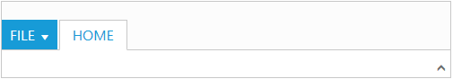
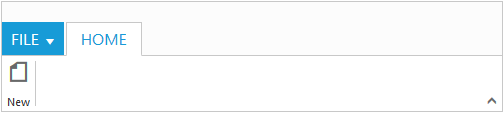
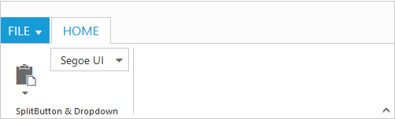

# Getting Started

Before we start with the Ribbon, please refer [this page](https://help.syncfusion.com/emberjs/overview) for general information regarding integrating Syncfusion widget’s.

## Control Initialization

* Open the command prompt in the folder [ember-app](https://help.syncfusion.com/emberjs/getting-started#create-a-simple-ember-application) or the folder in which the application is created.

* Use the command [ember generate route ribbon/default](https://guides.emberjs.com/v2.11.0/routing/defining-your-routes/) to create template `default.hbs` file in templates folder and router `default.js` file in routes folder. It also add the routing content in `router.js`.

* Use below code in `default.hbs` in templates folder to render the Ribbon.



    {{ej-ribbon id="defaultribbon" e-width="500" e-applicationTab=model.applicationTab }}
	<ul id="ribbonmenu">
         <li>
            <a>FILE</a>
            <ul>
               <li><a>New</a></li>
               <li><a>Open</a></li>
               <li><a>Save</a></li>
               <li><a>Print</a></li>
            </ul>
         </li>
      </ul>



* Use the below code in `default.js` in routes folder to bind the model to the Ribbon.



	export default Ember.Route.extend({
      model() {
         return {
            applicationTab : {
              type: ej.Ribbon.ApplicationTabType.Menu,
              menuItemID: "ribbonmenu", 
          }
         }
      }
    });



N> Set the required [`width`](https://help.syncfusion.com/api/js/ejribbon#members:width) to Ribbon, else default parent container or window width will be considered

## Running the application

* To run the application, execute below command.


 
 ember serve



* Browse to [http://localhost:4200](http://localhost:4200) to see the application. And navigate to Ribbon sample. The component is rendered as like the below screenshot. You can make changes in the code found under app folder and the browser should auto-refresh itself while you save files. 

## Adding Tabs

Tab is a set of related groups which are combined into single item. For creating Tab, [`id`](https://help.syncfusion.com/api/js/ejribbon#members:tabs-id) and [`text`](https://help.syncfusion.com/api/js/ejribbon#members:tabs-text) properties should be specified. 



export default Ember.Route.extend({
    model() {
        return {
            applicationTab : {
              type: ej.Ribbon.ApplicationTabType.Menu,
              menuItemID: "ribbonmenu", 
            },
            tabs: [{
                      id: "home",
                      text: "HOME"                      
                  }]
        }
    }
});





{{ej-ribbon id="defaultribbon" e-width="500" e-applicationTab=model.applicationTab e-tabs=model.tabs}}
	<ul id="ribbonmenu">
         <li>
            <a>FILE</a>
            <ul>
               <li><a>New</a></li>
               <li><a>Open</a></li>
               <li><a>Save</a></li>
               <li><a>Print</a></li>
            </ul>
         </li>
      </ul>



## Configuring Groups

List of controls are combined as logical [`groups`](https://help.syncfusion.com/api/js/ejribbon#members:tabs-groups) into Tab. Group alignment type as `row/column`, Default is `row`. 

Create group item with [`text`](https://help.syncfusion.com/api/js/ejribbon#members:tabs-groups-content-groups-text) specified and add content group to Groups collection with ejButton control settings.



export default Ember.Route.extend({
    model() {
        return {
            applicationTab: {
                    type: ej.Ribbon.applicationTabType.menu,
                    menuItemID: "ribbonmenu"
            },
            // tab item defined here
            tabs: [{
                    id: "home",
                    text: "HOME",
                    // group with content & button settings
                    groups: [{
                        text: "New",
                        content: [{
                            groups: [{
                                id: "new",
                                text: "New",
                                buttonSettings: {
                                    contentType: ej.ContentType.ImageOnly,
                                    prefixIcon: "e-icon e-ribbon e-new",
                                }
                            }]
                        }]
                    }]
            }]
        }
    }
});





{{ej-ribbon id="defaultribbon" e-width="500" e-applicationTab=model.applicationTab e-tabs=model.tabs}}
	<ul id="ribbonmenu">
         <li>
            <a>FILE</a>
            <ul>
               <li><a>New</a></li>
               <li><a>Open</a></li>
               <li><a>Save</a></li>
               <li><a>Print</a></li>
            </ul>
         </li>
      </ul>



## Adding Controls to Group

Syncfusion JavaScript Controls can be added to group’s content with corresponding [`type`](https://help.syncfusion.com/api/js/ejribbon#members:tabs-groups-type) specified like button, split button, toggle button, dropdown list, gallery, custom, etc. Default type is `button`.



export default Ember.Route.extend({
    model() {
        var fontFamily = [{
                value: 1,
                text: "Segoe UI"
            }, {
                value: 2,
                text: "Arial"
            }];
        return {
            applicationTab: {
                        type: ej.Ribbon.applicationTabType.menu,
                        menuItemID: "ribbon"
            },
            tabs: [{
                        id: "home",
                        text: "HOME",
                        groups: [{
                            text: "SplitButton & Dropdown",
                            alignType: ej.Ribbon.alignType.columns,
                            content: [{
                                groups: [{
                                    id: "paste",
                                    text: "paste",
                                    // split button settings
                                    splitButtonSettings: {
                                        contentType: ej.ContentType.ImageOnly,
                                        targetID: "split",
                                        prefixIcon: "e-icon e-ribbon e-ribbonpaste",
                                        buttonMode: "dropdown",
                                        arrowPosition: "bottom"
                                    }
                                }],
                                defaults: {
                                    type: ej.Ribbon.type.splitButton,
                                    width: 50,
                                    height: 70
                                }
                            }, {
                                groups: [{
                                    id: "fontFamily",
                                    // dropdown list settings
                                    type: ej.Ribbon.type.dropDownList,
                                    dropdownSettings: {
                                        dataSource: fontFamily,
                                        value: "1",
                                        width: 100
                                    }
                                }]
                            }]
                        }]
                }]
        }
    }
});





{{ej-ribbon id="defaultribbon" e-width="500" e-applicationTab=model.applicationTab e-tabs=model.tabs}}
	<ul id="ribbon">
        <li>
          <a>FILE</a>
          <ul>
              <li><a>New</a></li>
          </ul>
        </li>
    </ul>
    <ul id="split">
        <li>Paste</li>
    </ul>



