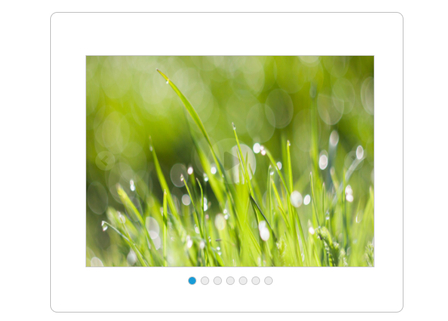
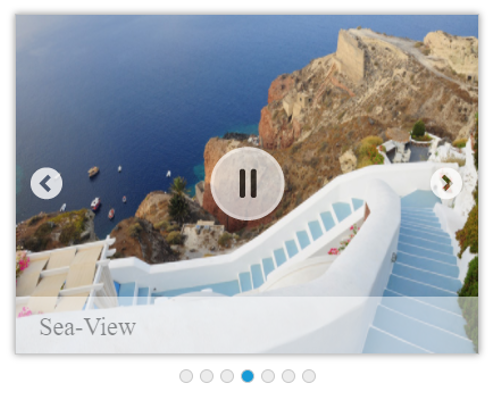

# Getting Started

This section explains briefly about how to create a **Rotator** in EmberJS. **EmberJs Image Rotator** comes with a visual that has a spectacular zoom in and fade out effect. A single line of code invokes the **Rotator** effect. Using the following guidelines you can create **Rotator** widget for a real-time website banner. It has five images that slide automatically. When you click the center button, image slides in a rotating manner and on second click the rotation stops.

The following screenshot demonstrates the functionality of **Rotator** widget.

## Create Rotator Widget

A Rotator widget can be made by the following steps.

 Create an HTML file and add the following template in the HTML file.



    

        
                {{#ej-rotator id="sliderContent" e-slidewidth=model.slideWidth e-framespace=model.frameSpace
                    e-slideheight=model.slideHeight e-displayitemscount=model.displayItemsCount e-navigatesteps=model.navigateSteps
                    e-pagerposition=model.pagerPosition  e-orientation=model.orientation e-showpager=model.showPager e-enabled=model.enabled e-showcaption=model.showCaption
            e-allowkeyboardnavigation=model.allowKeyboardNavigation e-showCaption=true  e-showPlayButton=true e-isresponsive=model.isResponsive e-animationtype= model.animationType}}              
                    {{/ej-rotator}}   
                

            



## Configure Images

The following guidelines help you to configure images.

* You can also load image from local storage.



    

        
               {{#ej-rotator id="sliderContent" e-slidewidth=model.slideWidth e-framespace=model.frameSpace
                   e-slideheight=model.slideHeight e-displayitemscount=model.displayItemsCount e-navigatesteps=model.navigateSteps
                   e-pagerposition=model.pagerPosition  e-orientation=model.orientation e-showpager=model.showPager e-enabled=model.enabled e-showcaption=model.showCaption
        e-allowkeyboardnavigation=model.allowKeyboardNavigation e-showCaption=true  e-showPlayButton=true e-isresponsive=model.isResponsive e-animationtype= model.animationType}}
               
                <li>
                    </li>
                        <li>
                            </li>
                        <li>
                            </li>
                        <li>
                            </li>
                        <li>
                            </li>
                        <li>
                            </li>
                        <li>
                            </li>

                 
                
                {{/ej-rotator}}                      
        

            



## Configure Styles

Add the following style in corresponding **.hbs** file or separate stylesheet.



    



## Set Actions

Add the following script in corresponding script file.



        export default Ember.Route.extend({
        model(){
        return {
        slideWidth: "100%",
        frameSpace: "0px",
        slideHeight: "auto",
        displayItemsCount: "1",
        navigateSteps: "1",
        pagerPosition: ej.Rotator.PagerPosition.Outside,
        orientation: ej.Orientation.Horizontal,
        showPager: true,
        enabled: true,
        showCaption: true,
        allowKeyboardNavigation: true,
        showPlayButton: true,
        isResponsive:true,
        animationType: "slide"
                     }
                         }
              });



The above code gives the output displayed in following screenshot.

