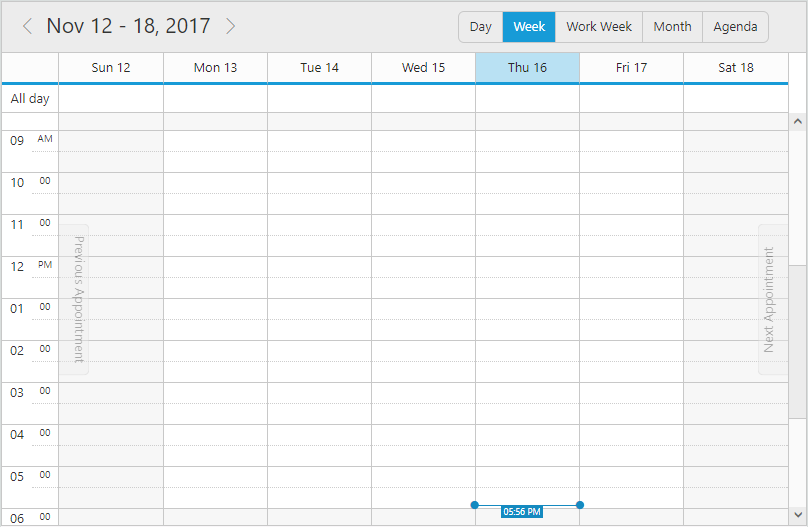
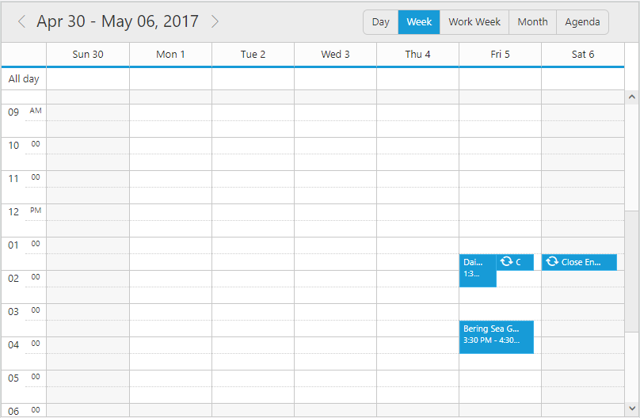

# Getting Started

To get start with how to use the Schedule component in an Ember application, refer the basic system requisites and also the steps to create an Ember CLI application from [here](https://help.syncfusion.com/emberjs/getting-started).

## External and Internal Dependencies

The following list of external dependencies are mandatory in order to render any of the Syncfusion controls.

* [jQuery](http://jquery.com) - 1.7.1 and later versions.
* [jsRender](https://github.com/borismoore/jsrender) - to render the templates.

The other required internal dependencies of Schedule are tabulated below,

<table>
<tr>
<th>
File  </th><th>
Description/Usage  </th></tr>
<tr>
<td>
ej.core.min.js  </td><td>
It is a core file which must be referred initially before using any of the Syncfusion controls.  </td></tr>
<tr>
<td>
ej.data.min.js  </td><td>
Used to handle data operation and should be used while binding data to the controls.  </td></tr>
<tr>
<td>
ej.globalize.min.js  </td><td>
Must be referred to localize any of the component's text and content.  </td></tr>
<tr>
<td>
ej.schedule.min.js  </td><td>
Schedule core script file which includes schedule related scripts files such as <i>ej.schedule.render.js</i>, <i>ej.schedule.resources.js</i> and <i>ej.schedule.horizontal.js</i>  </td></tr>
<tr>
<td>
ej.scroller.js  ej.touch.js  ej.draggable.js  ej.navigationdrawerbase.js  ej.listviewbase.js  ej.listview.js  ej.recurrenceeditor.js  ej.dropdownlist.js  ej.radiobutton.js  ej.dialog.js  ej.button.js  ej.autocomplete.js  ej.datepicker.js  ej.timepicker.js  ej.checkbox.js  ej.editor.js  ej.menu.js  ej.navigationdrawer.js  ej.tooltip.js  </td><td>
These files are referred for proper working of the sub-controls used within the Schedule.  </td></tr>
</table>

N> Schedule control uses multiple sub-controls within it, therefore refer the `ej.web.all.min.js` file (which encapsulates all the `ej` controls and frameworks in a single file) in the application, instead of referring all the above specified internal dependencies. 

To get the real appearance of the Schedule, the dependent CSS file `ej.web.all.min.css` (which includes styles of all the widgets) should also needs to be referred.

N> An uncompressed version of all the Syncfusion library files are available, which is used for development or debugging purpose and can be generated from the [custom script generator](http://csg.syncfusion.com).

## Initializing Schedule

The Schedule component can be created with the prefix of `ej-`. The below code example should be defined on the `default.hbs` file present within the templates folder.



	
	{{ej-schedule id="schedule"}}
    



Define the below code on `default.js` file within the routes folder, in order to bind model data to the Schedule. Here, it has been left empty to render the simple Schedule with no appointment data.



import Ember from 'ember';

export default Ember.Route.extend({
   model(){
    return {
        }
    }
});
    


## Run the application

To Run the Ember CLI application, execute the below command in the command prompt.


 
 ember serve



Now, open the browser and navigate to [http://localhost:4200](http://localhost:4200) to see the hosted application, on which the empty schedule will get displayed as shown below. 

## Populating appointment data

The above code example creates an empty Schedule with no data bound to it. To bind specific appointment data on Schedule, then the dataSource property of `appointmentSettings` needs to be defined as shown below.


	

        {{ej-schedule id="schedule" e-currentDate=model.currentDate e-appointmentSettings=model.appointmentSettings}}
    



Define the below code in order to bind the appointment model data to the Schedule.



    import Ember from 'ember';
    
    export default Ember.Route.extend({
        model() {
            return {
                currentDate: new Date(2017, 4, 5),
                appointmentSettings: {
                    dataSource: [   {
                                        Id: 100,
                                        Subject: 'Bering Sea Gold',
                                        StartTime: '2016/4/5 10:00:00',
                                        EndTime: '2016/4/5 11:00:00',
                                        AllDay: false,
                                        Recurrence: false
                                    }, {
                                        Id: 101,
                                        Subject: 'Daily Planet',
                                        StartTime: '2016/4/3 01:00:00',
                                        EndTime: '2016/4/3 02:00:00',
                                        AllDay: false,
                                        Recurrence: false
                                    }, {
                                        Id: 104,
                                        Subject: 'Close Encounters',
                                        StartTime: '2016/3/30 14:00:00',
                                        EndTime: '2016/3/30 15:30:00',
                                        AllDay: false,
                                        Recurrence: true,
                                        RecurrenceRule: 'FREQ=WEEKLY;BYDAY=MO,TH;INTERVAL=1;COUNT=5'
                                    }],
                    id: "Id",
                    subject: "Subject",
                    startTime: "StartTime",
                    description: "Description",
                    endTime: "EndTime",
                    allDay: "AllDay",
                    recurrence: "Recurrence",
                    recurrenceRule: "RecurrenceRule"
                }
            };
        }
    });


The Schedule component renders with appointments as depicted in the below screenshot.

