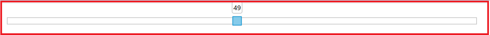
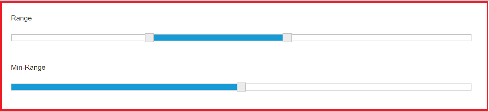

# Getting Started

Before we start with the Slider, please refer [this page](https://help.syncfusion.com/emberjs/overview) for general information regarding integrating Syncfusion widget’s.

## Control Initialization

* Open the command prompt in the folder [ember-app](https://help.syncfusion.com/emberjs/getting-started#create-a-simple-ember-application) or the folder in which the application is created.

* Use the command [ember generate route slider/default](https://guides.emberjs.com/v2.11.0/routing/defining-your-routes/) to create template `default.hbs` file in templates folder and router `default.js` file in routes folder. It also add the routing content in `router.js`.

* Use below code in `default.hbs` in templates folder to render the slider.



	{{ej-slider id="default" e-value=model.value e-width=model.width }}



* Use the below code in `default.js` in routes folder to bind the model to the slider.



	import Ember from 'ember';

    export default Ember.Route.extend({
      model() {
         return {
           width: "100%",
           value: "50"
         }
      }
    });



## Running the application

* To run the application, execute below command.


 
 ember serve



* Browse to [http://localhost:4200](http://localhost:4200) to see the application. And navigate to slider sample. The component is rendered as like the below screenshot. You can make changes in the code found under app folder and the browser should auto-refresh itself while you save files. 

## Slider Types

There are three different types of **Slider**, **Default Slider**, **Min-Range Slider** and **Range Slider**. By default, Default Slider renders. You can use the sliderType property to choose the type of Slider. Data type of this property is “Enum”.

Both Default Slider and Min-Range Slider have same behavior that is used to select a single value. In Min-Range Slider, a shadow is considered from the start value to current handle position. But Range Slider contains two handles that is used to select a range of values and a shadow is considered in between the two handles.




export default Ember.Route.extend({
    model(){
    return {
            width: "100%",
            value: "50",
			slidervalues: [30,60]
        }
    }
});






                

                    
Range

                     
                    {{ej-slider id="range" e-values=model.slidervalues e-sliderType="range" e-width=model.width }}
                     
                     
                    
Min-Range

                     
                    {{ej-slider id="minrange" e-value=model.value e-sliderType="minrange" e-width=model.width }}
                




## Button Support

**Slider** includes the button support for increment or decrement the values of the slider.

### Enabling Buttons

Use the **showButtons** property to enable the button support. By default this property is disabled. Data type of this property is “boolean”.

The following steps explains you on how to enable button support in **Slider**.




export default Ember.Route.extend({
    model(){
    return {
            width: "90%",
            value: "50",
            showButtons: true,
			      slidervalues: [30,60]
        }
    }
});






                

                    
Range

                     
                    {{ej-slider id="range" e-values=model.slidervalues e-sliderType="range" e-width=model.width e-showButtons=model.showButtons }}
                     
                     
                    
Min-Range

                     
                    {{ej-slider id="minrange" e-value=model.value e-sliderType="minrange" e-width=model.width e-showButtons=model.showButtons }}
                




