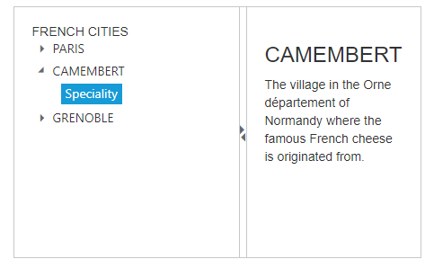
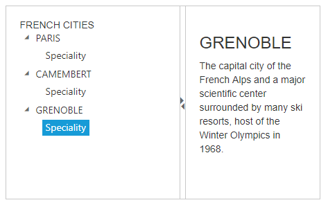

# Getting Started

This section explains briefly about how to create a **Splitter** in your application with **Syncfusion Essential EmberJS**.
Before going to getting started with Splitter widget please refer [Getting Started with Syncfusion EmberJS application](https://help.syncfusion.com/emberjs/overview/)  to know how to create simple Essential EmberJS application.
If you want to know individual script reference to create Splitter Please Refer under [Requires](https://help.syncfusion.com/api/js/ejsplitter/)
**Splitter** widget consists of movable split bar(s) that divides a container's display area into two or more resizable and collapsible panels. 

From the following guidelines, you can create a **Splitter**, add Tree view in the **Splitter** and set actions to view the text content. It is used to split the document or image and Expand or Collapse in the **Splitter**. The following screenshot demonstrates the functionality of **Splitter** widget.

 

## Create Splitter Control



     

        
                {{#ej-splitter id="outterSplitter" e-height=model.height e-width=model.width  e-properties=model.properties e-enableAutoResize=model.enableAutoResize}}                      
                    

                    

                       
                       

                        

                {{/ej-splitter}}   
                
                         
        



Add the following code in styles section,



    



## Configure Tree View 

Add the following code example in **HTML** file to configure Tree View.



        

        
        {{#ej-splitter id="outterSplitter" e-height=model.height e-width=model.width  e-properties=model.properties e-enableAutoResize=model.enableAutoResize}}                      
        

        

        <h3 class="h3">FRENCH CITIES</h3>

        {{#ej-treeview id="treeView" class="visibleHide" e-nodeSelect=model.nodeSelect }}
        <li>PARIS
        <ul>
        <li id="paris" class="_child">Speciality</li>
        </ul>
        </li>
        <li>CAMEMBERT
        <ul>
            <li id="camembert" class="_child">Speciality </li>
        </ul>
        </li>
        <li>GRENOBLE
        <ul>
            <li id="grenoble" class="_child">Speciality</li>
        </ul>
        </li>
        {{/ej-treeview}}
        

        

        

        

        Select any city from the tree to show the description.
        

        

        <h3>PARIS</h3>
        Paris, the city of lights and love - this short guide is full of ideas for how to make the most of the romanticism...
        

        

        <h3>CAMEMBERT</h3>
        The village in the Orne département of Normandy where the famous French cheese is originated from.
        

        

        <h3>GRENOBLE</h3>
        The capital city of the French Alps and a major scientific center surrounded by many ski resorts, host of the Winter Olympics in 1968.
        

        

        {{/ej-splitter}}           
         
        



Include following code in style section,



      



## Set Actions

Add the following code example in the view page to set the action to view the content.



    export default Ember.Route.extend({
    model() {
    return {
        height: 280, width: 454,
        properties: [{ paneSize: 250 }, {}],
        enableAutoResize: true,
        nodeSelect: function (sender) {
            if (sender.currentElement.hasClass('_child')) {
                var content = Ember.$('.' + sender.currentElement[0].id).html();
                Ember.$('._content').html(content);
            }
        },
        }
        }
     });



The following screenshot is the output for the above code.

 

