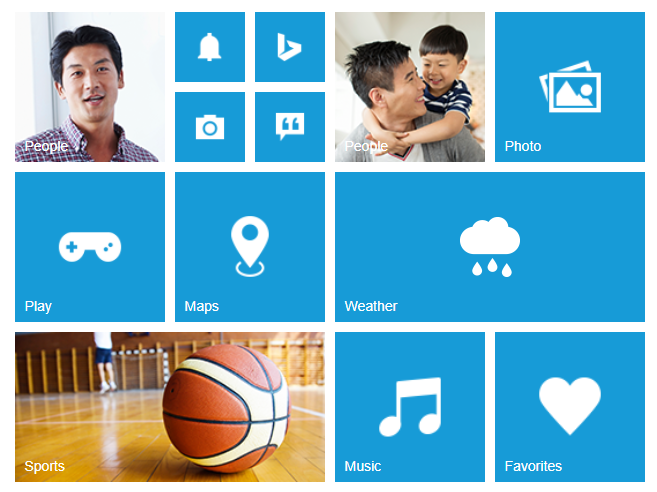
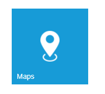

# Getting Started

The **Essential EmberJs Tiles** are simple, opaque rectangles or squares that are arrayed on the Start screen in a grid-like pattern and it can be either static or live. Tapping or selecting a **Tile** launches the app or other experience that is represented by the **Tile**.                            

Before going to getting started with Tile widget please refer [Getting Started with Syncfusion EmberJS application](https://help.syncfusion.com/emberjs/overview/)  to know how to create simple Essential EmberJS application.
If you want to know individual script reference to create Tile Please Refer under [Requires](https://help.syncfusion.com/api/js/ejtile/)                   

## Create Tile Widget

The following steps guide you to add group of **Tiles** for creating a home page that displays all the available applications.

Create a div element that acts as a container for Tile control. Initialize ejTile as in the following code example and specify the tile text, size and image URL.


        
        {{ej-tile id="tile7" e-imageUrl="http://js.syncfusion.com/demos/web/content/images/tile/windows/map.png"  e-tileSize="medium" e-text="Maps" }} 
        
        



Add the following code in **script** file.


 
        export default Ember.Route.extend({
        model(){
        return {
            
        }
        }
        });
    
 


Run the above code to render the following output. 

In this scenario, a home page is designed using tile for easy navigation. Therefore, you require many different sizes of tiles aligned in a grid-like manner. To align the tiles automatically, define the necessary tile elements inside the wrapper element that contains a ‘**e-tile-column’** class. You can define all columns elements under the wrapper element with ‘**e-tile-group’** class to make ‘n’ number of tiles as a grouped tile.

Refer to the following code example.


    
     

            

            
                

                    

                        

                {{ej-tile id="tile1" e-imageUrl="http://js.syncfusion.com/demos/web/content/images/tile/windows/people_1.png" e-imagePosition="fill" e-tileSize="medium" e-text="People" }} 
                

                    {{ej-tile id="tile2" e-imageUrl="http://js.syncfusion.com/demos/web/content/images/tile/windows/alerts.png"}} 
                    {{ej-tile id="tile3" e-imageUrl="http://js.syncfusion.com/demos/web/content/images/tile/windows/bing.png"}} 
                    {{ej-tile id="tile4" e-imageUrl="http://js.syncfusion.com/demos/web/content/images/tile/windows/camera.png"}} 
                    {{ej-tile id="tile5" e-imageUrl="http://js.syncfusion.com/demos/web/content/images/tile/windows/messages.png"}} 
                

                   {{ej-tile id="tile6" e-imageUrl="http://js.syncfusion.com/demos/web/content/images/tile/windows/games.png"  e-tileSize="medium" e-text="Play" }} 
                    {{ej-tile id="tile7" e-imageUrl="http://js.syncfusion.com/demos/web/content/images/tile/windows/map.png"  e-tileSize="medium" e-text="Maps" }} 
                    {{ej-tile id="tile8" e-imageUrl="http://js.syncfusion.com/demos/web/content/images/tile/windows/sports.png" e-imagePosition="fill" e-tileSize="wide" e-text="Sports" }} 
               

               

                    {{ej-tile id="tile9" e-imageUrl="http://js.syncfusion.com/demos/web/content/images/tile/windows/people_2.png"  e-imagePosition="fill" e-tileSize="medium" e-text="People" }} 
                    {{ej-tile id="tile10" e-imageUrl="http://js.syncfusion.com/demos/web/content/images/tile/windows/pictures.png"  e-tileSize="medium" e-text="Photo" }} 
                    {{ej-tile id="tile11" e-imageUrl="http://js.syncfusion.com/demos/web/content/images/tile/windows/weather.png" e-tileSize="wide" e-text="Weather" }} 
                    {{ej-tile id="tile12" e-imageUrl="http://js.syncfusion.com/demos/web/content/images/tile/windows/music.png"  e-tileSize="medium" e-text="Music" }} 
                    {{ej-tile id="tile13" e-imageUrl="http://js.syncfusion.com/demos/web/content/images/tile/windows/favs.png" e-tileSize="medium" e-text="Favorites" }} 
               

            

        

            
    

    



Add the following code inside the **script** tag.



        export default Ember.Route.extend({
        model(){
        return {
            
           }
            }
           });
 


Add the following in style sheet.



    



Run the above code to render the following output.

