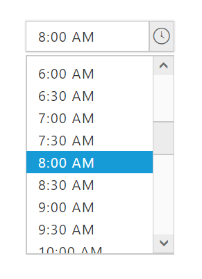
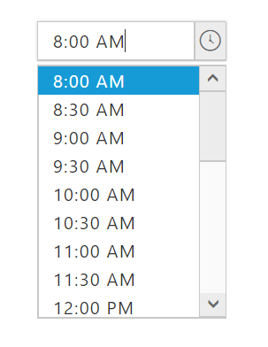

# Getting Started

This section explains briefly about how to create a TimePicker in your application with EmberJS

Before we start with the TimePicker, please refer [`this page`](https://help.syncfusion.com/emberjs/getting-started) for general information regarding integrating Syncfusion widget's.

## Adding JavaScript and CSS Reference

To render the TimePicker control, the following list of dependencies are required.

CSS file

* [ej.web.all.min.css](http://cdn.syncfusion.com/{{ site.releaseversion }}/js/web/flat-azure/ej.web.all.min.css) – includes all widgets styles (To know more about theme refer [Theming in Essential JavaScript Component](https://help.syncfusion.com/js/theming-in-essential-javascript-components#))

Script Files

<table>
<tr>
<th>
File </th><th>
Description / Usage </th></tr>
<tr>
<td>
ej.core.min.js  </td><td>
Includes only the widget basic functions and Framework features. Must be referred always before using all the JS controls  </td></tr>
<tr>
<td>
ej.globalize.min.js  </td><td>
To support the globalization.  </td></tr>
<tr>
<td>
ej.timepicker.min.js  </td><td>
TimePicker plugin.  </td></tr>
<tr>
<td>
ej.scroller.min.js  </td><td>
Scroller pulgin  </td></tr>
</table>

You can make use of ‘ej.web.all.min.js’ file which encapsulates all ‘ej’ web components and frameworks in single file.

* [ej.web.all.min.js](http://cdn.syncfusion.com/{{ site.releaseversion }}/js/web/ej.web.all.min.js) – includes all web widgets.

## Initialize TimePicker

* Open the command prompt in the folder [ember-app](https://help.syncfusion.com/emberjs/getting-started#create-a-simple-ember-application) or the folder in which the application is created.

* Use the command [ember generate route timepicker/default](https://guides.emberjs.com/v2.11.0/routing/defining-your-routes/) to create template file `default.hbs` in templates folder and router file `default.js` in routes folder. It also add the routing content in `router.js`.

* Use below code in `default.hbs` in templates folder to render the TimePicker control.



  { % raw % }

	  {{ ej-timepicker id="timePick" e-value="Value"}}

  { % endraw % }



* Use the below code in `default.js` in routes folder to bind the model to the TimePicker Control.



	export default Ember.Route.extend({
      model() {
         return {
           Value: "8:00 AM"
         }
      }
    });



## Running the application

* To run the application, execute below command.


 
 ember serve



Browse to [http://localhost:4200](http://localhost:4200) to see the application and navigate to TimePicker sample. The component is rendered as like the below screenshot.

## Min/Max values

TimePicker provides an option to select a value within a given range. This can be achieved by using minTime and maxTime properties of TimePicker. Only the time values ranging between minTime and maxTime values will be enabled in the TimePicker. 

* Use below code in `default.hbs` in templates folder to render the TimePicker control with minTime and maxTime values.



  { % raw % }

	  {{ ej-timepicker id="timePick" e-minTime= model.minimumTime e-maxTime= model.maximumTime}}

  { % endraw % }



* Use the below code in `default.js` in routes folder to bind the minTime and maxTime values to the TimePicker.



	export default Ember.Route.extend({
      model() {
         return {
            minimumTime : "8:00 AM"
            maximumTime:  "8:00 PM"
         }
      }
    });



