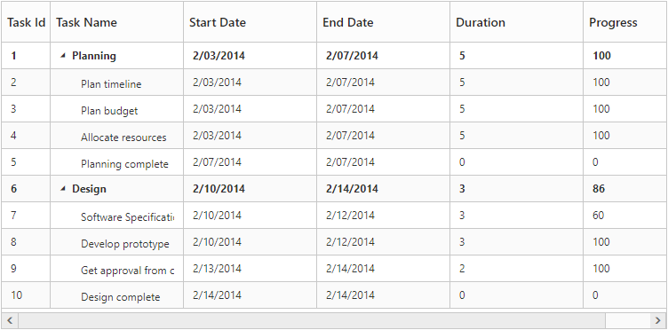
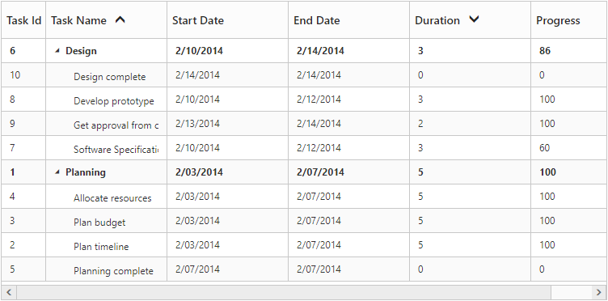
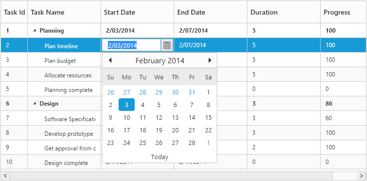

# Getting Started
This section helps to understand the getting started of the Ember TreeGrid with the step-by-step instructions.

## Getting started TreeGrid with Ember CLI

* To quick start with create a new Ember CLI application run the below commands in the command prompt.


> ember new EmberTreeGrid    // Create new Ember CLI app as 'EmberTreeGrid'

> cd EmberTreeGrid



* Add syncfusion-ember in `package.json` to add the Syncfusion Ember add-on into your application `EmberTreeGrid`.


    "devDependencies": {
        ...
	    "syncfusion-ember":"*" //To install the latest version
    }


* Disable EXTEND_PROTOTYPES option in the environment.js file under config folder to prevent on function prototype extension in our controls events.


    EmberENV: {
        FEATURES: {
            // Here you can enable experimental features on an ember canary build
            // e.g. 'with-controller': true
        },
        EXTEND_PROTOTYPES: false,
    },


* Open the command prompt in the root folder and run the command `npm install` to download the dependent files in node-modules.

## Configure Syncfusion source and theme reference

* Copy the files `ej.web.all.min` and `jsrender.min` into the `vendor` folder. Import the same into the application using below code in `ember-cli-build.js`.


    module.exports = function(defaults) {
        var app = new EmberApp(defaults, {
            // Add options here
        });
        app.import('vendor/ej.web.all.min.js');
        app.import('vendor/jsrender.min.js');
        return app.toTree();
    };


* Create the folder `scripts` and `content` in public folder and copy JavaScript and CSS files from `/scripts` and `/content` folder which is in JavaScript samples location `(Click explore button from the Javascript Dashboard)` into created folders. And include the necessary file references in Index page which is in `app` folder of the Ember application.


    <head>    
        <link rel="stylesheet" href="{{rootURL}}content/ejthemes/default-theme/ej.web.all.min.css">
    </head>
    <body>        
    </body>


## Configure the routes for the Router

* Use the below commands in the command prompt for generate routing to create template `default.hbs` file in templates folder and router `default.js` file in routes folder. It also add the routing content in `router.js`.



> ember generate route treegrid/default    // Defining routes



## Create TreeGrid sample in Ember CLI Application

* Use below code in `default.hbs` in templates folder to render the TreeGrid.

	
	
	{{ej-treegrid id="TreeGridDefault" 
                e-dataSource=model.dataSource 
                e-childMapping="subtasks"
                e-treeColumnIndex= 1
                e-isResponsive=true                
                e-columns=model.columns            
                }}
		


* Use the below code in `default.js` in routes folder to bind the model to the TreeGrid.


import Route from '@ember/routing/route';
let sampleData = [
    {
        taskID: 1,
        taskName: "Planning",
        startDate: new Date("02/03/2014"),
        endDate: new Date("02/07/2014"),
        progress: 100,
        duration: 5,
        priority: "Normal",
        approved: false,
        subtasks: [
            { taskID: 2, taskName: "Plan timeline", startDate: new Date("02/03/2014"), endDate: new Date("02/07/2014"), duration: 5, progress: 100, priority: "Normal", approved: false },
            { taskID: 3, taskName: "Plan budget", startDate: new Date("02/03/2014"), endDate: new Date("02/07/2014"), duration: 5, progress: 100, approved: true },
            { taskID: 4, taskName: "Allocate resources", startDate: new Date("02/03/2014"), endDate: new Date("02/07/2014"), duration: 5, progress: 100, priority: "Critical", approved: false },
            { taskID: 5, taskName: "Planning complete", startDate: new Date("02/07/2014"), endDate: new Date("02/07/2014"), duration: 0, progress: 0, priority: "Low", approved: true }
        ]
    },
    {
        taskID: 6,
        taskName: "Design",
        startDate: new Date("02/10/2014"),
        endDate: new Date("02/14/2014"),
        duration: 3,
        progress: 86,
        priority: "High",
        approved: false,
        subtasks: [
            { taskID: 7, taskName: "Software Specification", startDate: new Date("02/10/2014"), endDate: new Date("02/12/2014"), duration: 3, progress: 60, priority: "Normal", approved: false },
            { taskID: 8, taskName: "Develop prototype", startDate: new Date("02/10/2014"), endDate: new Date("02/12/2014"), duration: 3, progress: 100, priority: "Critical", approved: false },
            { taskID: 9, taskName: "Get approval from customer", startDate: new Date("02/13/2014"), endDate: new Date("02/14/2014"), duration: 2, progress: 100, approved: true },
            { taskID: 10, taskName: "Design Documentation", startDate: new Date("02/13/2014"), endDate: new Date("02/14/2014"), duration: 2, progress: 100, approved: true }           
        ]
    }
];
export default Route.extend({
    model() {
        return {
            dataSource: sampleData,
            columns: [
                { field: "taskID", headerText: "Task Id", editType: "numericedit" },
                { field: "taskName", headerText: "Task Name", editType: "stringedit" },
                { field: "startDate", headerText: "Start Date", editType: "datepicker" },
                { field: "endDate", headerText: "End Date", editType: "datepicker" },
                { field: "duration", headerText: "Duration", editType: "numericedit" },
                { field: "progress", headerText: "Progress", editType: "numericedit" }
            ],
        }
    }
});


A TreeGrid Control is created as shown in the following screen shot.

### Enable Sorting

The TreeGrid control has sorting functionality, to arrange the data in ascending or descending order based on a particular column.

#### Multicolumn Sorting

Enable the multicolumn sorting in TreeGrid by setting [`allowMultiSorting`](http://help.syncfusion.com/js/api/ejtreegrid#allowmultisorting "allowMultiSorting") as `true`. You can sort multiple columns in TreeGrid, by selecting the desired column header while holding the `Ctrl` key.



{{ej-treegrid id="TreeGridControl" 
    e-allowSorting=true
    e-allowMultiSorting=true
}}



### Enable Editing

You can enable Editing in TreeGrid by using the [`editSettings`](http://help.syncfusion.com/js/api/ejtreegrid#editsettings "editSettings") property as follows.



{{ej-treegrid id="TreeGridControl" 
    e-editSettings=model.editsettings
}}




export default Route.extend({
    model() {
        return {
            editsettings : {
            allowAdding: true,
            allowEditing: true,
            allowDeleting: true,
            editMode: 'cellEditing',
            rowPosition: 'belowSelectedRow'
            }
        }
    }
});


And also, the following editors are provided for editing support in TreeGrid control.

* string
* boolean
* numeric
* dropdown
* datepicker
* datetimepicker

You can set the editor type for a particular column as follows.



{{ej-treegrid id="TreeGridControl">
//..
    e-columns=model.columns
}}    





export default Route.extend({
    model() {
        return {
            columns: [
                { field: "taskID", headerText: "Task Id", editType: "numericedit" },
                { field: "taskName", headerText: "Task Name", editType: "stringedit" },
                { field: "startDate", headerText: "Start Date", editType: "datepicker" },
                { field: "endDate", headerText: "End Date", editType: "datepicker" },
                { field: "duration", headerText: "Duration", editType: "numericedit" },
                { field: "progress", headerText: "Progress", editType: "numericedit" }
            ],
        }
    }
});



The output of the DatePicker editor in TreeGrid control is as follows.

## Build or Run the Ember CLI application.

* To Build the Ember CLI application using the command `ember build` which builds the application and creates the `dist` folder. Now you can host the `dist` folder in IIS.

* To Run the Ember CLI application using the command `ember server` which builds the application and creates the `dist` folder. However it hosts the application in the url `http://localhost:4200`.

* Open the browser and navigates to `http://localhost:4200/treegrid/default`.

