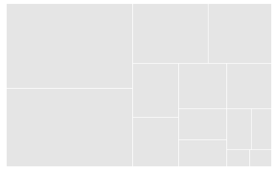
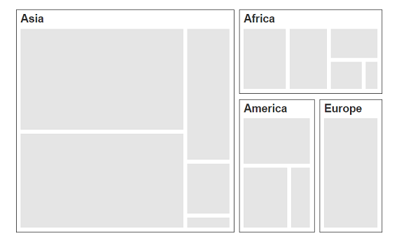
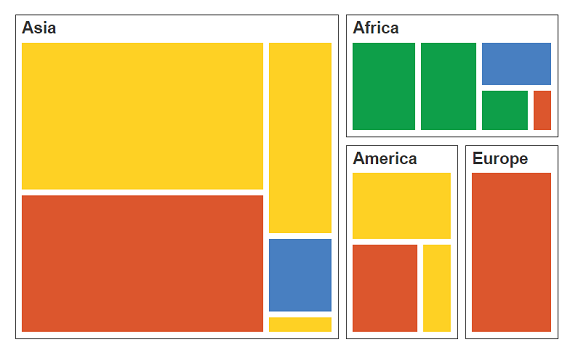
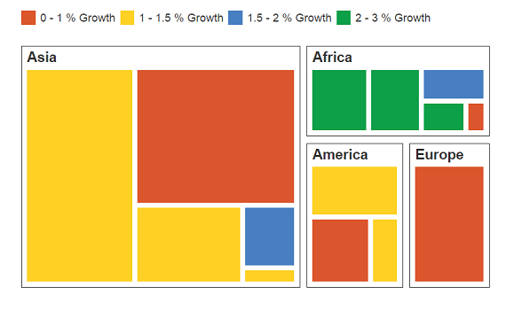

# Getting Started

Before we start with the TreeMap, please refer [this page](https://help.syncfusion.com/emberjs/overview) for general information regarding integrating Syncfusion widget’s.

## Adding JavaScript and CSS Reference

To render the TreeMap control, the following list of external dependencies are needed, 

* [jsRender](https://github.com/borismoore/jsrender) - to render the templates

The other required internal dependencies are tabulated below,

<table>
   <tr>
      <th>
         <b>Files</b>
      </th>
      <th>
         <b>Description/Usage </b>
      </th>
   </tr>
   <tr>
      <td>
         ej.core.min.js
      </td>
      <td>
        It is referred always before using all the JS controls.
      </td>
   </tr>
   <tr>
      <td>
         ej.data.min.js
      </td>
      <td>
         Used to handle data operation and is used while binding data to the JS controls.
      </td>
   </tr>
   <tr>
      <td>
        ej.treemap.min.js
      </td>
      <td>
        TreeMap core script file which includes TreeMap related scripts files.
      </td>
   </tr>
</table>

N> TreeMap uses one or more script files, therefore refer the `ej.web.all.min.js` (which encapsulates all the `ej` controls and frameworks in a single file) in the application instead of referring all the above specified internal dependencies. 

To get the real appearance of the TreeMap, the dependent CSS file `ej.web.all.min.css` (which includes styles of all the widgets) should also needs to be referred.

## Control Initialization

* Open the command prompt in the folder [ember-app](https://help.syncfusion.com/emberjs/getting-started#create-a-simple-ember-application) or the folder in which the application is created.

* Use the command [ember generate route treemap/default](https://guides.emberjs.com/v2.11.0/routing/defining-your-routes/)to create template `default.hbs` file in templates folder and router `default.js` file in routes folder. It also add the routing content in `router.js`.

* Use below code in `default.hbs` in templates folder to render the treemap.



	{{ej-treemap id="Map"}}



* Use the below code in `default.js` in routes folder to bind the model to the treemap.



	import Ember from 'ember';

    export default Ember.Route.extend({
      model() {
         return {
         }
      }
    });



### Populate DataSource

The `dataSource` property accepts the collection values as input. For example, you can provide the list of objects as input.


    var treemapData = [
            { Continent: "Asia", Region: "Southern Asia", Growth: 1.32, Population: 1749046000 },
            { Continent: "Asia", Region: "Eastern Asia", Growth: 0.57, Population: 1620807000 },
            { Continent: "Asia", Region: "South-Eastern Asia", Growth: 1.20, Population: 618793000 },
            { Continent: "Asia", Region: "Western Asia", Growth: 1.98, Population: 245707000 },
            { Continent: "Asia", Region: "Central Asia", Growth: 1.43, Population: 64370000 },
            { Continent: "Europe", Region: "Europe", Growth: 0.10, Population: 742452000 },
            { Continent: "America", Region: "South America", Growth: 1.06, Population: 406740000 },
            { Continent: "America", Region: "Northern America", Growth: 0.85, Population: 355361000 },
            { Continent: "America", Region: "Central America", Growth: 1.40, Population: 167387000 },
            { Continent: "Africa", Region: "Eastern Africa", Growth: 2.89, Population: 373202000 },
            { Continent: "Africa", Region: "Western Africa", Growth: 2.78, Population: 331255000 },
            { Continent: "Africa", Region: "Northern Africa", Growth: 1.70, Population: 210002000 },
            { Continent: "Africa", Region: "Middle Africa", Growth: 2.79, Population: 135750000 },
            { Continent: "Africa", Region: "Southern Africa", Growth: 0.91, Population: 60425000 }
        ];



Refer the treemapdata.js file as illustrated in the following code example in **index.html** file.



   



N> Population data is referred from [List of continents by population](http://en.wikipedia.org/wiki/List_of_continents_by_population).

## Initialize TreeMap

1\. Create a **&lt;div&gt;** tag with a specific id and set the height and width to determine the rendering treemap’s size with `ej-treemap` attribute.
2\. Set the dataSource attribute value as window.population_data, which contains the data details. 
3\. You can calculate the size of the object using `weightValuePath` of **TreeMap**.



	{{ej-treemap id="TreeMap" e-dataSource=model.dataSource e-weightValuePath=model.weightValuePath}}





    export default Ember.Route.extend({
      model() {
         return {
            dataSource: window.population_data,
            weightValuePath: "Population",
         }
      }
    });



## Running the application

* To run the application, execute below command.


 
 ember serve



* Browse to [http://localhost:4200](http://localhost:4200) to see the application. And navigate to treemap sample. The component is rendered as like the below screenshot. You can make changes in the code found under app folder and the browser should auto-refresh itself while you save files. 

The above code renders a treemap, with default properties.

 

## Group with Levels

You can group TreeMap items using the levels in it.

### Group Path

You can use `groupPath` property for every flat level of the TreeMap control. It is a path to a field on the source object that serves as the “Group” for the level specified. You can group the data based on the `groupPath` in the TreeMap control. When the `groupPath` is not specified, then the items are not grouped and the data is displayed in the order specified in the `dataSource`.

### Group Gap

You can use `groupGap` property to separate the items from every flat level and to differentiate the levels mentioned in the TreeMap control.

The following code sample explains how to group TreeMap Items using ‘Levels’.



	{{ej-treemap id="TreeMap" e-dataSource=model.dataSource e-weightValuePath=model.weightValuePath e-levels=model.levels}}





    export default Ember.Route.extend({
      model() {
         return {
            dataSource: window.population_data,
            weightValuePath: "Population",
            levels: [{ groupPath: "Continent", groupGap: 5}],
         }
      }
    });



The following screenshot displays grouping of **TreeMap****Items** using **Levels**.

## Customize TreeMap by Range

You can differentiate the nodes based on its value and color ranges using Range color. You can also define the color value range using from and to properties. 

### Color Value Path

The `colorValuePath` of TreeMap is a path to a field on the source object. You can determine the color for the object using `colorValuePath` of TreeMap.

The following code sample explains how to customize TreeMap appearance using Range.



	{{ej-treemap id="TreeMap" e-dataSource=model.dataSource e-weightValuePath=model.weightValuePath e-levels=model.levels e-colorValuePath=model.colorValuePath e-rangeColorMapping=model.rangeColorMapping}}





    export default Ember.Route.extend({
      model() {
         return {
            dataSource: window.population_data,
            weightValuePath: "Population",
            levels: [{ groupPath: "Continent", groupGap: 5}],
            colorValuePath: "Growth",
            rangeColorMapping: [
                    { color: "#DC562D", from: "0", to: "1" },
                    { color: "#FED124", from: "1", to: "1.5" },
                    { color: "#487FC1", from: "1.5", to: "2" },
                    { color: "#0E9F49", from: "2", to: "3" }
            ]
         }
      }
    });



The following screenshot displays a customized **TreeMap** control. 

## Enable Tooltip

You can enable the tooltip by setting `showTooltip` property to “True”. By default, it takes the property of the bound object that is referred in the `weightValuePath` and displays its content when the corresponding node is hovered. You can customize the template for tooltip using `tooltipTemplate` property.

Add the template script to .hbs file for treemap tooltip template , refer the below code snippet for tooltipTemplate



	{{ej-treemap id="TreeMap" e-dataSource=model.dataSource e-weightValuePath=model.weightValuePath e-levels=model.levels e-colorValuePath=model.colorValuePath e-rangeColorMapping=model.rangeColorMapping e-tooltipTemplate=model.tooltipTemplate e-showTooltip=model.showTooltip}}

    





    export default Ember.Route.extend({
      model() {
         return {
            dataSource: window.population_data,
            weightValuePath: "Population",
            levels: [{ groupPath: "Continent", groupGap: 5}],
            colorValuePath: "Growth",
            rangeColorMapping: [
                    { color: "#DC562D", from: "0", to: "1" },
                    { color: "#FED124", from: "1", to: "1.5" },
                    { color: "#487FC1", from: "1.5", to: "2" },
                    { color: "#0E9F49", from: "2", to: "3" }
            ],
            showTooltip: true,
            tooltipTemplate: 'template',
         }
      }
    });



## Leaf ItemSettings

You can customize the Leaf level TreeMap items using `leafItemSettings`. The Label and tooltip values take the property of bound object that is referred in the `labelPath` when defined. The following code sample displays how the tooltip is enabled.



	{{ej-treemap id="TreeMap" e-dataSource=model.dataSource e-weightValuePath=model.weightValuePath e-levels=model.levels e-colorValuePath=model.colorValuePath e-rangeColorMapping=model.rangeColorMapping e-tooltipTemplate=model.tooltipTemplate e-showTooltip=model.showTooltip e-leafItemSettings=model.leafItemSettings}}





    export default Ember.Route.extend({
      model() {
         return {
            dataSource: window.population_data,
            weightValuePath: "Population",
            levels: [{ groupPath: "Continent", groupGap: 5}],
            colorValuePath: "Growth",
            rangeColorMapping: [
                    { color: "#DC562D", from: "0", to: "1" },
                    { color: "#FED124", from: "1", to: "1.5" },
                    { color: "#487FC1", from: "1.5", to: "2" },
                    { color: "#0E9F49", from: "2", to: "3" }
            ],
            showTooltip: true,
            tooltipTemplate: 'template',
            leafItemSettings: { labelPath: "Region" }
         }
      }
    });



The following screenshot displays a ToolTip in a **TreeMap** control.

## Enable Legend

You can set the color value of leaf nodes using TreeMap Legend. This legend is appropriate only for the TreeMap whose leaf nodes are colored using `rangeColorMapping`. You can set `showLegend` property value to “True” to make a legend visible.

### Label for Legend

You can customize the labels of the legend item using `legendLabel` property of `rangeColorMapping`. 

The following code sample illustrates how to add labels for legend in a TreeMap.



	{{ej-treemap id="TreeMap" e-dataSource=model.dataSource e-weightValuePath=model.weightValuePath e-levels=model.levels e-colorValuePath=model.colorValuePath e-rangeColorMapping=model.rangeColorMapping e-tooltipTemplate=model.tooltipTemplate e-showTooltip=model.showTooltip e-leafItemSettings=model.leafItemSettings e-showLegend=model.showLegend
    e-legendSettings=model.legendSettings}}





    export default Ember.Route.extend({
      model() {
         return {
            dataSource: window.population_data,
            weightValuePath: "Population",
            levels: [{ groupPath: "Continent", groupGap: 5}],
            colorValuePath: "Growth",
            rangeColorMapping: [
                    { color: "#DC562D", from: "0", to: "1",legendLabel: "0 - 1 %    Growth" },
                    { color: "#FED124", from: "1", to: "1.5" , legendLabel: "1 - 1.5 % Growth"},
                    { color: "#487FC1", from: "1.5", to: "2", legendLabel: "1.5 - 2 % Growth" },
                    { color: "#0E9F49", from: "2", to: "3" , legendLabel: "2 - 3 % Growth"}
                ],
				showTooltip: true,
                tooltipTemplate: 'template',
                leafItemSettings: { labelPath: "Region" },
				showLegend: true,
                legendSettings: {
                  showLegend:true,                                                                      
                  height:38,
                  width:690,
                },
         }
      }
    });



The following screenshot displays labels in a **TreeMap** control. 

N> Population data is referred from [List of continents by population](http://en.wikipedia.org/wiki/List_of_continents_by_population).

